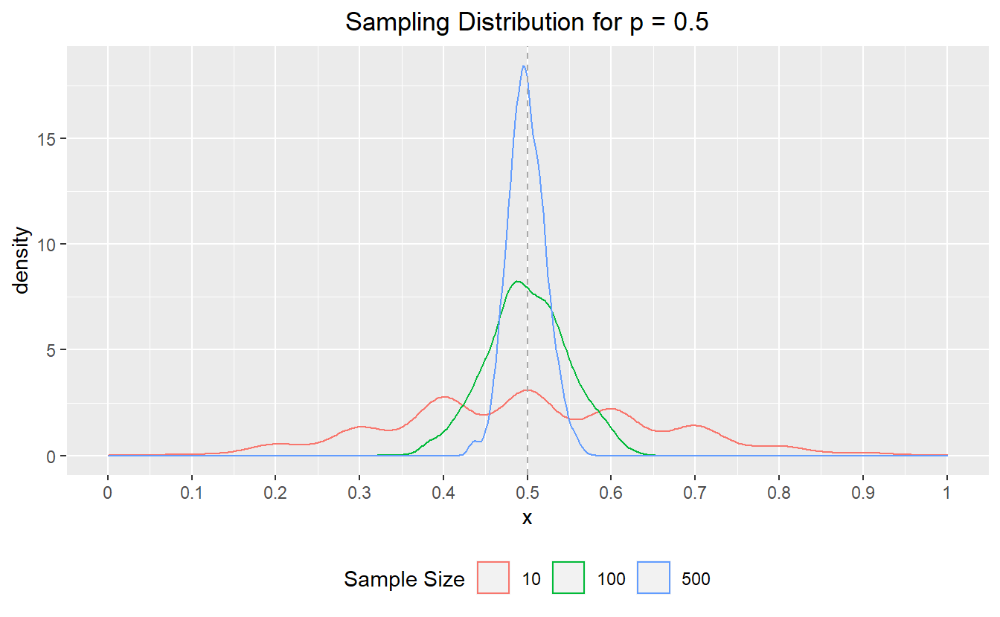
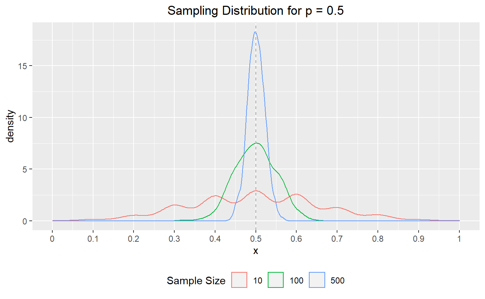

Last month, I dusted off a training course that I first developed in 2018 to teach to a class of new hires at work. The content focuses on many types of *data disasters*[^1] that are often encountered when working with data -- from misunderstanding how data is structured pr how tools are meant to work, to errors in causal interpretation and model building -- yet rarely taught in stats training.

This year, however, the material felt a bit different, and it was not simply because (for the second year) I was sitting alone in a room all afternoon rambling to myself and a Zoom screen about all the ways everything can go wrong and how you really can't ever trust anything (in data, that is.)

<blockquote class="twitter-tweet">

Teaching an intro data analysis class tomorrow which means I'll be sitting alone in a room by myself for three hours and talking at my computer screen about how numbers can lie to you. Just another normal, healthy 2020 thing <a href="https://t.co/u6nKfLhaxj">pic.twitter.com/u6nKfLhaxj</a>

--- Emily Riederer (@EmilyRiederer) <a href="https://twitter.com/EmilyRiederer/status/1305666403824021507?ref_src=twsrc%5Etfw">September 15, 2020</a>
</blockquote>

This year, the material took on a whole new level of gravity. As I walked through my taxonomy and examples of data disasters, one of my underlying message had always been that stats education focuses on the "complex" things (e.g. proving asymptotic convergence) but simple things can also be hard and important. However, as the pandemic has evolved over the last two years, more highly important data processing has been done in the open and on the fly than ever before, and much of it has unsurprisingly hit many of the snags one would when working with messy, inconsistent, ever-changing, observational data.

As I walked through the course, I found myself thinking about many pandemic-related examples for every "disasters" which all felt more urgent and timely than the industry-specific examples that I had concocted. In this post, I walk through just one such example of simple things that are hard. This is the story of a [simple average informing public health policy in Indiana](https://www.indystar.com/story/news/health/2020/12/23/covid-indiana-positivity-rate-error-corrected-dec-30/4013741001/) and what it illustrates about imprecise estimands, the definition of the average, sampling variability, independence assumptions, and selection bias.

What happened?
--------------

A [local news article](https://www.indystar.com/story/news/health/2020/12/23/covid-indiana-positivity-rate-error-corrected-dec-30/4013741001/) explains that the seven-day test positivity rate was being calculated as the average of daily positivity rates. Instead, the methodology was changed to calculate a single rolling weekly rate:

> "The change to the methodology is how we calculate the seven-day positivity rate for counties. In the past, similar to many states, we've added each day's positivity rate for seven days and divided by seven to obtain the week's positivity rate. Now we will add all of the positive tests for the week and divide by the total tests done that week to determine the week's positivity rate. This will help to minimize the effect that a high variability in the number of tests done each day can have on the week's overall positivity, especially for our smaller counties."

That is, the decision was made to move from `avg( n_positive / n_tests )` to `sum( n_positive ) / sum(n_tests)`.

While the article states that the change would not have historically changed any decision-making, this metric nontheless was tied to important decision making processes, thus raising the takes for its accuracy:

> The changes could result in real-world differences for Hoosiers, because the state uses a county's positivity rate as one of the numbers to determine which restrictions that county will face. Those restrictions determine how many people may gather, among other items.

At the outset, this may seem like a trivial change and the type of distinction one might not bother to make when throwing together a quick dashboard or report[^2] However, as we will examing step-by-step, this subtle mechanical difference actually carries with it a weight of statistical reasoning.

What went wrong?
----------------

### What is the target?

The first step to tracking a metric is defining the metric to track. This sounds obvious, but too often it is not. Metric design requires a lot of thought[^3] yet often glossed over even in important contexts such as medical research[^4]. In more complex problems, this will affect the research design and statistical methods we use to derive results, but in simpler cases like this, it can simply alter basic arithmetic.

So, the problem here starts with the very definition of what we are trying to track:

> average proportion of positive test results over the past seven days

Now, that seems pretty specific. An average of a proportion with a clear numerator and denominator over a defined time horizon. Easy, right? Not so fast. There's more nuance than meets the eye in how we calculate *averages* and what technically "happened" in the *last seven days*.

### Average over what?

At some point in elementary school, we were probably all taught that you calculate an average by adding up a bunch of numbers and dividing the total by the number of numbers we started with. That's not *wrong*, but it's actually more of a special case than a general rule.

Later on, we might have learned about the *weighted average* as a separate concept. There, instead of `sum(x) / count(x)`, we might have learned another formula like `sum( x * weight(x) ) / sum(weight(x))`. Of course, this isn't so much an extension as an abstraction (where normal arithmetic averages are recreated when the weight is set to 1 for all values of the number in question.)

So, ultimately, all averages are weighted averages whether we acknowledge it or not. That, in turn, suggests that whenever we define a metric as an *average*, the obligatory next question is "the average over what?"

What I suspect happened in the case from Indiana, is that they were taking unweighted arithmetic average of the test positivity proportions for the last seven days. That is, they were using the *average of days* instead of the *average over tests*.

To see the difference, suppose there are 50 tests on day 1 with 20% positive and 100 tests on day 2 with 10% positivity. Averaging over days gives up a value of 15% and over tests a value of 13.3%

<pre class='chroma'><code class='language-r' data-lang='r'>(avg_of_days &lt;- (10/50 + 10/100) / 2)
(avg_of_test &lt;- (10 + 10) / (50 + 100))

#&gt; [1] 0.15
#&gt; [1] 0.1333333
</code></pre>

It's worth nothing that what's happening here is also mathematically equivallent to comparing the average of the proportions instead of the proportions of sums.

<pre class='chroma'><code class='language-r' data-lang='r'>(avg_of_props &lt;- (10/50 + 10/100) / 2)
(props_of_sums &lt;- (10 + 10) / (50 + 100))

#&gt; [1] 0.15
#&gt; [1] 0.1333333
</code></pre>

And, alternatively, none of this matters if the number of tests are the same on both days because then our weights are constant and we are back to the flat arithmetic average over observations (days).

<pre class='chroma'><code class='language-r' data-lang='r'>(avg_of_props &lt;- (20/100 + 10/100) / 2)
(props_of_sums &lt;- (20 + 10) / (100 + 100))

#&gt; [1] 0.15
#&gt; [1] 0.15
</code></pre>

### Does sample size cause problems?

So, we probably used the wrong type of average for the question at hand, but we probably could have gotten away with it if the sample sizes across days were not substantially different. We say how the sample size affects the weighting, but can it cause other statistical problems?

Suppose for a minute, that this is a binomial setup where each test has an equal probability of coming back positive (it does not). We can simulate a number of draws from binomial distributions of different sample sizes, compute the sample proportion of successes, and inspect the mean and variance. Below, we confirm what we would expect that small samples produce unbiased but high variance estimates[^5].

<pre class='chroma'><code class='language-r' data-lang='r'>p &lt;- 0.5
n &lt;- 1000
size &lt;- <a href='https://rdrr.io/r/base/c.html'>c</a>(10, 100, 500)
samples &lt;- <a href='https://rdrr.io/r/base/lapply.html'>lapply</a>(size, FUN = function(x) <a href='https://rdrr.io/r/stats/Binomial.html'>rbinom</a>(n, x, p) / x)
<a href='https://rdrr.io/r/base/lapply.html'>vapply</a>(samples, FUN = function(x) <a href='https://rdrr.io/r/base/Round.html'>round</a>(<a href='https://rdrr.io/r/base/mean.html'>mean</a>(x), 3), FUN.VALUE = <a href='https://rdrr.io/r/base/numeric.html'>numeric</a>(1))
<a href='https://rdrr.io/r/base/lapply.html'>vapply</a>(samples, FUN = function(x) <a href='https://rdrr.io/r/base/Round.html'>round</a>(<a href='https://rdrr.io/r/stats/sd.html'>sd</a>(x), 3), FUN.VALUE = <a href='https://rdrr.io/r/base/numeric.html'>numeric</a>(1))

#&gt; [1] 0.496 0.499 0.499
#&gt; [1] 0.156 0.049 0.022
</code></pre>

If staring at summary statistics is uninspiring, we can wrap our minds around the extend of the difference with a plot.

So, days with smaller samples are most likely to take the most extreme values which could yank an average in one direction *or the other* ephemerally[^6]. This alone is a bad situation for a metric of interest; however, it can't be the full story. The initial article implies that the positivity rate was being *consistently overestimated*, that is, biased.

### Is sample size suggestive of a problem?

The vagaries of sample size may not independently be causing this problem, but they do raise a few broader issues. First, unweighted arithmetic averages make the most sense when we can make statistics' favorite assumptions of "independent and identically distributed". If, in fact, we see large variances in sample size, that would suggest this is not the case.

<pre class='chroma'><code class='language-r' data-lang='r'>avg_of_ratios &lt;- (10/100 + 90/100) / 2

ratio_of_sums &lt;- (10 + 90) / (100 + 100)

avg_of_ratios == ratio_of_sums

avg_of_ratios_uneq &lt;- (10/100 + 180 / 200) / 2

ratio_of_sums_uneq &lt;- (10 + 180) / (100 + 200)

avg_of_ratios_uneq == ratio_of_sums_uneq

weightavg_of_ratios_uneq &lt;- (100/300)*(10/100) + (200/300)*(180/200)

ratio_of_sums_uneq == weightavg_of_ratios_uneq

#&gt; [1] TRUE
#&gt; [1] FALSE
#&gt; [1] TRUE
</code></pre>

<pre class='chroma'><code class='language-r' data-lang='r'>df1 &lt;- <a href='https://rdrr.io/r/base/data.frame.html'>data.frame</a>(
  numer = <a href='https://rdrr.io/r/base/c.html'>c</a>( 10,  90),
  denom = <a href='https://rdrr.io/r/base/c.html'>c</a>(100, 100)
)

<a href='https://rdrr.io/r/base/with.html'>with</a>(df1, <a href='https://rdrr.io/r/base/mean.html'>mean</a>(numer)/<a href='https://rdrr.io/r/base/mean.html'>mean</a>(denom))
<a href='https://rdrr.io/r/base/with.html'>with</a>(df1, <a href='https://rdrr.io/r/base/mean.html'>mean</a>(numer / denom))

#&gt; [1] 0.5
#&gt; [1] 0.5
</code></pre>

<pre class='chroma'><code class='language-r' data-lang='r'>df2 &lt;- <a href='https://rdrr.io/r/base/data.frame.html'>data.frame</a>(
  numer = <a href='https://rdrr.io/r/base/c.html'>c</a>( 10,  90*2),
  denom = <a href='https://rdrr.io/r/base/c.html'>c</a>(100, 100*2)
)

<a href='https://rdrr.io/r/base/with.html'>with</a>(df2, <a href='https://rdrr.io/r/base/mean.html'>mean</a>(numer)/<a href='https://rdrr.io/r/base/mean.html'>mean</a>(denom))
<a href='https://rdrr.io/r/base/with.html'>with</a>(df2, <a href='https://rdrr.io/r/base/mean.html'>mean</a>(numer / denom))

#&gt; [1] 0.6333333
#&gt; [1] 0.5
</code></pre>

A sidenote on BI tools
----------------------

Independence assumptions
------------------------

defining estimand forces us to think about what are we even doing here?

average can be for denoising or smoothing

implicit assumption of iid if using for denoising; otherwise it's not just noise you're canceling out

other time, you may not care if you are just going to treat everything the same anyway

Sample Size
-----------

if data is from same distribution, this could increase variance but shouldn't effect mean

Recall that the standard deviation of sample proportion is $\sqrt(p*(1-p)/n)$

link to discussions of sample size and different types of averages

<pre class='chroma'><code class='language-r' data-lang='r'><a href='https://rdrr.io/r/base/Random.html'>set.seed</a>(123)

# define simulation parameters ----
## n: total draws from binomial distribution
## p: proportion of successes
p &lt;- 0.5
n &lt;- 1000

# sample from binomials of different size ----
s010 &lt;- <a href='https://rdrr.io/r/stats/Binomial.html'>rbinom</a>(n,  10, p) /  10
s100 &lt;- <a href='https://rdrr.io/r/stats/Binomial.html'>rbinom</a>(n, 100, p) / 100
s500 &lt;- <a href='https://rdrr.io/r/stats/Binomial.html'>rbinom</a>(n, 500, p) / 500

# set results as dataframe for inspection ----
df &lt;- <a href='https://rdrr.io/r/base/data.frame.html'>data.frame</a>(
  s = <a href='https://rdrr.io/r/base/rep.html'>rep</a>(<a href='https://rdrr.io/r/base/c.html'>c</a>(10, 100, 500), each = n),
  x = <a href='https://rdrr.io/r/base/c.html'>c</a>(s010, s100, s500)
)
</code></pre>

<pre class='chroma'><code class='language-r' data-lang='r'>p &lt;- 0.5
n &lt;- 1000
size &lt;- <a href='https://rdrr.io/r/base/c.html'>c</a>(10, 100, 500)
samples &lt;- <a href='https://rdrr.io/r/base/lapply.html'>lapply</a>(size, FUN = function(x) <a href='https://rdrr.io/r/stats/Binomial.html'>rbinom</a>(n, x, p) / x)
<a href='https://rdrr.io/r/base/lapply.html'>vapply</a>(samples, function(x) <a href='https://rdrr.io/r/base/Round.html'>round</a>(<a href='https://rdrr.io/r/base/mean.html'>mean</a>(x), 3), <a href='https://rdrr.io/r/base/numeric.html'>numeric</a>(1))

#&gt; [1] 0.501 0.499 0.499

<a href='https://rdrr.io/r/base/lapply.html'>vapply</a>(samples, function(x) <a href='https://rdrr.io/r/base/Round.html'>round</a>(<a href='https://rdrr.io/r/stats/sd.html'>sd</a>(x), 3), <a href='https://rdrr.io/r/base/numeric.html'>numeric</a>(1))

#&gt; [1] 0.156 0.048 0.022
</code></pre>

<pre class='chroma'><code class='language-r' data-lang='r'><a href='https://rdrr.io/r/stats/aggregate.html'>aggregate</a>(df$x, by = <a href='https://rdrr.io/r/base/list.html'>list</a>(df$s), FUN = mean)

#&gt;   Group.1        x
#&gt; 1      10 0.497500
#&gt; 2     100 0.499520
#&gt; 3     500 0.500632

<a href='https://rdrr.io/r/stats/aggregate.html'>aggregate</a>(df$x, by = <a href='https://rdrr.io/r/base/list.html'>list</a>(df$s), FUN = sd)

#&gt;   Group.1          x
#&gt; 1      10 0.15990409
#&gt; 2     100 0.05064518
#&gt; 3     500 0.02126021
</code></pre>

<pre class='chroma'><code class='language-r' data-lang='r'><a href='https://rdrr.io/r/base/library.html'>library</a>(<a href='http://ggplot2.tidyverse.org'>ggplot2</a>)

<a href='https://ggplot2.tidyverse.org/reference/ggplot.html'>ggplot</a>(data = df) +
  <a href='https://ggplot2.tidyverse.org/reference/aes.html'>aes</a>(x = x, col = <a href='https://rdrr.io/r/base/character.html'>as.character</a>(s)) +
  <a href='https://ggplot2.tidyverse.org/reference/geom_density.html'>geom_density</a>() +
  <a href='https://ggplot2.tidyverse.org/reference/geom_abline.html'>geom_vline</a>(xintercept = p, col = 'darkgrey', linetype = 2) +
  <a href='https://ggplot2.tidyverse.org/reference/labs.html'>labs</a>(
    title = "Sampling Distribution for p = 0.5",
    col = "Sample Size"
  ) +
  <a href='https://ggplot2.tidyverse.org/reference/scale_continuous.html'>scale_x_continuous</a>(breaks = <a href='https://rdrr.io/r/base/seq.html'>seq</a>(0, 1, 0.1), labels = <a href='https://rdrr.io/r/base/seq.html'>seq</a>(0, 1, 0.1)) +
  <a href='https://ggplot2.tidyverse.org/reference/theme.html'>theme</a>(
    plot.title = <a href='https://ggplot2.tidyverse.org/reference/element.html'>element_text</a>(hjust = 0.5),
    legend.position = "bottom"
  )

</code></pre>

<pre class='chroma'><code class='language-r' data-lang='r'>p &lt;- 0.5
n &lt;- <a href='https://rdrr.io/r/base/c.html'>c</a>(<a href='https://rdrr.io/r/base/rep.html'>rep</a>(100, 2), <a href='https://rdrr.io/r/base/rep.html'>rep</a>(1000, 7))
est &lt;- <a href='https://rdrr.io/r/base/lapply.html'>lapply</a>(n, FUN = function(x) <a href='https://rdrr.io/r/stats/Binomial.html'>rbinom</a>(100, size = x, prob = p) / x)
</code></pre>

Bias
----

Conclusion
----------

then back to the data for why it matters.

but low sample days based on real world are probably also a sign of a different distribution (only very urgent cases get tested?)

[^1]: Similar to the long-form writing project I'm working in the open over [here](https://data-disasters.netlify.app/)

[^2]: In fact, I suspect there is a side story here about some common BI tools making the computation of the former metric significantly easier than the latter. But, that is not something I can substantiate, so I will not get on that soapbox.

[^3]: One framework for approaching metric design is eloquently explored by Sean Taylor in this essay: <a href="https://medium.com/@seanjtaylor/designing-and-evaluating-metrics-5902ad6873bf" class="uri">https://medium.com/@seanjtaylor/designing-and-evaluating-metrics-5902ad6873bf</a>

[^4]: This new study cites many examples of poorly defined estimands (think metrics) from the BMJ: <a href="https://trialsjournal.biomedcentral.com/articles/10.1186/s13063-021-05644-4" class="uri">https://trialsjournal.biomedcentral.com/articles/10.1186/s13063-021-05644-4</a>

[^5]: We also know this with standard statistical results and formulas, but it's more fun to see it.

[^6]: As discussed at length in this Scientific American article: <a href="https://www.americanscientist.org/article/the-most-dangerous-equation" class="uri">https://www.americanscientist.org/article/the-most-dangerous-equation</a>

