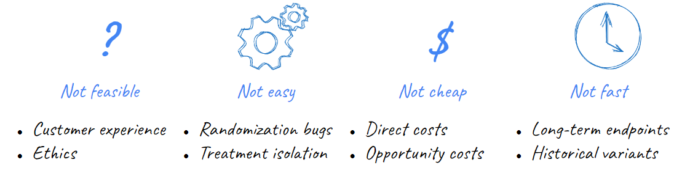

*This post summarizes the final third of my talk at Data Science Salon NYC in June 2023. Please see the [talk details](/talk/causal-design-patterns) for more content.*

Techniques of observational causal inference are becoming increasingly popular in industry as a complement to experimentation. Causal methods offer the promise of accelerating measurement agendas and facilitating the estimation of previously un-measurable targets by allowing analysts to extract causal insights from "found" data (e.g. observational data collected without specific intent). However, if executed without careful attention to their assumptions and limitations, they can lead to spurious conclusions.

Both experimental and observational methods attempt to address the **fundamental problem of causal inference**: that is, the fact that for a given treatment of interest, we can never "see" the *individual-level outcome* both for the case when an individual received a treatment and a counterfactual scenario in which *for the same individual in the exact same context* that treatment was withheld. Some literature casts this as a "missing data" problem.^[For example, see https://arxiv.org/abs/1710.10251] Counterfactual data is uncollectable; however, this fundamental missingness can be partially mitigated by diligent collection of *other* types of quantitative and qualitative information to control for confounding^[If you've heard of 'selection on observables' in causal literature, richer data means observables!] and interrogate assumptions.

In this post, I argue that industry has unique advantages when using causal techniques over the social science disciplines that originated many foundational methods due to industry's (theoretically) superior ability to observe and capture relevant supplemental data and context. Examining the implicit assumptions in common [causal design patterns](/post/causal-design-patterns) motivates the types of proactive enterprise information management -- including data, metadata, and knowledge management -- that will help preserve the raw inputs that future data scientists will need to effectively deploy causal techniques on historical data and answer questions that our organizations cannot even anticipate today. By casting an intentionally wide net on what information we observationally collect, we increase the likelihood that the future "found" data will have what those analysts need to succeed. 

## Why industry needs causal inference

Industry data science tends to highly value the role of A/B testing and experimentation. However, there are many situations where experimentation is not an optimal approach to learning. Experiments can be infeasible if we worry about the ethics or reputational risk of offering disparate customer treatments; they may be impractical in situations that are hard to randomize or avoid spillover effects; they can be costly to run and configure either in direct or opportunity costs; and, finally, they can just be *slow* if we wish to measure complex and long-term impacts on customer behaviors (e.g. retention, lifetime value).

## What causal methods require

These limitations are one of the reasons why observational causal inference is gaining increasing popularity in industry. Methods of observational causal inference allows us to estimate treatment effects without randomized controlled experimentation by using existing historical data. At the highest level, these methods work by replacing *randomization* with strategies to exploit other forms of *semi-random variation* in historical exposures of a population to a treatment. Since this semi-random *variation* could be susceptible to confounding, observational methods supplement variation with *additional data* to control for other observable sources of bias in our estimates and *contextual assumptions* about the data generating process. 

My previous post on [causal design patterns](/post/causal-design-patterns) outlines a number of foundational causal methods, but I'll briefly recap to emphasize the different ways that sources of variation, data, and context are used:

- **Stratification and Inverse Propensity Score Weighting**: 
  + Exploits "similar" populations of treated and untreated individuals 
  + Assumes we can observe and control for common causes of the treatment and the outcome
- **Regression Discontinuity**: 
  + Exploits a sharp, semi-arbitrary cut-off between treated and untreated individuals
  + Assumes that the outcome is continuous with respect to the assigment variable and the assignment mechanism is unknown to individuals (to avoid self-selection) 
- **Difference in Differences**: 
  + Exploits variation between *behavior over time* of treated and untreated *groups*
  + Assumes that the treatment assignment is unrelated to expected future outcomes and that the treatment is well-isolated to the treatment group
  
Notably, the assumptions mentioned above are largely untestable statistically (e.g. not like testing for normality or multicolinearity) but rely on knowledge of past strategies and policies that guided differential treatment in historical data.^[There are some exceptions to this like placebo tests, bunching checks, etc.]

## Industry's unique advantages deploying causal inference

Many causal methods originated in fields like epidemiology, economics, political science, and other social sciences. In such fields, direct experimentation is often impossible and even first-hand data collection is less common. Often, researchers may have to rely on pre-existing data sources like censuses, surveys, and administrative data (e.g. electronic health records). 

Despite the lineage of these methods, industry has many advantages over traditional research fields in using them because each company controls the entire "universe" in which its customers exist. This should in theory provide a distinct advantage when collecting each of the three "ingredients" that causal methods use to replace randomization:

- **Variation**: We control customer engagement strategies through methods like customer segmentation or models. Subsequent customer treatments are completely known to us but inherently have some arbitrary, judgmental component to exploit
- **Data**: We tend to be able to collect more measurements of our customers both as a snapshot (more variety in fields) and longitudinally (more observations over time) that can be brought into our analyses to control for confounders^[Notable, the availability of more data absolutely does *not* mean that we should simply "dump in" all the data we have. Controlling for certain variables like colliders is counterproductive.], reduce other sources of variation in our estimate, and have additional 'out of time' data left over to conduct forms of validation like placebo tests
- **Context**: We tend to know how past strategies were set-up, how they looked to individuals involved, and *why* those decisions were made. This can be critical in reasoning whether our assumptions hold

However, to convert this theoretical benefit to a practical one requires information management.

## Data management for causal inference

While all causal methods will be enhanced with better enterprise information management, it's easiest to see the motivation by thinking back to specific examples. Causal inference can benefit from better data, metadata, and knowledge management. These are illustrated by propensity score weighting, regression discontinuity, and diff-in-diff respectively.

**Integrated Data Management**

Earlier, we posited that one advantage that industry has over academia for causal inference is access to richer historical data sources as a higher level of resolution (more measures per individual at more time points). A rich set of customer measures is critical for stratification and propensity score weighting where we attempt to control for selection on observables by balancing populations along dimensions that might be common causes of treatment assignment and outcome. (And, we may also wish to control for other unrelated sources of variation that effect only the outcome to develop more precise estimates.)

However, this is only true if customer data is proactively *collected, cleaned, and harmonized* across sources in the true spirit of a customer 360 view. Enterprises may collect data about customers from many different operational systems -- for example, demographic information provided at registration, digital data on their logins and web activity, campaign data on attempted customer touchpoints and engagement, behavioral or fulfillment data on purchases / subscription renewals / etc. Any of these sources could be useful "observables" that help close confounding pathways in our analyses. 

To make this data useful and accessible for analysis, it must be *proactively integrated* into a common source like a data warehouse, *well-documented* to help future users understand the nuances of each system, *harmonized* so fields have standard definitions (e.g. common definitions of an "account" and a "customer"), and *unified* by using techniques like entity resolution to ensure all sources share common identifiers so that they can be merged for analysis.

**Metadata Management**

Beyond those "typical" sources of customer data, our past customer strategies create data beyond the data directly generated by our customers. Metadata about past campaigns such as precise business logic on the different treatments offered (e.g. if sending customers a discount, what algorithmically determined the amount?), the campaign targeting and segmentation (e.g. What historical behaviors were used to segments customers? Was treatment determined by a predictive model?), and launch timing can all be critical to clearly identifying those sources of variation that we wish to exploit. For example, we might know that we once ran an re-engagement campaign to attempt the nudge interaction from customers who didn't log-in to a website for some amount of time, but knowing whether that campaign was targeting customers >30 days inactive or >45 days inactive impacts our ability to analyze it with a regression discontinuity. 

This means that we need to *treat metadata as first-class data* and ensure that it is extracted from operational source systems, structured in a machine-readable format, and preserved in analytical data stores along with our customer data.

The importance of "metadata as data" extends beyond business-as-usual organization strategies. We can also fuel future causal inference with better metadata management of past formal experiments and execution errors. As discussed above, formal experiments may represent a substantial *investment* in company resources so the data collected from them should be regarded as an *asset*. Beyond their utility for one-time reads and decisions, experiment designs and results should be carefully catalogued along with the assigned treatment group and the randomization criteria. This can support future *observational* analysis of past experiments, including generalizing and transporting results to different populations. Furthermore, even *mistakes* in executing past strategies may become "natural experiments" to help businesses understand scenarios that they might never have prioritized for testing. So, machine-readable incident logs and impacted populations can be useful as well.

**Knowledge Management**

Of course, not *all* information can be condensed into a nice, machine-readable spreadsheet. Methods like difference-in-differences illustrate how conceptual context can also help us battle-test assumptions like whether the decision-to-treat could have spilled over into the control population or been influenced by an anticipated change in the future outcome. This is the one area where industry may sometimes *lag* social sciences in information since some population-level treatments like a state law or local ordinance often have documented histories through the legislative process, news coverage, and historical knowledge about their implementation.

Industry can catch up on knowledge management by documenting and preserving in a centralized knowledge repository key information about strategic decisions undertaken, the motivating factors, and the anticipated customer experience. Such documents are inevitably created when working on new projects through memos ad decks intended to communicate the business case, intent, and expected customer experience. However, proactively figuring out how to *organize and index* this information through a classification system and *democratize access* through centralized knowledge repositories is critical to giving future users entree to this tribal knowledge.

