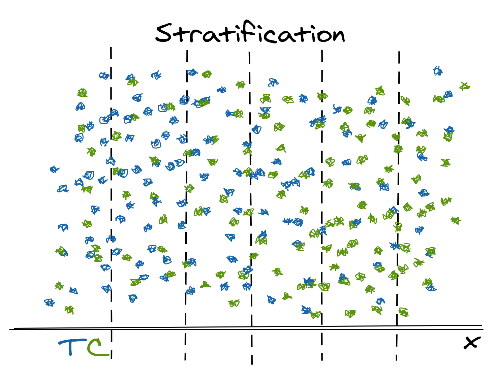
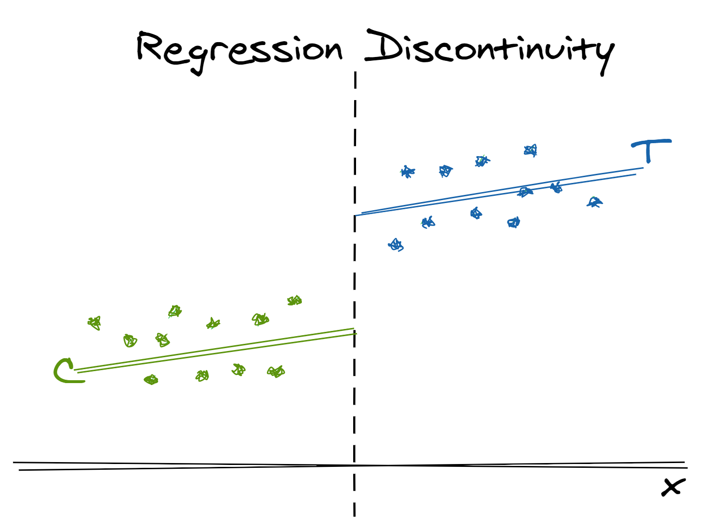
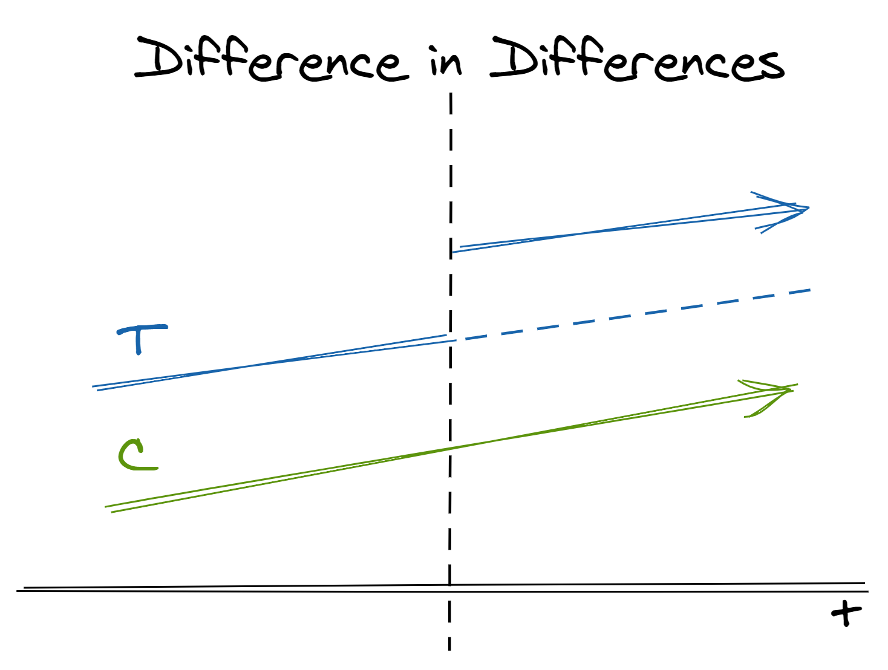

Software engineers study design patterns^[A concept popularized by the 1994 book *Design Patterns: Elements of Reusable Object-Oriented Software*. See more on [Wikipedia](https://en.wikipedia.org/wiki/Design_Patterns)] to help them recognize archetypes, consider approaches with a common language, and reuse tried-and-true architectures. Similarly, statistics has many prototypical analyses, but too often these frameworks are siloed within specific disciplines and clouded by domain-specific language. This makes methods harder to discover and hides their general applicability. Consequently, it can be hard for practitioners outside of these fields to recognize when the problem they are facing fits one of these paradigms.

Observational causal inference is one such field. The need to understand true causal (versus correlative) effects and to derive meaning and strategy from "found" historical data (as opposed to experimentally "produced" data) is nearly universal, but methods are scattered across epidemiology, economics, political science, and more. 

This post aims to break down some of those barriers by briefly summarizing common cross-disciplinary design patterns for measuring causal effects from observational data with an emphasis on potential use in industry. For each method, I provide an illustration, overview of the method, summary of the required data structure and key assumptions, and a hypothetical consumer retail example. 

Causal inference is complex and doing it well requires both statistical and domain expertise. Instead of providing all of the details [which are already eloquently described in countless free resources](#learn-more), this post humbly aims to advertise these methods so analysts can add them into their mental index and investigate them further when they encounter a relevant question.

## Why CI in Industry?

Classic examples of causal questions include "Does smoking cause cancer?" and "Does education cause extra income?" Naively, we might compare outcomes (cancer or income) for those receiving the treatment (smoking and education) and those not. However, the fact that someone chose to smoke or pursue higher education creates selection bias; these behaviors likely correlate to other factors (risk taking, financial support, etc.) which can also impact the outcome. 

In industry, businesses want to know what causal effect their strategies (e.g. promotional offers) have on customer behavior. Here, of course, business have a major advantage over the examples above because the assignment mechanism into the treatment group (e.g. whom to send a discount code) is *known* and *under their control*. They often also have richer "pre-treatment" behavior for each individual (customer) which can help both assess and correct for bias. 

However, these advantages don't make causal inference unnecessary; if anything, they simply make it more possible and more relevant. Good businesses don't act at random. For example, we market to customers who are likely to be interested in our company and who, therefore, might have been interested even without marketing. When it comes to measuring effectiveness, good business is bad science. Because our *treatments* are not given at random, comparing the *outcomes* of treated and untreated groups is confounded and biased towards making us think we are more effective than we actually may be.

One antidote to this is true experimentation in which treatment is randomly assigned *within* the homogenous target population. Experimentation, particularly A/B tests, have become a mainstay of industry data science, so why does observational causal inference matter? 

- Some situations you cannot test due to ethics, logistics, or reputational risk
- Testing can be expensive. There are *direct costs* (e.g. testing a marketing promotion) of instituting a policy that might not be effective, *implementation costs* (e.g. having a tech team implement a new display), and *opportunity costs* (e.g. holding out a control group and not applying what you hope to be a profitable strategy as broadly as possible)^[Regarding opportunity costs, however, [multi-armed bandits](https://multithreaded.stitchfix.com/blog/2020/08/05/bandits/) can help balance this opportunity cost by deciding when to "explore versus exploit"]
- Randomized experimentation is harder than it sounds! Sometimes experiments may not go as planned, but treating the results as observational data may help salvage some information value
- Data collection can take time. We may want to read long-term endpoints like customer retention or attrition after many year.^[Specifically, we *should* consider these endpoints. Notoriously, short-term tests can be superficially rosy due to a novelty effect] When we long to read an experiment that *wasn't* launched three years ago, historical observational data can help us get a preliminary answer sooner
- Similarly, we can't time travel. Some strategies that we've fully launched we cannot unwind just to test. If we regret not testing after the fact, we can potential find a quasiexperiment to analyze
- It's not either-or but both-and. Due to the financial and temporal costs of experimentation, causal inference can also be a tool to help us better prioritize what experiments are worth running
- Even when you can experiment, understanding observational causal inference can help you better identify biases and design your experiments

Beyond these specific challenges, perhaps the best reason is that there are so many questions that you can answer. As we'll see, most all of these methods rely on exploiting some arbitrary amount of randomness in whether or not a specific individual or group received a certain treatment. Industry (and life in general) is full of non-random but well-defined (and somewhat arbitrary) policies which make it fertile ground for observational causal inference. Analysts can embark on data search-and-rescue missions and find new uses in reams of historical data that might be otherwise discounted as hopelessly biased or outdated.

## Unifying themes

To illustrate potential applications, this post will provide a brief overview of Stratification, Propensity Score Weighting, Regression Discontinuity, and Difference in Differences with motivating examples from consumer retail. Each of these methods deal with situations where different groups receive different treatments but the assignment of groups was not completely random. 

To measure a causal effect, we want to somehow consider the [potential outcomes](https://en.wikipedia.org/wiki/Rubin_causal_model) and be able to contrast the average outcome under the treatment versus the average outcome under a *counterfactual* scenario in which similar observations went untreated. 

To create this counterfactual without true randomization, these methods attempt to exploit different sources of partial random variation^[You may see this called "exogeneity" in the economics literature] while avoiding different types of confounding in order to derive a valid inference.

The types of partial randomization found in your historical data and the types of biases you are concerned about dictate which methods are applicable. In short:

- If you have significant overlap between "similar" treated and untreated individuals but the treatment was not randomly assigned, [stratification](#stratification) or [propensity score weighting](#propensity-score-weighting) can help you *rebalance* your data so that your treated and untreated groups have a more similar distribution of traits and their average outcomes are more comparable
- If you have *disjoint* treated and untreated groups partitioned by a sharp cut-off, [regression discontinuity](#regression-discontinuity) allows you to measure the *local* treatment effect at the juncture between groups
- If treatments are assigned to different *populations*, [difference-in-differences](#difference-in-differences) and event study methods help to compare different groups across multiple *time* periods.

## Stratification 

Stratification helps us correct for imbalanced weighting of treated and control populations that arise due to a non-random assignment mechanism.

**TLDR**: When you have "similar"^[What is "similarity"? Without going into too much detail, we're specifically concerned here about characteristics of an individual that affect both their likelihood to receive the treatment of interest **and** affect the outcome of interest] treated and untreated *individuals* with different distributions on a small number of relevant dimensions, use stratification helps to *rebalance* these groups to make their average effects more comparable

**Motivating Example:** 

- Suppose we attempted to A/B test "one-click instant checkout" on our Black Friday website and want to measure the effect on total purchase amount^[On one hand, we might think this would reduce abandoned baskets; on the other hand, it might decrease browsing]. 
- Due to a glitch the code, web users had a 50% chance of being in the treatment group (i.e. seeing the button) but mobile users only had a 30% chance. 
- Additionally, we know that mobile users tend to spend less per order. Thus, the fact that web users are *over-represented* in the treatment group means that simply comparing treatment versus control outcomes will bias our results and make the causal effect of the button appear higher than it is in actuality.

**Approach:**

- Bin (stratify) the population by subgroups based on values of each observation's characteristics
- Calculate the average treatment effect in each subgroup
- Take the weighted average of the subgroup effects, weighted for the population of interest (e.g. treatment distribution, control distribution, population distribution)

**Key Assumptions:**

- All common causes of the treatment and the outcome can be captured through the covariates (more mathematically, the outcome and the treatment are independent conditional on the covariates)
- All observations had some positive probability of being treated. Heuristically, you can think of this as meaning in the image above that there are no major regions where there are only green control observations and no blue treatment observations
- Only a small number of variables require adjustment (because they impact both the treatment likelihood and the outcome) Otherwise, we are plagued by the [curse of dimensionality](https://en.wikipedia.org/wiki/Curse_of_dimensionality)

**Example Application:**

- Although we could run another A/B test, we only had one shot at Black Friday and need to decide whether or not to include this button next year. We can calculate separate treatment effects within web orders versus mobile orders and then weight average these effects based on the overall channel distribution across all orders. 
- (Technically with modern web design, we could make separate decisions for mobile and web users, so we might not actually care about the overall treatment effect. This is just an example.)

**Related Methods:**

- Propensity score weighting (covered next) can be seen as a more advanced form of stratification. Both methods share the goal of making the distribution of treatment and control groups more similar.

**Tools:**

- This method is computationally simple, so it can essentially be done with `SQL` or any basic data wrangling package like `dplyr` or `pandas` so long as the tool can perform aggregations by group

## Propensity Score Weighting

Similar to stratification, propensity score (think "likelihood of treatment") weighting helps us correct for systemic differences between treatment and control populations that stem from non-random assignment mechanisms. However, this approach allows us to control for many observable characteristics that influence assignment by reducing all relevant information into a single score on which we balance.^[Heuristically, you can think of it as a type of "dimensionality reduction" based on *relevance* instead of *variance*.]

**TLDR**: When you have "similar"^[See previous footnote on "similarity".] treated and untreated *individuals* with different distributions on a larger number of relevant dimensions, propensity score weighting helps to *rebalance* these groups to make their average effects more comparable

**Motivating Example:** 

- We sent a marketing promotion text message to all of our customers for whom we have a valid cell phone number and want to know the causal effect on the likelihood to make a purchase in the next month. 
- We did not intentionally leave a control group untreated, but we can observe the untreated response for customers for whom we do *not* have a valid cell phone number. 
- Phone number is an optional field on UI when making a purchase, so there is some randomness between the population; however, we know that those who do not provide a phone number are less frequent shoppers *on average* but a full spectrum of low-to-high frequency shoppers exists in both groups
- Thus, if we simply compare the treated and untreated groups, the promotion will look *more effective* than it really was because it is being sent to generally *more active* customers.

**Approach:**

- Model the probability of *receiving* the treatment (the propensity score) based each observation's observable characteristics that are relevant both to their treatment assignment and to their outcome.^[Note that we are modeling whether or not they *receive* treatment - not if they *respond* to it. This may seem unintuitive since we *know* whether or not they received treatment, but you can intuitively think of it as modeling how similar various untreated observation are to treated ones]
- In observational data, the treatment group's distribution of propensity scores will generally skew right (tend higher, shown in solid blue) and the control group's distribution will skew left (tend lower, shown in solid green)
- Use predicted probabilities (propensity scores) to weight the untreated observations to fit the same distribution of treatment likelihood as the control group (shown in dotted green)
- Weights can be constructed in different ways depending on the quantity of interest (average treatment effect of treated, average treatment effect of population, average treatment effect if given to the control population, etc.)
- Apply weights when calculating the average outcome in each of the treated and control groups and subtract to find the treatment effect

**Key Assumptions:**

- All common causes of the treatment and the outcome can be captured through the covariates (more mathematically, the outcome and the treatment are independent conditional on the covariates)
- All observations had some positive probability^[This is often called the positivity assumption] of being treated. Heuristically, you can think of this as meaning in the image above there are no regions on the line where the treatement or control frequency curves go all the way down to zero 

**Example Application:**

- Model the propensity of treatment (or equivalently, having a phone number on record)  based on demographics and historical purchase behavior 
- Derive weights to calculate the average treatment effect of the treated. Treated observations are left unweighted; for untreated observations, the weight is the ratio of the propensity score over one minus the propensity score^[Intuitively, you can think of this as canceling out the probability of being untreated (the actual state) and replacing it with the probability of receiving treatment (the target state) in the same way one converts 60 inches to feet by multiplying by (1 foot / 12 inches).] ^[I promised I wouldn't get into the math and formulas in the post, but here's a short numerical illustration of how this works. Suppose we have two groups A and B. A has 30 treated individuals and 20 untreated individuals, so the true propensity score is 60% (30/50). B has 10 treated individuals and 40 untreated individuals so the true propensity score is 20% (10/50). Thus, Group A accounts for 75% (30/40) of the treated group and 33% (20/60) of the untreated group. If the distinction between Group A and Group B suggests different performance on the outcome of interest, this imbalance would skew our comparison between the treated and untreated. Following our formula, the weight to apply to the untreated Group A population is 3/2 (0.6/0.4) and the weight to apply to the untreated Group B population is 1/4 (0.2/0.8). When we weight average our untreated group then, the weight on Group A  in the untreated group is (20 * 3/2) / ( 20\*3/2 + 40\*1/4) = 30 / 40 = 3/4 = 75%. And voila! Now the distribution is the same as in the treated group. In reality, we would apply propensity scores instead to situations with *multiple* and *continuous* factors effecting the propensity score (not just "Groups A and B"), but a univariate and discrete example can make it easier to see what is happening.]

**Related Methods:**

- Stratification is conceptually similar to propensity score weighting since it implicitly calculates the treatment effect on a reweighted sample. There, the reweighting comes after computing localized effects instead of before
- Propensity scores are sometimes also used in matching, but there are [arguments](https://www.youtube.com/watch?v=rBv39pK1iEs&list=PL0n492lUg2sjYNAtpfatEm-AuGkAmCz4G) against this approach

**Tools:**

- [`WeightIt`](https://cran.r-project.org/web/packages/WeightIt/index.html) R package
- Easy to implement with simple `stats::glm()` as shown in Lucy D'Agostino McGowan's [blog post](https://livefreeordichotomize.com/2019/01/17/understanding-propensity-score-weighting/)

## Regression Discontinuity

Often, in real life and particularly in industry, we violate the "positive probability of treatment throughout the covariate space" assumption required by stratification and propensity score weighting. Business and public policy often use strategies that have sharp cut-offs (e.g. customer segmentation based on age and spend) with individuals on either side of this cut-off receiving different treatments. In such cases, we have no relevant observations to re-weight. However, we can apply a regression discontinuity design to understand the local effect of a treatment at the point of discontinuity.

**TLDR**: When you have disjoint treated and untreated *individuals* separated by a sharp cut-off, use the arbitrary variation in treatment assignment for those right above or below the cut-off to measure a local causal effect 

**Motivating Example:**

- Customers who have not made a purchase in 90 days are sent a "\$10 Off Your Next Purchase" coupon. 
- We can use the sharp cut-off in "days since last purchase" to measure the effect of a coupon on spend in the next year. 
- While it's implausible to think that customers who haven't purchased in 10 days are similar to those who have not in 150 days, customers who haven't purchased in 88 days are likely not substantively different than those who have not purchased in 92 days except for the different treatment

**Approach:** 

- A set of individuals either do or do not receive a treatment based on an arbitrary cut-off. 
- Model the relationship between the "running" variable (the variable used in the cut-off) and the outcome on both sides of the cut-off. Then, the *local* treatment effect at the point of the cut-off can be determined by the difference in modeled outcome at this value of the running variable.
- Note that we can only measure the *local* treatment effect *at the cut-off* -- not the global average treatment effect, as we did with stratification and propensity score weighting

**Key Assumptions:**

- The assignment rule is unknown to the individuals being observed so it cannot be gamed
- The outcome of interest can be modeled as a continuous function with respect to the decisioning variable
- We can fit a reasonably well-specified and simple model between the outcome of interest and the decisioning variable. Since RDD necessarily requires us to use estimates from the very "tails" of our model, overly complex models (e.g. high degree polynomials) can reach bizarre conclusions

**Example Application:** 

- We can model the relationship between "days since last spend" and "spend in the next year" and evaluate the difference in modeled values at the value of 90 for "days since last spend"
- A *counter-example* that violates the assumption would be advertising "Free Shipping and Returns over \$50" and attempting to measure the effect of offering free shipping on future customer loyalty. Why? This cut-off is *known* to individuals ahead of time and can be gamed. For example, perhaps less loyal are more skeptical of a company's products and more likely to return, so they might intentionally spend more than \$50 to change their classification and gain entrance to the treatment group
- As a side note, could you have simply A/B tested in this case? Definitely! It would be easy to get a fairer comparison by randomly withholding the coupon from some customers. However, its unlikely that *every* historical campaign your organization ever ran had a good randomized control. With this approach, you can still extract some useful insights to inform your next steps.

**Related Methods:**

- Fuzzy regression discontinuity allows for cut-off points to be probabilistic instead of absolute
- [Instrumental variable methods](https://en.wikipedia.org/wiki/Instrumental_variables_estimation) and two-stage least squares can be thought of as a broader family in which regression discontinuity is a simple example. More broadly, these methods address confounding between a treatment and an outcome by modeling the relationship between a treatment and an instrument which is only related to the outcome through the treatment

**Tools:**

- [`rdd`](https://cran.r-project.org/web/packages/rdd/index.html) R package for regression discontinuity 
- [`AER`](https://cran.r-project.org/web/packages/AER/index.html) R package for instrumental variable methods

## Difference in Differences

So far, we've looked at methods that try to make groups as *similar* before treatment as possible. One way we can evaluate these methods is to see if, as we would expect, their values of the variable of interest before treatment are similar (e.g. spend in the 6 months leading up to a promotion.) However, the data we have available makes that intractably restrictive. Instead of looking for similarity in absolute level, difference-in-differences helps us more flexibly settle for similarity in trajectories over time. That is, instead of comparing treatment and control groups within the same population at the same time, we can compare the *relative change* across treatment and control populations *across time*. 

**TLDR**: When you have group-level treatments or data available, use random variation *across populations* to compare their overall trends *over time*

**Motivating Example:** 

- We want to estimate the effect of a store remodel on visits. 
- A remodel affects all potential customers, so this "treatment" cannot be applied at the individual level; in theory, it could be randomized to individual *stores*, but we do not have the budget for or interest to randomly remodel many stores before there is evidence of a positive effect.

**Approach:**

- In two separate populations, one receives the treatment and one does not. We believe but-for the treatment the two populations would have similar trends in outcome
- We can estimate the treatment effect by taking the *difference* between the post-treatment *difference* between populations and the pre-treatment *difference* between populations
- In effect, this is the same as extrapolating the counterfactual for the treated population in the post-treatment period if it had not received treatment (the dashed line in the image above)
- Technically, this is implemented as a fixed-effects regression model

**Key Assumptions:**

- The decision to treat the treatment group was not influenced by the outcome
- If not for the treatment, the two groups being compared would have parallel trends in the outcome. Note that groups are allowed to have different *levels* but must have similar trends over time
- There is no spill-over effect such that treating the treatment group has an effect on the control group

**Example Application:**

- We can estimate the effect of a store remodel on visits by comparing store traffic before and after the remodel with traffic at a store that did not remodel. 
- Note how sensitive this method is to our assumptions: 
  + if the remodel is an expansion and caused by a foreseen increase in traffic, our first assumption is violated and our effect will be overestimated
  + if the control we chose is another nearby store in the same town, we could experience spillover effects where more people who would have otherwise gone to the control store decide to go to the treatment store instead. This again would overestimate the effect
- Another *counter-example* that violates the assumption would be measuring the effect of placing a certain product brand near a store's check-out on sales and using sales of a different brand of the same product as the control. Why? Since these products are substitutes, the product placement of the treatment group could "spillover" to negatively effect sales of the control

**Related Methods:**

- Variants exist that relax different assumptions. For example, we may consider cases in which different units receive the treatment at different times, different units have different (heterogenous) treatment effects, the parallel trend assumption only holds after conditioning on covariates, and many more scenarios
- Synthetic control methods can be thought of as an extension of difference-in-differences where the control is a weighted average of a number of different possible controls
- Bayesian structural time-series methods relax the "parallel trends" asumptions of difference-in-differences by modeling the relationship between time series (including trend and seasonal components)

**Tools:** 

- [`did`](https://bcallaway11.github.io/did/) R package for difference-in-differences
- [`Synth`](https://www.jstatsoft.org/article/view/v042i13) R package for synthetic controls
- [`CausalImpact`](http://google.github.io/CausalImpact/CausalImpact.html) R package for Bayesian structural time-series

## Implications

If the examples above have at all intrigued you, there are a few more things to keep in mind. Explaining these design patterns is easy; implementing them when, and *only* when, relevant is hard. Causal inference requires investment in data management, domain knowledge, and probabilistic reasoning. 

Data management is need to ensure that data on past treatments is preserved, discoverable, and sufficiently detailed. All of these methods require rich data with measures of baseline characteristics of each individual being studied and a solid understanding of the treatment they received. This may seem obvious, but it's easy to neglect to preserve data of sufficient granularity. For example, we might have a database that maps every customer's account to a system-generated `campaign_id` denoting some marketing campaign that they participated in; however, unless information about that specific campaign (the specific treatment, the targeting, the timing, etc.) is readily available, this is not terribly useful. Additionally, as in our stratification example, some of the best opportunities for causal inference come from execution errors (or, more gently, "natural experiments"). We may be inclined to forget about these errors and move on, but information on events that did not go as intended can be powerful fodder for future analysis.

Domain knowledge is essential to validating the assumptions. Unlike other forms of inference (e.g. a basic linear regression), many of the assumptions we discussed for the methods above cannot be computational or visually assessed (e.g. not like the quintessential residual or QQ plots). Instead, assumptions rely largely and careful attention to detail combined with intuition and background knowledge from one's domain. This means causal inference should necessarily be a human-in-the-loop activity.

Finally, a solid grasp of probabilistic reasoning and understanding of these methods is also critical. As many of the resources I link below discuss at length, it's easy to do causal inference wrong. For example, attempting to control for the wrong variables can sometimes *induce* correlations and cause biases instead of eliminating them.^[For more here, look for references to "collider bias" in the linked resources, such as [this section](https://mixtape.scunning.com/ch2.html#colliding) of *Causal Inference: the Mixtape*.] 

## Learn More

The point of this post is not to teach any one method of causal inference but to help raise awareness for basic causal questions, data requirements, and analysis designs which one might be able to use in the wild. There's a plethora of fantastic resources available to learn more about the specific implementation of these or other methods. Please check out my companion [resource roundup post](/post/resource-roundup-causal/) for links to many free books, courses, talks, tutorials, and more.
