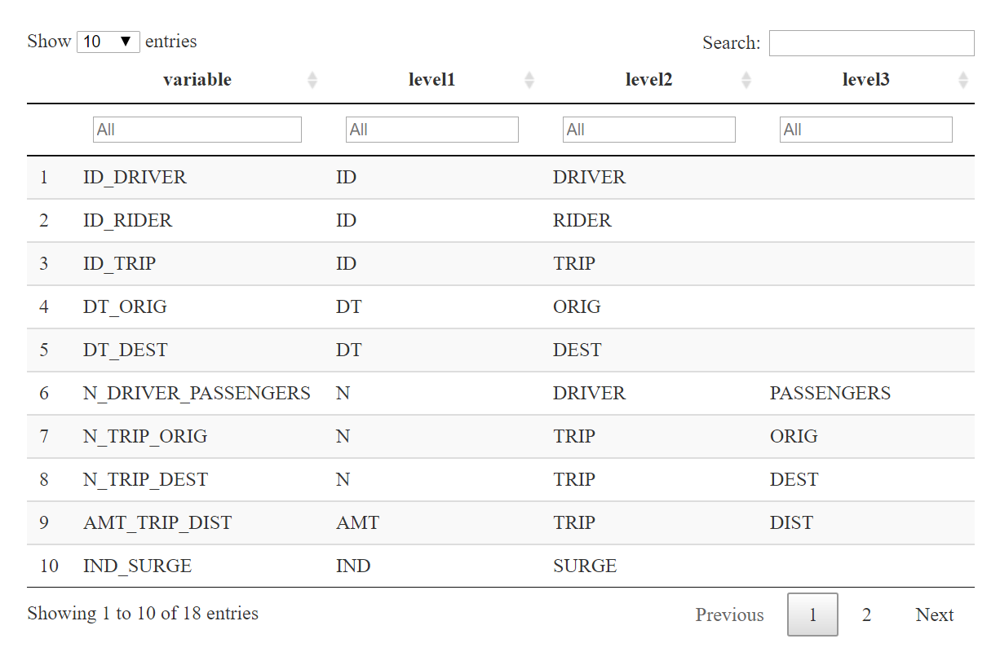

Software products use a range of strategies to make promises or contracts with their users. Mature code packages and APIs document expected inputs and outputs, check adherence with unit tests, and transparently report code coverage. Programs with graphical user interfaces form such contracts by labeling and illustrating interactive components to explain their intent (for example, the "Save" button typically does not bulk-delete files).

Published data tables, however, exist in an ambiguous gray area; static enough not to be considered a "service" or "software", yet too raw to earn the attention to user experience given to interfaces. This ambiguity can create a strange symbiosis between data produces and consumers. Producers may publish whatever data is accessible by the system or seems relevant, and consumers may be quick to assume tables or fields that "sound right" happen to be custom-fit for their top-of-mind question. Producers wonder why consumers aren't satisfied, and consumers wonder why the data is never "right".

Metadata management solutions aim to solve this problem, and there are many promising developments in this space including Lyft's [Amundsen](https://eng.lyft.com/amundsen-lyfts-data-discovery-metadata-engine-62d27254fbb9), LinkedIn's [DataHub](https://engineering.linkedin.com/blog/2019/data-hub), and Netflix's [Metacat](https://netflixtechblog.com/building-and-scaling-data-lineage-at-netflix-to-improve-data-infrastructure-reliability-and-1a52526a7977). However, metadata solutions generally require a great degree of cooperation: producers must vigilantly maintain the documentation and consumers must studiously check it -- despite such tools almost always living outside of either party's core toolkit and workflow.

Using [controlled vocabularies](https://en.wikipedia.org/wiki/Controlled_vocabulary) for column names is a low-tech, low-friction approach to building a shared understanding of how each field in a data set is intended to work. In this post, I'll introduce the concept with an example and demonstrate how controlled vocabularies can offer lightweight solutions to rote data validation, discoverability, and wrangling. I'll illustrate these usability benefits with R packages including `pointblank`, `collapsibleTree`, and `dplyr`, but we'll conclude by demonstrating how the same principles apply to other packages and languages.

Controlled Vocabulary
---------------------

The basic idea of controlled vocabularies is to define upfront a set of words, phrases, or stubs with well-defined meanings which can be used to index information. When these stubs are defined for different types of information and pieces together in a consistent order, the vocabulary becomes of descriptive grammar that we can use to describe more complex content and behavior.

In the context of a data set, this vocabulary can also serve as a latent contract between data producers and data consumers and carry promises regarding different aspects of the data lineage, valid values, and appropriate uses. When used consistently across all of an organization's tables, it can significantly scale data management and increase usability as knowledge from working with one dataset easily transfers to another.

For example, imagine we work at a ride-share company and are building a data table with one record per trip. What might a controlled vocabulary look like?[^1]

**Level 1: Measure Types**

For reasons that will be evident in the examples, I like the first level of the hierarchy to generally capture a semi-generic "type" of the variable. This is not quite the same as data types in a programming language (e.g. `bool`, `double`, `float`) although everything with the same prefix should ultimately be cast in the same type. Instead, these data types imply both a type of information and appropriate usage patterns:

-   `ID`: Unique identified for an entity.
    -   Numeric for more efficient storage and joins unless system of record generates IDs with characters
    -   Likely a primary key in some other table
-   `IND`: Binary 0 or 1 indicator or an event occurence
    -   Because always 0 or 1, can be averaged to find proportion occurence
    -   Can consider calling `IS` instead of `IND` for even less ambiguity which case is labeled 1
-   `N`: Count of quantity or event occurrence
    -   Always a non-negative integer
-   `AMT`: Sum-able real number amount. That is, any non-count amount that is "denominator-free"
-   `VAL`: Numeric variables that are not inherently sum-able
    -   For example, rates and ratios that cannot be combined or numeric values like latitude and longitude for which typical arithmetic operations don't make sense
-   `DT`: Date of some event
    -   Always cast as a `YYYY-MM-DD` date
-   `TM`: Timestamp of some event
    -   Always cast as a `YYYY-MM-DD HH:MM:SS` timestamp
    -   Distinguishing dates from timestamps will avoid faulty joins of two date fields arranged differently
-   `CAT`: Categorical variable as a character string (potentially encoded from an `ID` field)

While these are relatively generic, domain-specific categories can also be used. For example, since location is so important for ride-sharing, it might be worth having `ADDR` as a level 1 category.

**Level 2: Measure Subjects**

The best hierarchy varies widely by industry and the *overall contents of a database* -- not just one table. Here, we expect to be interested in trip-attributed about many different subjects: the rider, driver, trip, etc. so the measure subject might be the logical next tier. We can define:

-   `DRIVER`: Information about the driver
-   `RIDER`: Information about the rider, the passenger who called the ride-share
-   `TRIP`: Information about the trip itself
-   `ORIG`: Information about the trip start (time and geography)
-   `DEST`: Information about the trip destination (time and geography)
-   `COST`: Information about components of the total cost (could be a subset of `TRIP`, but pertains to all parties and has high cardinality at the next tier, so we'll break it out)

Of course, in a highly normalized database, measures of these different entities would exist in separate tables. However, this discipline in naming them would still be beneficial so quantities are unambiguous when an analyst combines them.

**Levels 3-n: Details**

The first few tiers of the hierarchy are critical to standardize to make our "performance promises" and to aid in data searchability. Later levels will be measure specific and may not be worth defining upfront. However, for concepts that are going to exist across many tables, it is worthwhile to pre-specify their names and precise formats. For example:

-   `CITY`: Should this be in all upper case? How should spaces in city name be treated?
-   `ZIP`: Should 6 digit or 10 digit zip codes be used?
-   `LAT`/`LON`: To how many decimals should latitude and longitude be geocoded? If the company only operate in certain geographic areas (e.g. the continental US), coarse cut-offs for these can be determined
-   `DIST`: Is distance measured in miles? Kilometers?
-   `TIME`: Are durations measured in seconds? Minutes?
-   `RATING`: What are valid ranges for other known quantities like star ratings?

Terminal "adjectives" could also be considered. For example, if the data-generating systems spit out analytically unideal quantities that should be preserved for data lineage purposes, suffixes such as `_RAW` and `_CLEAN` might denote version of the same variable in its original and manicured states, respectively.

**Putting it all together**

This structure now gives us a grammar to compactly name 35 variables in table:

-   `ID_{DRIVER | RIDER | TRIP}`: Unique identifier for party of the ride
-   `DT_{ORIG | DEST}`: Date at the trip's start and end, respectively
-   `TM_{ORIG | DEST}`: Timestamp at the trip's start and end, respectively
-   `N_TRIP_{PASSENGERS | ORIG | DEST}` Count of unique passengers, pick-up points, and drop-off points for the trip
-   `N_DRIVER_SEATS`: Count of passenger seats available in the driver's car
-   `AMT_TRIP_{DIST | TIME}`: Total trip distance in miles traveled and time taken
-   `AMT_COST_{TIME | DIST | BASE | FEES | SURGE | TIPS}`: Amount of each cost component
-   `IND_SURGE`: Indicator variable if ride caled during surge pricing
-   `CAT_TRIP_TYPE`: Trip type, such as 'Pool', 'Standard', 'Elite'
-   `CAT_RIDER_TYPE`: Rider status, such as 'Basic', 'Frequent', 'Subscription'
-   `VAL_{DRIVER | RIDER}_RATING`: Average star rating of rider and driver
-   `ADDR_{ORIG | DEST}_{STREET | CITY | STATE | ZIP}`: Address components of trip's start and end
-   `VAL_{ORIG | DEST}_{LAT | LON}`: Latitude and longitude of trip's start and end

The fact that we can describe 35 variables in roughly 1/3 the number of rows already speaks to the value of this structure in helping data consumers build a strong mental model to quickly manipulate the data. But now we can demonstrate far greater value.

To start, we create a small fake data set using our schema. For simplicity, I simulate 18 of the 35 variables listed above:

<pre class='chroma'><code class='language-r' data-lang='r'><a href='https://rdrr.io/r/utils/head.html'>head</a>(data_trips)
#&gt;   ID_DRIVER ID_RIDER ID_TRIP    DT_ORIG    DT_DEST N_DRIVER_PASSENGERS
#&gt; 1      8731     8090    7532 2019-12-30 2019-12-30                   2
#&gt; 2      9433     8253    1096 2019-04-25 2019-04-25                   2
#&gt; 3      1360     1889    1287 2019-10-30 2019-10-30                   2
#&gt; 4      3513     3341    8074 2019-12-18 2019-12-18                   1
#&gt; 5      9492     8452    5474 2019-05-21 2019-05-21                   2
#&gt; 6      4612     4953    4923 2019-09-16 2019-09-16                   2
#&gt;   N_TRIP_ORIG N_TRIP_DEST AMT_TRIP_DIST IND_SURGE VAL_DRIVER_RATING
#&gt; 1           1           1      44.29443         1          4.294246
#&gt; 2           1           1      46.48727         0          3.506867
#&gt; 3           1           1      27.26462         0          3.107075
#&gt; 4           1           1      24.33683         0          4.738209
#&gt; 5           1           1      34.14240         0          2.702380
#&gt; 6           1           1      40.32285         1          4.458878
#&gt;   VAL_RIDER_RATING VAL_ORIG_LAT VAL_DEST_LAT VAL_ORIG_LON VAL_DEST_LON
#&gt; 1         2.659883     40.90792     40.45962    110.00604    107.36030
#&gt; 2         3.901828     41.39110     40.93268    111.88002    117.49940
#&gt; 3         4.120607     40.43550     40.36837     97.30581    104.01129
#&gt; 4         4.376985     41.38009     41.32140     90.49517    119.04464
#&gt; 5         2.344266     40.09413     41.54466     70.18628     98.42380
#&gt; 6         3.500147     40.84545     41.81863     89.26682     93.30287
#&gt;   CAT_TRIP_TYPE CAT_RIDER_TYPE
#&gt; 1         Elite       Frequent
#&gt; 2      Standard       Frequent
#&gt; 3          Pool          Basic
#&gt; 4      Standard       Frequent
#&gt; 5         Elite          Basic
#&gt; 6          Pool   Subscription</code></pre>

Data Validation
---------------

The "promises" in variable names aren't just there for decoration. They can actually help producers publish higher quality data my helping to automate data validation checks. Data quality is context-specific and requires effort on the consumer side, but setting up safeguards in any data pipeline can help detect and eliminate commonplace errors like duplicated or corrupt data.

Of course, setting up data validation pipelines isn't the most exciting part of any data engineer's job. But that's where R's `pointblank` package comes to the rescue with an excellent domain-specific language for common assertive data checks. Combining this syntax with `dplyr`'s "select helpers" (such as [`starts_with()`](https://tidyselect.r-lib.org/reference/starts_with.html)), the same validation pipeline could ensure many of the data's promises are kept with no additional overhead. For example, `N_` columns should be strictly non-negative and `IND_` columns should always be either 0 or 1.

The following example demonstrate the R syntax to write such a pipeline in `pointblank`, but the package also allows rules to be specified in a standalone YAML file which could further increase portability between projects.

<pre class='chroma'><code class='language-r' data-lang='r'>agent &lt;-
  data_trips %&gt;%
  create_agent(actions = action_levels(stop_at = 0.001)) %&gt;%
  col_vals_gte(starts_with("N"), 0) %&gt;%
  col_vals_gte(starts_with("N"), 0) %&gt;%
  col_vals_not_null(starts_with("IND")) %&gt;%
  col_vals_in_set(starts_with("IND"), <a href='https://rdrr.io/r/base/c.html'>c</a>(0,1)) %&gt;%
  col_is_date(starts_with("DT")) %&gt;%
  col_vals_between(matches("_LAT(_|$)"), 19, 65) %&gt;%
  col_vals_between(matches("_LON(_|$)"), -162, -68) %&gt;%
  interrogate()</code></pre>

 In the example above, just 7 lines of portable table-agnostic code end up creating 14 data validation checks. The results catch two errors. Upon investigation[^2], we find that our geocoder is incorrectly flipping the sign on longitude!

One could also imagine writing a linter or validator of the variables names themselves to check for typos, outliers that don't follow common stubs, etc.

Data Discoverability
--------------------

On the user side, a controlled vocabulary makes new data easier to explore. Although is is not and should not be a replacement for a true data dictionary, imagine how relatively easy it is to understand the following variables' intent and navigate either a searchable tab of visualization of the output.

To make some accessible outputs, we can first wrangle the column names into a table of their own.

<pre class='chroma'><code class='language-r' data-lang='r'>cols_trips &lt;- <a href='https://rdrr.io/r/base/names.html'>names</a>(data_trips)
cols_trips_split &lt;- <a href='https://rdrr.io/r/base/strsplit.html'>strsplit</a>(cols_trips, split = "_")
cols_components &lt;- <a href='https://rdrr.io/r/base/data.frame.html'>data.frame</a>(
  variable = cols_trips,
  level1 = <a href='https://rdrr.io/r/base/lapply.html'>vapply</a>(cols_trips_split, FUN = function(x) x[1], FUN.VALUE = <a href='https://rdrr.io/r/base/character.html'>character</a>(1)),
  level2 = <a href='https://rdrr.io/r/base/lapply.html'>vapply</a>(cols_trips_split, FUN = function(x) x[2], FUN.VALUE = <a href='https://rdrr.io/r/base/character.html'>character</a>(1)),
  level3 = <a href='https://rdrr.io/r/base/lapply.html'>vapply</a>(cols_trips_split, FUN = function(x) x[3], FUN.VALUE = <a href='https://rdrr.io/r/base/character.html'>character</a>(1))
)
<a href='https://rdrr.io/r/utils/head.html'>head</a>(cols_components)
#&gt;              variable level1 level2     level3
#&gt; 1           ID_DRIVER     ID DRIVER       &lt;NA&gt;
#&gt; 2            ID_RIDER     ID  RIDER       &lt;NA&gt;
#&gt; 3             ID_TRIP     ID   TRIP       &lt;NA&gt;
#&gt; 4             DT_ORIG     DT   ORIG       &lt;NA&gt;
#&gt; 5             DT_DEST     DT   DEST       &lt;NA&gt;
#&gt; 6 N_DRIVER_PASSENGERS      N DRIVER PASSENGERS</code></pre>

Part of the metadata, then, could make it particularly easy to search by various stubs -- whether that be the measure type (e.g. `N` or `AMT`) or the measure subject (e.g. `RIDER` or `DRIVER`).^\[DT output with searchable columns[^3]

<pre class='chroma'><code class='language-r' data-lang='r'><a href='https://rdrr.io/r/base/library.html'>library</a>(<a href='https://github.com/rstudio/DT'>DT</a>)
<a href='https://rdrr.io/pkg/DT/man/datatable.html'>datatable</a>(cols_components,  filter = <a href='https://rdrr.io/r/base/list.html'>list</a>(position = 'top', clear = FALSE))</code></pre>

Similarly, we can use visualization to both validate and explore the available fields. Below, data fields are illustrated in a tree.

<pre class='chroma'><code class='language-r' data-lang='r'><a href='https://rdrr.io/r/base/library.html'>library</a>(<a href='https://github.com/AdeelK93/collapsibleTree'>collapsibleTree</a>)
<a href='https://rdrr.io/pkg/collapsibleTree/man/collapsibleTree.html'>collapsibleTree</a>(cols_components, 
                hierarchy = <a href='https://rdrr.io/r/base/paste.html'>paste0</a>("level", 1:3),
                nodeSize = "leafCount"
                )
<!--html_preserve-->

<!--/html_preserve--></code></pre>

Depending on the type of exploraion being done, it might be more convenient to drilldown first by measure subject. `collapsibleTree` flexibly lets us control this by specifying the `hierarchy`.

<pre class='chroma'><code class='language-r' data-lang='r'><a href='https://rdrr.io/pkg/collapsibleTree/man/collapsibleTree.html'>collapsibleTree</a>(cols_components, 
                hierarchy = <a href='https://rdrr.io/r/base/paste.html'>paste0</a>("level", <a href='https://rdrr.io/r/base/c.html'>c</a>(2,1,3)),
                nodeSize = "leafCount"
                )
<!--html_preserve-->

<!--/html_preserve--></code></pre>

These naming conventions are particularly friendly to a "passive search" via an IDE with autocomplete functionality. Simply typing "`N_`" and pausing or hitting tab might elicit a list of potential options of count variables in the data set.

More broadly, driving this standardization opens up interesting possibility for variable-first documentation. As our grammar for describing fields becomes richer and less ambiguous, it's increasingly possible for users to explore a variable-first web of quantities and work their way back to the appropriate tables which contain them.

Data Wrangling
--------------

Controlled, hierarchical vocabularies also make basic data wrangling pipelines a breeze. By programming on the column names, we can appropriately summarize multiple pieces of data in the most relevant way.

For example, the following code uses `dplyr`'s "select helpers" to sum up count variables where we might reasonably be interested in the total and find the arithmetic average of indicator variables to help us calculate the proportion of occurrences of an event (here, the incidence of surge pricing).

Note what our controlled vocabulary and the implied "contracts" have given us. We aren't summing up fields like latitude and longitude which would have no inherent meaning. Conversely, we can confidently calculate proportions which we couldn't do if there was a chance our indicator variable contained nulls or occasionally used other numbers (e.g. `2`) to denote something like the surge severity instead of pure incidence.

<pre class='chroma'><code class='language-r' data-lang='r'><a href='https://rdrr.io/r/base/library.html'>library</a>(<a href='https://dplyr.tidyverse.org'>dplyr</a>)

data_trips %&gt;%
  <a href='https://dplyr.tidyverse.org/reference/group_by.html'>group_by</a>(CAT_RIDER_TYPE) %&gt;%
  <a href='https://dplyr.tidyverse.org/reference/summarise.html'>summarize</a>(
    <a href='https://dplyr.tidyverse.org/reference/across.html'>across</a>(<a href='https://tidyselect.r-lib.org/reference/starts_with.html'>starts_with</a>("N_"), sum),
    <a href='https://dplyr.tidyverse.org/reference/across.html'>across</a>(<a href='https://tidyselect.r-lib.org/reference/starts_with.html'>starts_with</a>("IND_"), mean)
  )
#&gt; # A tibble: 3 x 5
#&gt;   CAT_RIDER_TYPE N_DRIVER_PASSENGERS N_TRIP_ORIG N_TRIP_DEST IND_SURGE
#&gt;   &lt;chr&gt;                        &lt;int&gt;       &lt;dbl&gt;       &lt;dbl&gt;     &lt;dbl&gt;
#&gt; 1 Basic                           42          27          27     0.519
#&gt; 2 Frequent                        57          37          37     0.432
#&gt; 3 Subscription                    54          36          36     0.417</code></pre>

Addendum on Other Languages
---------------------------

The above examples use a few specific R packages with helpers that specifically operate on column names. However, the value of this approach is language agnostic since most popular languages for data manipulation support character pattern matching and wrangling operations specified by lists of variable names. We will conclude with a few examples.

### Generating SQL

Although SQL is a hard language to "program on", many programming-friendly tools offer SQL generators. For example, using `dbplyr`, we can use R to generate SQL code that sums up all of our count variables by rider type without having to type them out manually.

<pre class='chroma'><code class='language-r' data-lang='r'><a href='https://rdrr.io/r/base/library.html'>library</a>(<a href='https://dbplyr.tidyverse.org'>dbplyr</a>)

df_mem &lt;- <a href='https://dbplyr.tidyverse.org/reference/memdb_frame.html'>memdb_frame</a>(data_trips, .name = "example_table")

df_mem %&gt;%
  <a href='https://dplyr.tidyverse.org/reference/group_by.html'>group_by</a>(CAT_RIDER_TYPE) %&gt;%
  <a href='https://dplyr.tidyverse.org/reference/summarise_all.html'>summarize_at</a>(<a href='https://dplyr.tidyverse.org/reference/vars.html'>vars</a>(<a href='https://tidyselect.r-lib.org/reference/starts_with.html'>starts_with</a>("N_")), sum, na.rm = TRUE) %&gt;%
  <a href='https://dplyr.tidyverse.org/reference/explain.html'>show_query</a>()
#&gt; &lt;SQL&gt;
#&gt; SELECT `CAT_RIDER_TYPE`, SUM(`N_DRIVER_PASSENGERS`) AS `N_DRIVER_PASSENGERS`, SUM(`N_TRIP_ORIG`) AS `N_TRIP_ORIG`, SUM(`N_TRIP_DEST`) AS `N_TRIP_DEST`
#&gt; FROM `example_table`
#&gt; GROUP BY `CAT_RIDER_TYPE`</code></pre>

### R - `base` & `data.table`

However, we aren't of course limited just to `tidyverse` style coding. Similarly concise workflows exists in both `base` and `data.table` syntaxes. Suppose we wanted to summarize all numeric variables. First, we can use [`base::grep`](https://rdrr.io/r/base/grep.html) to find all column names that begin with `N_`.

<pre class='chroma'><code class='language-r' data-lang='r'>cols_n &lt;- <a href='https://rdrr.io/r/base/grep.html'>grep</a>("^N_", <a href='https://rdrr.io/r/base/names.html'>names</a>(data_trips), value = TRUE)
<a href='https://rdrr.io/r/base/print.html'>print</a>(cols_n)
#&gt; [1] "N_DRIVER_PASSENGERS" "N_TRIP_ORIG"         "N_TRIP_DEST"</code></pre>

We can define the variables we want to group by in another vector.

<pre class='chroma'><code class='language-r' data-lang='r'>cols_grp &lt;- <a href='https://rdrr.io/r/base/c.html'>c</a>("CAT_RIDER_TYPE")</code></pre>

These vectors can be used in aggregation operations such as [`stats::aggregate`](https://rdrr.io/r/stats/aggregate.html):

<pre class='chroma'><code class='language-r' data-lang='r'><a href='https://rdrr.io/r/stats/aggregate.html'>aggregate</a>(data_trips[cols_n], by = data_trips[cols_grp], FUN = sum)
#&gt;   CAT_RIDER_TYPE N_DRIVER_PASSENGERS N_TRIP_ORIG N_TRIP_DEST
#&gt; 1          Basic                  42          27          27
#&gt; 2       Frequent                  57          37          37
#&gt; 3   Subscription                  54          36          36</code></pre>

Or with `data.table` syntax:

<pre class='chroma'><code class='language-r' data-lang='r'><a href='https://rdrr.io/r/base/library.html'>library</a>(<a href='http://r-datatable.com'>data.table</a>)
dt &lt;- <a href='https://Rdatatable.gitlab.io/data.table/reference/as.data.table.html'>as.data.table</a>(data_trips)
dt[, <a href='https://rdrr.io/r/base/lapply.html'>lapply</a>(.SD, sum), by = cols_grp, .SDcols = cols_n]
#&gt;    CAT_RIDER_TYPE N_DRIVER_PASSENGERS N_TRIP_ORIG N_TRIP_DEST
#&gt; 1:       Frequent                  57          37          37
#&gt; 2:          Basic                  42          27          27
#&gt; 3:   Subscription                  54          36          36</code></pre>

### python `pandas`

Similarly, we can use list comprehensions in python to create a list of columns names matching a specific pattern (`cols_n`). This list and a list to define grouping variables can be passed to `pandas`'s data manipulation methods.

<pre class='chroma'><code class='language-r' data-lang='r'>import pandas as pd
cols_n   = [vbl for vbl in data_trips.columns if vbl[0:2] == 'N_']
cols_grp = ["CAT_RIDER_TYPE"]
data_trips.groupby(cols_grp)[cols_n].sum()

#>                 N_DRIVER_PASSENGERS  N_TRIP_ORIG  N_TRIP_DEST
#> CAT_RIDER_TYPE                                               
#> Basic                            42         27.0         27.0
#> Frequent                         57         37.0         37.0
#> Subscription                     54         36.0         36.0
</code></pre>

[^1]: Again, vocabularies should span a database -- not just an individual dataset, but for simplicity we just talk through a smaller example.

[^2]: the output of `pointblank` is actually an interactive table. For blog-specific reasons, I show only the `png` here.

[^3]: As with `pointblank`, `DT` output is interactive, but my blog unfortunately reacts poorly to the extra JavaScript so for now I'm only showing an image

