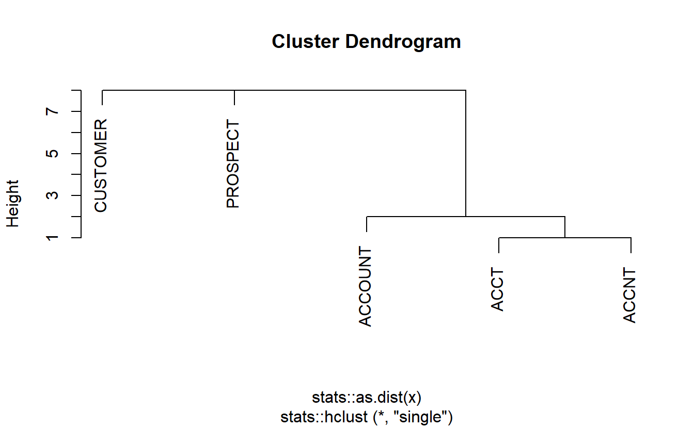

Back in September, I wrote about how [controlled vocabularies](/post/column-name-contracts) can help form contracts between data producers and consumers. In short, I argued that aligning on an ontology of stub names for use naming variables in a dataset can improve data documentation, validation, and wrangling with minimal overhead.

However, all of these benefits assume *absolute consistency* in the use of the controlled vocabulary. As soon as typos creep into variable names or fields violate the supposed data validation checks that their stubs promise, these vocabularies become more of a liability than an asset by luring data consumers into complacency.

I'm pleased to announced the experimental [`convo`](https://emilyriederer.github.io/convo/index.html) package to enable the definition and application of controlled vocabularies. In this post, I briefly describe the key features. Please see the package website for full documentation.

<pre class='chroma'><code class='language-r' data-lang='r'><a href='https://rdrr.io/r/base/library.html'>library</a>(<a href='https://github.com/emilyriederer/convo'>convo</a>)
</code></pre>

Defining your vocabulary
------------------------

`convo` uses a YAML specification to define controlled vocabularies. Stubs are defined at each level which can optionally take on additional fields such as `desc` (a human-readable description), `valid` (which specifies `pointblank`-style data validation checks), and `rename` (which specifies how variable names should change under certain computations).

<pre class='chroma'><code class='language-r' data-lang='r'>filepath &lt;- <a href='https://rdrr.io/r/base/system.file.html'>system.file</a>("", "ex-convo.yml", package = "convo")
<a href='https://rdrr.io/r/base/cat.html'>cat</a>(<a href='https://rdrr.io/r/base/readLines.html'>readLines</a>(filepath), sep = "\n")

#&gt; level1:
#&gt;   ID:
#&gt;     desc: Unique identifier
#&gt;     valid:
#&gt;       - col_vals_not_null()
#&gt;       - col_is_numeric()
#&gt;       - col_vals_between(1000, 99999)
#&gt;   IND:
#&gt;     desc: Binary indicator
#&gt;     valid:
#&gt;       - col_is_numeric()
#&gt;       - col_vals_in_set(c(0,1))
#&gt;     rename:
#&gt;       - when: SUM
#&gt;         then: 'N'
#&gt;       - when: AVG
#&gt;         then: P
#&gt;   AMT:
#&gt;     desc: Non-negative, summable quantity
#&gt;     valid:
#&gt;       - col_is_numeric()
#&gt;       - col_vals_gte(0)
#&gt;   VAL:
#&gt;     desc: Value
#&gt;     valid:
#&gt;       - col_is_numeric()
#&gt;     rename:
#&gt;       - when: AVG
#&gt;         then: VALAV
#&gt;   CAT:
#&gt;     desc: Category
#&gt;     valid:
#&gt;       - col_is_character()
#&gt;   CD:
#&gt;     desc: System-generated code
#&gt;     valid:
#&gt;       - col_is_character()
#&gt;   DT:
#&gt;     desc: Calendar date in YYYY-MM-DD format
#&gt;     valid:
#&gt;       - col_is_date()
#&gt; level2:
#&gt;   A:
#&gt;     desc: Type A
#&gt;   C:
#&gt;     desc: Type C
#&gt;   D:
#&gt;     desc: Type D
#&gt; level3:
#&gt;   "\\d{4}": []
</code></pre>

We can read this into R and retrieve a brief summary. Note that in this case the third-level stub allows for a regular expression to be used.

<pre class='chroma'><code class='language-r' data-lang='r'>convo &lt;- <a href='https://rdrr.io/pkg/convo/man/read_convo.html'>read_convo</a>(filepath)
<a href='https://rdrr.io/r/base/print.html'>print</a>(convo)

#&gt; Level 1
#&gt; - ID
#&gt; - IND
#&gt; - AMT
#&gt; - VAL
#&gt; - CAT
#&gt; - CD
#&gt; - DT
#&gt; Level 2
#&gt; - A
#&gt; - C
#&gt; - D
#&gt; Level 3
#&gt; - \d{4}
</code></pre>

Alternatively, you may define a `convo` as a simple R list object (as shown when `bad_convo` is defined in the following two examples.)

Assessing vocabulary quality
----------------------------

Good features of a vocabulary stubs include *monosemy* (having only one meaning) and *unique* (being the only thing to mean that thing). Functions [`pivot_convo()`](https://rdrr.io/pkg/convo/man/pivot_convo.html) and [`cluster_convo()`](https://rdrr.io/pkg/convo/man/cluster_convo.html) help us spot deviations from these two properties. To illustrate these functions, I'll use a different `convo` than above since that one exhibits both monosemy and uniqueness already.

[`pivot_convo()`](https://rdrr.io/pkg/convo/man/pivot_convo.html) allows us to obtain all of the level indices at which each stub appears. When the `repeats_only` argument is set to the default value `TRUE`, this function only returns stubs that exist at multiple levels, thus violating monsemy. For example, this function could help us realize that we had used the stub "CAT" to refer both to a categorical variable and an animal.

<pre class='chroma'><code class='language-r' data-lang='r'>bad_convo &lt;- <a href='https://rdrr.io/r/base/list.html'>list</a>(<a href='https://rdrr.io/r/base/c.html'>c</a>("IND", "AMT", "CAT"), <a href='https://rdrr.io/r/base/c.html'>c</a>("DOG", "CAT"))
<a href='https://rdrr.io/pkg/convo/man/pivot_convo.html'>pivot_convo</a>(bad_convo)

#&gt; $CAT
#&gt; [1] 1 2
</code></pre>

Similarly, [`cluster_convo()`](https://rdrr.io/pkg/convo/man/cluster_convo.html) attempts to catch errors in uniqueness by clustering stubs based on string similarity. This can highlight similar but distinct stubs, which might arise when a common word or concept is abbreviated in different ways. In the following example, "ACCOUNT", "ACCT", and "ACCNT" are closely clustered in the second level, which might help us realize that all three are intended to represent a customer's account.

<pre class='chroma'><code class='language-r' data-lang='r'>bad_convo &lt;- <a href='https://rdrr.io/r/base/list.html'>list</a>(<a href='https://rdrr.io/r/base/c.html'>c</a>("IND", "IS", "AMT", "AMOUNT", "CAT", "CD"),
              <a href='https://rdrr.io/r/base/c.html'>c</a>("ACCOUNT", "ACCT", "ACCNT", "PROSPECT", "CUSTOMER"))
clusts &lt;- <a href='https://rdrr.io/pkg/convo/man/cluster_convo.html'>cluster_convo</a>(bad_convo)
<a href='https://rdrr.io/r/graphics/plot.default.html'>plot</a>(clusts[[2]])

</code></pre>

Evaluating variable names
-------------------------

Having defined a `convo`, we can next use it to evaluate variable names. The [`evaluate_convo()`](https://rdrr.io/pkg/convo/man/evaluate_convo.html) function accepts a `convo` object and a set of names in a vector. It returns any variable names that violate the controlled vocabulary, listed at the specific level in which the violation occurs.

<pre class='chroma'><code class='language-r' data-lang='r'>col_names &lt;- <a href='https://rdrr.io/r/base/c.html'>c</a>("ID_A", "IND_A", "XYZ_D", "AMT_B", "AMT_Q", "ID_A_1234", "ID_A_12")
<a href='https://rdrr.io/pkg/convo/man/evaluate_convo.html'>evaluate_convo</a>(convo, col_names, sep = "_")

#&gt; Level 1
#&gt; - XYZ_D
#&gt; Level 2
#&gt; - AMT_B
#&gt; - AMT_Q
#&gt; Level 3
#&gt; - ID_A_12
</code></pre>

If a large number of violations occur, it might be more useful to directly retrieve all of the stubs existing in variable names that are not part of the `convo`. To do this, we can use set operators available in the [`compare_convo()`](https://rdrr.io/pkg/convo/man/compare_convo.html) function to examing the unions, intersections, and set differences between our controlled vocabulary and our variable names. Doing so might inspire new candidate stubs that ought to be included in our controlled vocabulary.

<pre class='chroma'><code class='language-r' data-lang='r'>convo_colnames &lt;- <a href='https://rdrr.io/pkg/convo/man/parse_stubs.html'>parse_stubs</a>(col_names)
<a href='https://rdrr.io/pkg/convo/man/compare_convo.html'>compare_convo</a>(convo_colnames, convo, fx = "setdiff")

#&gt; Level 1
#&gt; - XYZ
#&gt; Level 2
#&gt; - B
#&gt; - Q
#&gt; Level 3
#&gt; - 12
</code></pre>

If desired, newly uncovered stubs can be added to the `convo` object in R with the [`add_convo_stub()`](https://rdrr.io/pkg/convo/man/add_convo_stub.html) function:

<pre class='chroma'><code class='language-r' data-lang='r'>convo2 &lt;- <a href='https://rdrr.io/pkg/convo/man/add_convo_stub.html'>add_convo_stub</a>(convo, level = 2, stub = "B", desc = "Type B")
convo2 

#&gt; Level 1
#&gt; - ID
#&gt; - IND
#&gt; - AMT
#&gt; - VAL
#&gt; - CAT
#&gt; - CD
#&gt; - DT
#&gt; Level 2
#&gt; - A
#&gt; - C
#&gt; - D
#&gt; - B
#&gt; Level 3
#&gt; - \d{4}
</code></pre>

Currently, there is not support for editing the YAML specification via R function. New stubs would need to be added manually. However, a completely new YAML file can be created with the [`write_convo()`](https://rdrr.io/pkg/convo/man/write_convo.html) function. This is particularly useful if you are creating a controlled vocabulary for the first time based on an existing set of variables names. First, you may parse them with [`parse_stubs()`](https://rdrr.io/pkg/convo/man/parse_stubs.html) to create a minimal controlled vocabulary (stubs without descriptions, validation checks, etc.) and then you may write this to a draft YAML file for further customization.

Validating data fields fields
-----------------------------

The validation checks specified with `pointblank` verbs in your YAML file can be used to create either a `pointblank` agent or a `pointblank` [YAML file](https://rich-iannone.github.io/pointblank/reference/yaml_read_agent.html) which can be used to consistently apply all of the promised data checks.

The `pointblank` YAML file may be created with the [`write_pb()`](https://rdrr.io/pkg/convo/man/write_pb.html):

<pre class='chroma'><code class='language-r' data-lang='r'><a href='https://rdrr.io/pkg/convo/man/write_pb.html'>write_pb</a>(convo, <a href='https://rdrr.io/r/base/c.html'>c</a>("IND_A", "AMT_B"), filename = "convo-validation.yml")
</code></pre>

<pre class='chroma'><code class='language-r' data-lang='r'><a href='https://rdrr.io/r/base/cat.html'>cat</a>(<a href='https://rdrr.io/r/base/readLines.html'>readLines</a>("convo-validation.yml"), sep = "\n")

#&gt; read_fn: ~setNames(as.data.frame(matrix(1, ncol = 2)), c("IND_A", "AMT_B"))
#&gt; tbl_name: .na.character
#&gt; label: '[2021-01-17|12:45:17]'
#&gt; locale: en
#&gt; steps:
#&gt; - col_is_numeric:
#&gt;     columns: vars(IND_A)
#&gt; - col_vals_in_set:
#&gt;     columns: vars(IND_A)
#&gt;     set:
#&gt;     - 0.0
#&gt;     - 1.0
#&gt; - col_is_numeric:
#&gt;     columns: vars(AMT_B)
#&gt; - col_vals_gte:
#&gt;     columns: vars(AMT_B)
#&gt;     value: 0.0
</code></pre>

Alternatively, a validation agent can be created directly with [`create_pb_agent()`](https://rdrr.io/pkg/convo/man/create_pb_agent.html):

<pre class='chroma'><code class='language-r' data-lang='r'>data_to_validate &lt;- <a href='https://rdrr.io/r/base/data.frame.html'>data.frame</a>(IND_A = 1, IND_B = 5, DT_B = <a href='https://rdrr.io/r/base/as.Date.html'>as.Date</a>("2020-01-01"))
agent &lt;- <a href='https://rdrr.io/pkg/convo/man/create_pb_agent.html'>create_pb_agent</a>(convo, data_to_validate)
pointblank::<a href='https://rdrr.io/pkg/pointblank/man/interrogate.html'>interrogate</a>(agent)
</code></pre>

Document fiels and vocabularies
-------------------------------

`convo` also offers preliminary support for documentation.

Basic data dictionaries may be created with [`describe_names()`](https://rdrr.io/pkg/convo/man/describe_names.html) which attempts to create definitions for fields based on a user-provided glue string and YAML-specified stub definitions.

<pre class='chroma'><code class='language-r' data-lang='r'>vars &lt;- <a href='https://rdrr.io/r/base/c.html'>c</a>("AMT_A_2019", "IND_C_2020")
desc_df &lt;- <a href='https://rdrr.io/pkg/convo/man/describe_names.html'>describe_names</a>(vars, convo, desc_str = "{level1} of {level2} in given year")
DT::<a href='https://rdrr.io/pkg/DT/man/datatable.html'>datatable</a>(desc_df)
</code></pre>

Alternatively, the entire controlled vocabulary may be put into a dictionary.

<pre class='chroma'><code class='language-r' data-lang='r'>desc_df &lt;- <a href='https://rdrr.io/pkg/convo/man/describe_convo.html'>describe_convo</a>(convo, include_valid = TRUE, for_DT = TRUE)
DT::<a href='https://rdrr.io/pkg/DT/man/datatable.html'>datatable</a>(desc_df, escape = FALSE)
</code></pre>

(The tables actually look much nicer when displayed with the full power of `DT`, which also allows for interactive filtering and sorting. Unfortunately, the Javascript behind DT causes a weird conflict with my static site generator weird interactions with my blog theme, so I just show screenshots here.)

Open issues
-----------

`convo` is still very experimental and there are many open questions. Currently, I'm debating many aspects of `convo` specification including:

-   What other formats should be allowed for defining a controlled vocabulary? Should there be a spreadsheet/CSV-based format? More support for constructing the object in R directly?
-   Currently, the separators between levels are specified in the function calls.
    -   Should this be part of the `convo` object instead?
    -   Should there be support for varying selectors at different levels (e.g. this would generalize better to using `convo` to validate file names with [`/`](https://rdrr.io/r/base/Arithmetic.html) delimiting directories and subdirectories and `_` or [`-`](https://rdrr.io/r/base/Arithmetic.html) used in parts of file names)
-   `convo` assumes prefix-based schemes with names start and "grow" from the beginning. Should suffix-based scheme be supported?
    -   One on hand, this provides significantly more flexibility
    -   On the other hand, I do strongly believe there are advantages to prefixed-based names (e.g. autocomplete, related concepts clustering when sorted) and any additional flexibility will make the initial specification increasingly gnarly for users
-   Should specification allow truly hierarchical naming structures where allowed stubs at level `n+1` vary by the stub at level `n`?
-   Should it be possible to mark some levels are required? Currently, no levels may be "skipped" but if five levels are specified, the software permits derived names of lengths fewer or greater than 5 (so long as any existing levels 1-5 follow the format)
-   Would it be useful to be able to programmatically edit the YAML file specification within R? What is the use case for this?
-   Currently, the `describe` function family is rather primitive. I hope to make this more aesthetic or integrate more deeply with `pointblank`

If you are interested, please take the package for a spin and do not hesitate to get in touch about these issues or any other ideas you have! Seeing more use cases beyond my own helps me understand which of these ideas add value versus unneccesary bloat and confusion.

