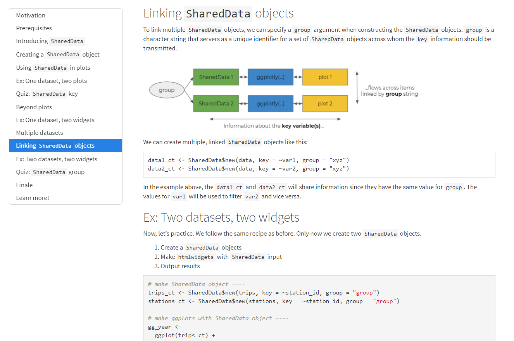
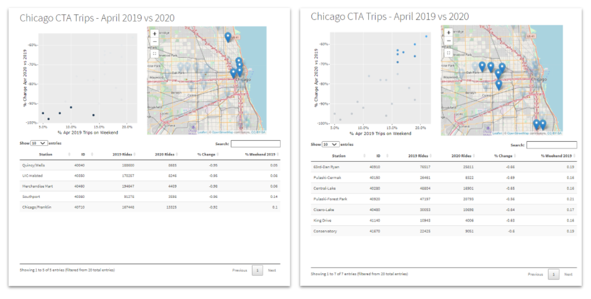

```{r setup, include=FALSE}
knitr::opts_chunk$set(echo = FALSE, warning = FALSE, message = FALSE, error = FALSE, out.width = "100%")
```

This week, I was pleased to become an official [RStudio Certified Instructor](https://education.rstudio.com/trainers) after completing Greg Wilson's training program, based on his excellent book [Teaching Tech Together](http://teachtogether.tech/). Part of the certification process involved teaching a 10 minute lesson. I chose to create a brief introduction to using the `crosstalk` package for dynamic interaction and filtering of plots, maps, and tables.

The primary intent of this post is simply to point out these materials, which are available on [GitHub](https://github.com/emilyriederer/demo-crosstalk). The lesson teaches the skills needed to create an three-panel application like [this](https://emilyriederer.github.io/demo-crosstalk/analysis/demo.html) (as shown in the screnshot above) with a scatterplot, map, and table comparing ridership at a sample of Chicago train stations in April of 2019 versus 2020 (not long after COVID shutdowns). 

To make this more accessible, I converted to previous "lecture" component into a [step-by-step tutorial](https://emilyriederer.github.io/demo-crosstalk/tutorial/tutorial-rmd.html) hosted on the repo's GitHub Pages.^[Initially, I was going to republish the post in it's entirety, but be warned: `hugodown`, which I currently use to render `Rmd` to `md`, has [known issues](https://github.com/r-lib/hugodown/issues/36) with including output from `htmlwidgets` R packages (such as `leaflet` and `DT`) in the Hugo Academic theme that I use. This is not a problem when rendering to normal `rmarkdown::html_output` or apparently [when using `blogdown`](https://github.com/rstudio/blogdown/issues/7). ]



Not convinced? Let me tell you just a bit more about `crosstalk`.

`crosstalk` is, in my opinion, an exciting and underutilized tool for interactive graphics. Shiny is the R world's go-to tool for creating interactive applications. However, Shiny has a higher learning curve and can be difficult to share with non-R users because it must be deployed on a server. `crosstalk`, on the other hand, requires minimal additional syntax and enables browser-based interactions which can be shared in a typical HTML R Markdown output.  

This convenience comes at the cost of the feature set. `crosstalk` can handle interactive *filtering* and *highlighting* across multiple plots, maps, and tables to feature the same data subsets. However, unlike Shiny, t cannot do operations that would require R to recompute the data (for example, aggregation or refitting a model). Arguably, this limitation can also be a strength of `crosstalk`; since interaction is limited, the onus still lies firmly on the analyst to find a clear story and think carefully about which relationships to highlight.

Let's look at an example.



The screenshots above demonstrate the types of exploration that can be done with `crosstalk`'s dynamic filtering. In the overall scatterplot (above), we see a positive correlation between a higher proportion of weekend (versus weekend) trips in 2019 and lower declines in ridership from 2019 to 2020. This makes sense since business areas have lower weekend travel and would also be more affected by "stay at home" orders. We can use `crosstalk` to confirm this theory. Highlight the stations with the greatest decline in trips (left), Chicagoans could quickly recognize the mapped stations to be in the Chicago Loop, the heart of the business district. Conversely, those with the greatest weekend travel and lowest ride decline tend to be located in more residential areas on the west and south sides. (This is, of course, a rather simplistic outcome. I simply use this example to illustrate how the different pieces come together; not to draw any particular conclusion.) You can recreate these exact views in the [demo](https://emilyriederer.github.io/demo-crosstalk/analysis/demo.html), as linked above.

If [this tutorial](https://emilyriederer.github.io/demo-crosstalk/tutorial/tutorial-rmd.html) peaks your curiosity, check our package developer Carson Sievert's book [Interactive web-based data visualization with R, plotly, and shiny](https://plotly-r.com/index.html) from CRC Press for more information and advanced features.

