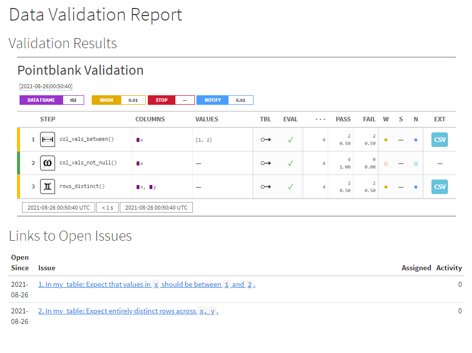

Data quality monitoring is an essential part of any data analysis or business intelligence workflow. As such, an increasing number of promising tools[^1] have emerged as part of the [Modern Data Stack](https://moderndatastack.xyz/) to offer better orchestration, testing, and reporting.

Although I'm very excited about the developments in this space, I realize that emerging products may not be the best fit for every organization. Enterprise tools can be financial costly, and, more broadly, even free and open-source offerings bring costs in the time and risks associated with vetting tools for security, training associates, and committing to potential lock-in of building workflows around these tools. Additionally, data end-users may not always have the ability to get far enough "upstream" in the production process of their data to make these tools make sense.

"Right-sizing" technology to the problem at hand is a critical task. A "best" solution with the most polished, professional, exciting product isn't always the best *fit* for your needs. Trade-offs must be made between feature completeness and fit-for-purpose. In other words, sometimes its more important for technology to be *"good enough"*.[^2]

Additionally, in an embarassment of riches of developer tools, sometimes the number of tools (no matter how good) we have to work with can become a burden. Personally, I like to leverage a core set of tools like Slack and GitHub for as many of their strengths when possible instead of allowing a creep of many different project-specific communication and project management tools.

With all of that in mind, in this post I explore a lightweight approach to a data quality workflow using a minimal set of tools that are likely already part of many team's data stacks: R, GitHub, and Slack. This approach may be far from perfect, but I believe it provides a lot of "bang for the buck" by enabling scheduling data quality monitoring, instantaneous alerting, and workflow management at little-to-no incremental overhead.

The full code for this demo is available in my [emilyriederer/data-validation-demo](https://github.com/emilyriederer/data-validation-demo) repo on GitHub.

Overall Workflow
----------------

To think about right-sizing, it's first useful to think about what features from some of the "hot" data quality monitoring products make them so appealing. Key features and tradeoffs include:

-   **Always-on monitoring**: Monitoring any time data is loaded or changed (or preferably *before* -- such as dbt's dev schemas and Great Expectation's in-pipeline integration)
-   **Reporting**: Dashboards or tools to review outputs of data validation
-   **Alerting**: Proactive logging and alerting of failures of data validation checks
-   **Integration in data production process**: As alluded to in the "always-on" point, the more validation is not just a passive activity but part of data production itself the better (e.g. preventing bad data from being loaded)

This approach makes some tradeoffs. It's not orchestrated or trigger-based but can be scheduled to run on a regular basis. It's also loosely-coupled with data production, but as we will see it can still support a better GitHub-based workflow for seeing issues through to resolution.

The basic idea of this workflow is to recreate as many of these strengths as possibly by maximally leveraging the strengths of existing tools. We use each for what its already good at, including:

-   **R**:
    -   Data validation with the [`pointblank` package](https://rich-iannone.github.io/pointblank/) can be run directly or "outsourced" upstream to run in-place in a database (if that is where your data lives)
    -   Validation failures are logged as GitHub issues using the [`projmgr` package](https://emilyriederer.github.io/projmgr/)
    -   A more aesthetic version of data quality reporting output is produced by running the above steps by rendering an **R Markdown** document to HTML
-   **GitHub**: Serves as the central nervous system for execution, project management, and reporting
    -   **Actions**: Reruns the `pointblank` checks on a regular basis and updates an RMarkdown-based website
    -   **Pages**: Hosts the resultings RMarkdown-generated HTML for accessible data quality reporting
    -   **Issues**: Record data quality errors caught by `pointblank`. This provides an easy platform to assign owners, discuss issues, and track progress. With detailed labels, closed issues can also serve as a way to catalog past errors and identify trends or needed areas of improvement (where repeat failures occur)
-   **Slack**: Integrates with GitHub to provide alerts on new issues on a Slack channel. Individual teams or team members can use Slack's controls to determine how they receive notifications (e.g. email, mobile notification, etc.) for time-sensitive issues

Intrigued? Next we'll step through the technical details.

Detailed Implementation
-----------------------

This workflow revolves around a single main R Markdown document. The full version can be found [on GitHub](https://github.com/emilyriederer/data-validation-demo/blob/master/data-valid-pipe.Rmd), and we will step through key components of the code and its interaction with the GitHub and Slack platforms below.

### Validating data (with `pointblank`)

The first key step is setting up validation with `pointblank`. Here, I show a minimal example which uses a very small toy dataset. However, `pointblank` can also connect to a number of remote datasources like databases and run these checks on the data in-place[^3] The following example just runs a few checks for data ranges, nulls, and duplicates although a wide array of premade and customizable checks are available.

Out of the box, we can produce an aesthetic table of validation results.

<pre class='chroma'><code class='language-r' data-lang='r'>tbl &lt;- <a href='https://rdrr.io/r/base/data.frame.html'>data.frame</a>(x = <a href='https://rdrr.io/r/base/c.html'>c</a>(1, 2, 3, 3), y = <a href='https://rdrr.io/r/base/c.html'>c</a>(1, 1, 2, 2))
act &lt;- action_levels(warn_at = 0.01, notify_at = 0.01, stop_at = NULL)
table_name &lt;- "my_table"
agent &lt;-
  create_agent(tbl, actions = act) %&gt;%
  col_vals_between(vars(x), 1, 2) %&gt;%
  col_vals_not_null(vars(x)) %&gt;%
  rows_distinct(vars(x,y))
res &lt;- interrogate(agent)
res
</code></pre>

### Posting results as GitHub issues (with `projmgr`)

Beyond `pointblank`'s aesthetic output, we can also extract an underlying dataframe with all of the check information include which columns were included in the check, a human-readable description of the check, and the failure rate.

<pre class='chroma'><code class='language-r' data-lang='r'>out &lt;- 
  res$validation_set %&gt;%
  <a href='https://rdrr.io/r/stats/filter.html'>filter</a>(warn) %&gt;%
  select(columns_expr, brief, column, n, n_failed, f_failed) 
</code></pre>

With this information, we can use `projmgr` to connect to a GitHub repository[^4].

<pre class='chroma'><code class='language-r' data-lang='r'>repo &lt;- create_repo_ref("emilyriederer", "data-validation-demo")
</code></pre>

The full data wrangling steps are shown in the [R Markdown](https://github.com/emilyriederer/data-validation-demo/blob/master/data-valid-pipe.Rmd), but after light data wrangling of the output dataset (`out`) to convert validation results into a title, description, and labels, we can post these issues to our repository.

<pre class='chroma'><code class='language-r' data-lang='r'>issue_numbers &lt;- pmap(issues_df, 
                      possibly(~post_issue(ref = repo, ...), otherwise = "")
                      )
</code></pre>

This creates the two issues shown above with labels for each table and variable.

The full R Markdown also shows how this collection of issues can also be pulled back into the resulting report to provide context on the status of each issue such as whether it has been assigned to an owner and the number of comments it has.

### Running on GitHub Actions

Of course, monitoring isn't useful if it doesn't run and detect new errors at a reasonable cadence. One way to run this report regularly is using [GitHub Actions](https://github.com/features/actions). With a simple [config file](https://github.com/emilyriederer/data-validation-demo/blob/master/.github/workflows/run-validation.yaml), we are able to schedule a daily cron job. This job:

-   Exposes the GITHUB personal access token we need for `projmgr` to be able to write issues to our repository[^5]
-   Sets up R and pandoc to be able to knit an R Markdown
-   Installs needed packages
-   Renders the R Markdown to the file `docs/index.html` (Why this name? See the next step)
-   Pushes the results back to the repo

<pre class='chroma'><code class='language-r' data-lang='r'>on:
  schedule:
    - cron: "30 4 * * 3"
  push:
    branches:
      - master

jobs:
  render:
    name: Render my document
    runs-on: macOS-latest
    steps:
      - name: Create and populate .Renviron file
        run: |
          echo GITHUB_PAT="$GH_PAT" >> ~/.Renviron
        shell: bash
        env:
          GH_PAT: ${{secrets.GH_PAT}}
      - uses: actions/checkout@v2
      - uses: r-lib/actions/setup-r@v1
      - uses: r-lib/actions/setup-pandoc@v1
      - uses: r-lib/actions/setup-tinytex@v1
      - name: Install rmarkdown
        run: Rscript -e 'install.packages(c("pointblank", "projmgr", "dplyr", "purrr", "glue", "rmarkdown", "knitr"))'
      - name: Render my document to all types
        run: Rscript -e 'rmarkdown::render("data-valid-pipe.Rmd", output_file = "index.html", output_dir = "docs")'
      - name: Commit results
        run: |
          git add --force docs
          git commit -m 'Rerun validation checks' || echo "No changes to commit"
          git push origin || echo "No changes to commit"
</code></pre>

### Publishing on GitHub Pages

Now that we've created an HTML report from our R Markdown, we can easily host it on [GitHub Pages](https://pages.github.com/) by going to our repo's `Settings > Pages` and selecting as a `Source` the `main` or `master` branch and, specifically, the `docs` folder. GitHub will then provide a URL to our pages where the `docs/index.html` file serves as the main page.

In the case of my repo `emilyriederer/data-validation-demo`, the URL is <a href="https://emilyriederer.github.io/data-validation-demo/" class="uri">https://emilyriederer.github.io/data-validation-demo/</a>.

### Setting up Slack notifications

Of course, no one wants to go check one more report every single day. While you can watch a repository on GitHub and receive emails about new issues, you might prefer not to fill up your own inbox or have more control over how you manage these notifications. In your team is already using Slack, [GitHub + Slack integration](https://github.com/integrations/slack) offers a great alternative.

You can consider making a dedicated Slack channel for data issues and automate instant Slack notifications when any new issues are opened. First, as described in the link above, install GitHub integration for Slack. Then, the following commands (typed simply as if you are writing a message on the Slack channel) connect to your GitHub repo and unsubscribe from all notifications except for issues.

<pre class='chroma'><code class='language-r' data-lang='r'>/invite @github
/github subscribe your-org/your-repo
/github unsubscribe your-org/your-repo pulls commits releases deployments
</code></pre>

Slack messages can both allow teams to customize how and when they are notified about emerging issues across different devices. This also allows a space for "meta" discussions, such as who is equipped to handle an issue, before someone is assigned and the conversation moves to GitHub itself.

Trade Offs
----------

There's always a fine line between exploiting the synergies of different tools or creating an incoherent Rube Goldberg machine with rough edges and new problems. However, different solutions are best suited for different organizations, teams, and data needs. I'm very excited about all of the emerging data quality tools and platforms, and for large enterprises I suspect that may be the way to go. However, if you're looking for scaling up your data management practices with minimal new tools, infrastructure, or tech debt, I hope this set of powerful but lightweight tools can be a first step in a good direction.

[^1]: Just to name a few: dbt, datafold, Soda, Great Expectations, and Monte Carlo

[^2]: With love and admiration, I borrow this phrase from the excellent paper "Good Enough Practices in Scientific Computing": <a href="https://journals.plos.org/ploscompbiol/article?id=10.1371/journal.pcbi.1005510" class="uri">https://journals.plos.org/ploscompbiol/article?id=10.1371/journal.pcbi.1005510</a>

[^3]: Logic is translated to SQL via `dbplyr`.

[^4]: Assuming you have your personal access token set per the documentation: <a href="https://emilyriederer.github.io/projmgr/articles/github-pat.html" class="uri">https://emilyriederer.github.io/projmgr/articles/github-pat.html</a>

[^5]: This assumes that within GitHub, the PAT is defined as a secret called GH\_PAT. Curiously, GitHub does not allow secrets that start with the word "GITHUB". Who knew? Additionally, depending on the privacy level of your repository, you might not need a PAT to make issues and could skip this step.

