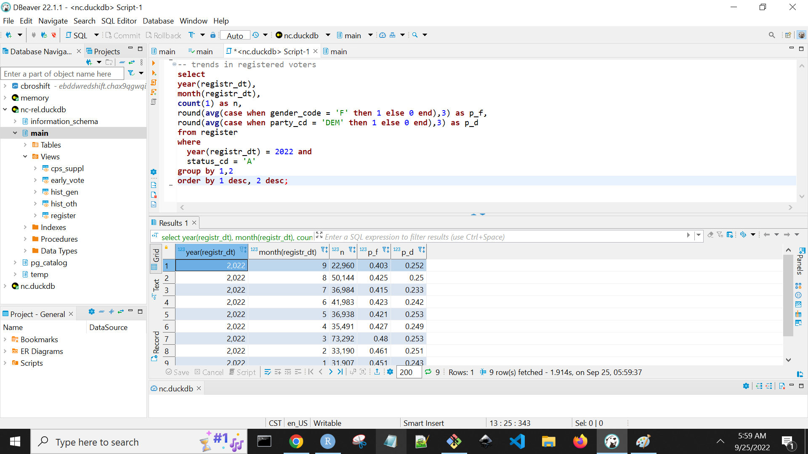
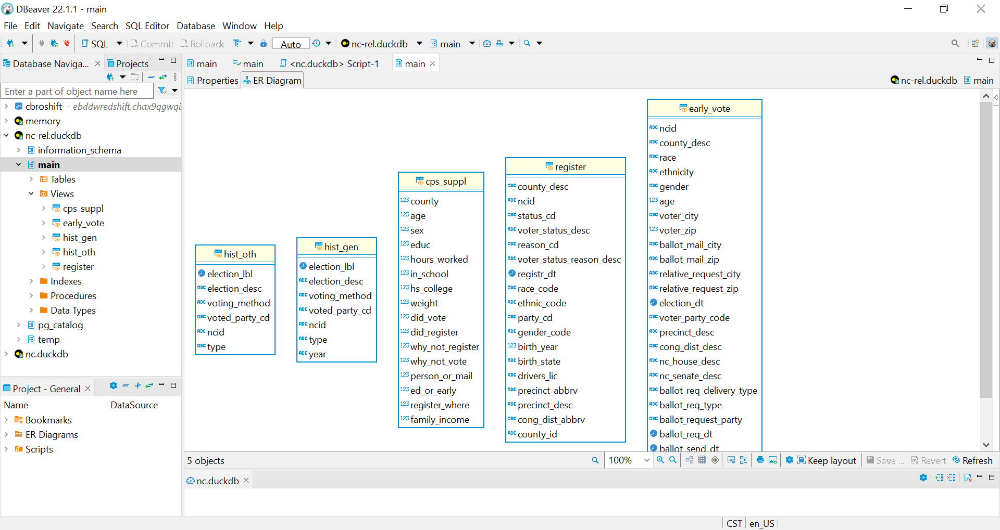

There comes a time in every analyst's life when data becomes too big for their laptop's RAM. While open-source tools like R, python, and SQL have made "team of one" data analysts ever more powerful, analysts abilities to derive value from their skillsets are highly interdependent with the tools at their disposal.

For R and python, the size of datasets becomes a limiting factor to local processing; for a SQL-focused analyst, the existence of a database is prerequisite, as the gap between "democratized" SQL *querying* skills and data engineering and database management skills is not insignificant. The ever-increasing number of managed cloud services (from data warehouses, containers, hosted IDEs and notebooks) offer a trendy and effective solution. However, budget constraints, technical know-how, security concerns, or tight-timelines can all be headwinds to adoption.

So what's an analyst to do when they have the knowledge and tools but not the infrastructure to tackle their problem?

[`DuckDB`](https://DuckDB.org/) is quickly gaining popularity as a solution to some of these problems. DuckDB is a no-dependency, serverless database management system that can help parse massive amounts of data out-of-memory via familiar SQL, python, and R APIs. Key features include:

-   **Easy set-up**: Easily installed as an executable or embedded within R or python packages
-   **Columnar storage**: For efficient retrieval and vectorized computation in analytics settings
-   **No installation or infrastructure required**: Runs seamlessly on a local machine launched from an executable
-   **No loading required**: Can read external CSV and Parquet files *and* can smartly exploit Hive-partitioned Parquet datasets in optimization
-   **Expressive SQL**: Provides semantic sugar for analytical SQL uses with clauses like `except` and `group by all` (see blog [here](https://DuckDB.org/2022/05/04/friendlier-sql.html))

This combination of features can empower analysts to use what they have and what they know to ease into the processing of much larger datasets.

In this post, I'll walk through a scrappy, minimum-viable setup for analysts using `DuckDB`, motivated by the [North Carolina State Board of Election](https://www.ncsbe.gov/results-data)'s rich voter data. Those interested can follow along in [this repo](https://github.com/emilyriederer/nc-votes-DuckDB) and put it to the test by launching a free 8GB RAM GitHub Codespaces.

This is very much *not* a demonstration of best practices of anything. It's also not a technical benchmarking of the speed and capabilities of `DuckDB` versus alternatives. (That ground is well-trod. If interested, see [a head-to-head to pandas](https://DuckDB.org/2021/05/14/sql-on-pandas.html) or [a matrix of comparisons across database alternatives](https://benchmark.clickhouse.com/).) If anything, it is perhaps a "user experience benchmark", or a description of a minimum-viable set-up to help analysts use what they know to do what they need to do.

## Motivation: North Carolina election data

North Carolina (which began accepting ballots in early September for the upcoming November midterm elections) offers a rich collection of voter data, including daily-updating information on the current election, full voter registration data, and ten years of voting history.

-   NC 2022 midterm early vote data from [NCSBE](https://www.ncsbe.gov/results-data) (\~6K records as-of 9/23 and growing fast!)
-   NC voter registration file from [NCSBE](https://www.ncsbe.gov/results-data) (\~9M records / 3.7G unzipped, will be static for this cycle once registration closes in October)
-   NC 10-year voter history file from [NCSBE](https://www.ncsbe.gov/results-data) (\~22M records / 5G unzipped, static)

All of these files are released as zipped full-population (as opposed to delta) CSV files.

One can imagine that this data is of great interest to campaign staff, political scientists, pollsters, and run-of-the-mill political junkies and prognosticators. However, the file sizes of registration and history data, which is critical for predicting turnout and detecting divergent trends, could be prohibitive.

Beyond these files, analysis using this data could surely be enriched by additional third-party sources such as:

-   Current Population Survey 2022 November voting supplement from [US Census Bureau](https://www.census.gov/data/datasets/time-series/demo/cps/cps-supp_cps-repwgt/cps-voting.html)
-   County-level past election results from [MIT Election Lab via Harvard Dataverse](https://dataverse.harvard.edu/file.xhtml?fileId=6104822&version=10.0)
-   Countless other data sources either from the US Census, public or internal campaign polls, organization-specific mobilizaton efforts, etc.

Your mileage may vary based on your system RAM, but many run-of-the-mill consumer laptops might struggle to let R or python load all of this data into memory. Or, a SQL-focused analyst might yearn for a database to handle all these complex joins.

So how can `DuckDB` assist?

## DuckDB highlights

To explain, we'll first level-set with a brief demo of some of the most relevant features of `DuckDB`.

Suppose we have flat files of data, like a `sample.csv` (just many orders of magnitude larger!)

<pre class='chroma'><code class='language-r' data-lang='r'>import pandas as pd
df = pd.DataFrame({'a':[1,2,3], 'b':[4,5,6], 'c':[7,8,9]})
df.head()

#>    a  b  c
#> 0  1  4  7
#> 1  2  5  8
#> 2  3  6  9

df.to_csv('sample.csv', index = False)
</code></pre>

`DuckDB` can directly infer it's schema and read it in a SQL-like interface by using functions like `read_csv_auto()` in the `FROM` clause.

<pre class='chroma'><code class='language-r' data-lang='r'>import duckdb
con = duckdb.connect()
df = con.execute("select * from read_csv_auto('sample.csv')").fetchdf()
df.head()

#>    a  b  c
#> 0  1  4  7
#> 1  2  5  8
#> 2  3  6  9

con.close()
</code></pre>

While very useful, this is of course bulky to type. We may also set-up a persistent DuckDB database as a `.duckdb` file as save tables with CTAS statements, as with any normal relational database. Below, we create the `sample-db.duckdb` database and add one table and one view with our data.

<pre class='chroma'><code class='language-r' data-lang='r'>con = duckdb.connect('sample-db.duckdb')
ctas = "create or replace table sample as (select * from read_csv_auto('sample.csv'));"
con.execute(ctas)

#> <duckdb.DuckDBPyConnection object at 0x0000000032103670>

cvas = "create or replace view sample_vw as (select * from read_csv_auto('sample.csv'));" 
con.execute(cvas)

#> <duckdb.DuckDBPyConnection object at 0x0000000032103670>

con.close()
</code></pre>

Now, suppose the data in `sample.csv` changes (now with 4 rows versus 3).

<pre class='chroma'><code class='language-r' data-lang='r'>df = pd.DataFrame({'a':[1,2,3,4], 'b':[4,5,6,7], 'c':[7,8,9,10]})
df.to_csv('sample.csv', index = False)
</code></pre>

Our table stored the data directly within the database ("disconnected" from the file) so it remains the same as before whereas our view changed.

<pre class='chroma'><code class='language-r' data-lang='r'>con = duckdb.connect('sample-db.duckdb')
df1 = con.execute("select count(1) from sample").fetchdf()
df2 = con.execute("select count(1) from sample_vw").fetchdf()
con.close()
df1.head()

#>    count(1)
#> 0         3

df2.head()

#>    count(1)
#> 0         4
</code></pre>

(Here, I focus just on the features we will use; not strictly the coolest or most important. I highly encourage taking a spin through the [docs](https://duckdb.org/docs/guides/python/sql_on_pandas) for countless features not discussed -- like directly querying from or fetching to pandas and Arrow formats, an alternative relational API, etc.)

## Data management pattern

With these features in mind, we return to the problem at hand. How can an analyst mimic the experience of having the infrastructure needed to do their work?

One approach could look something like the following. As a one-time exercise someone would:

1.  Download all relevant files
2.  (Optionally) Convert large, static files to Parquet versus CSV. DuckDB handles both well, but Parquet has some benefits that we'll discuss in the next section
3.  Create a DuckDB database with references to the files as `view`s

Then, any analyst wanting to interact with the data could:

1.  Interact with DuckDB as with any database connection
2.  Whenever needed, re-download the files to the same name/directory to "refresh" the "database"

The [nc-votes-duckdb](https://github.com/emilyriederer/nc-votes-duckdb) GitHub repo shows this flow in practice. If you want to follow along, you can click `Code > Create codespaces on master` and follow the more detailed instructions in the `README.md` or at the bottom of this post.

### One-time set-up

The scripts for the first set of steps are in the `etl` subdirectory. The e-step (extract) isn't all that interesting -- just some basic python scripts for downloading files from the internet, unzipping, and moving them around. These land the raw data in the `data/raw` subdirectory.

Data transformation mostly involves converting large CSVs to Parquet format (and dropping personally-identifying fields from the data on principle). As mentioned above, this step is optional but has some benefits. First, if one person is "configuring" a database for many analysts, Parquet compression makes files smaller for storage and sharing. Second, at query-time Parquet is:

-   More reliably structured with a well-defined schema
-   Faster to retrieve due to columnar storage
-   Able to be pruned by a savvy database optimizer (when appropriately partitioned by columns relevant to common query patterns)

[Conversion from CSV to Parquet](https://duckdb.org/docs/guides/import/parquet_export) itself can be done with DuckDB. However, as of writing, I don't believe that writing to a Hive-partitioned dataset is possible, so for this step, I used `pyarrow`, the python interface to [Apache Arrow](https://arrow.apache.org/) (another promising, memory-conserving data processing framework.)

This snippet from [etl/transform-register.py](https://raw.githubusercontent.com/emilyriederer/nc-votes-duckdb/master/etl/transform-register.py) demonstrates streaming a CSV by chunk and writing it out to county-level partitions:

<pre class='chroma'><code class='language-r' data-lang='r'># convert to hive-partitioned parquet
if os.path.exists(path_temp):
    shutil.rmtree(path_temp)

with csv.open_csv(path_raw, 
                  convert_options= opts_convr_reg, 
                  parse_options = opts_parse,
                  read_options = opts_read_reg) as reader:

    for next_chunk in reader:
        if next_chunk is None:
            break
        tbl = pa.Table.from_batches([next_chunk])
        pq.write_to_dataset(
                tbl,
                root_path = path_temp,
                use_dictionary = cols_reg_dict,
                partition_cols= ['county_id']
        )
</code></pre>

(Notably: counties are rather imbalanced in size and not the most important geography in many election contexts. This is for example purpose only, but partitions should always be picked based on how you expect to use the data. )

Once all the data in transformed, we can "load" our DuckDB database with relative-path references to our data. Again, this step can be done through any DuckDB API or the command line. Below, I use python in the [etl/load-db.py](https://github.com/emilyriederer/nc-votes-duckdb/blob/master/etl/load-db.py) to create the `nc.duckdb` database and create references to the different datasets.

<pre class='chroma'><code class='language-r' data-lang='r'>import duckdb
import os

# clean-up if already exists
if os.path.exists('nc.duckdb'):
  os.remove('nc.duckdb')

# create new duckdb files 
con = duckdb.connect('nc.duckdb')

# generate SQL to register tables
template = """
  CREATE VIEW {view_name} as 
  (select * from read_parquet('{path}'{opts}))
  """
data_dict = {
  'early_vote': 'data/early_vt.parquet',
  'hist_gen': 'data/history_general/*/*.parquet',
  'hist_oth': 'data/history_other/*/*.parquet',
  'register': 'data/register/*/*.parquet',
  'cps_suppl': 'data/cps_suppl.parquet'
}
partitioned = ['hist_gen', 'hist_pri', 'register']

for k,v in data_dict.items():

  print("Loading {view_name} data...".format(view_name = k))
  opt = ', HIVE_PARTITIONING=1' if k in partitioned else ''
  cvas = template.format(view_name = k, path = v, opts = opt)
  con.execute(cvas)

con.close()
</code></pre>

Similarly, other views could be defined as desired that query these views to do further data transformation.

### Ongoing usage

Due to the decoupling of storage and compute, ongoing data management is nearly trivial. With this "infrastructure" set-up, analysts would need only to selectively redownload any changed datasets (in my project, using the `extract-.*.py` scripts as needed) to allow their queries to pull in the latest data.

Big picture, that means that (after initial set-up) an analyst would have no more overhead "managing their database" than they would with a "typical" CSV-driven workflow. Specifically for this project, the early votes data is the only dataset that changes frequently. For ease-of-use, it could even be left in CSV format to make the download process even easier for any users.

## Data access patterns

With this set-up in place, analysts can then use their favorite tools to query the data.

### python

<pre class='chroma'><code class='language-r' data-lang='r'>import duckdb
con = duckdb.connect('nc.duckdb')
df = con.execute('select count(1) from early_vote').fetchdf()
con.close()
</code></pre>

### R

<pre class='chroma'><code class='language-r' data-lang='r'><a href='https://rdrr.io/r/base/library.html'>library</a>(<a href='https://duckdb.org/'>duckdb</a>)
con &lt;- <a href='https://dbi.r-dbi.org/reference/dbConnect.html'>dbConnect</a>( <a href='https://rdrr.io/pkg/duckdb/man/duckdb.html'>duckdb</a>('nc.duckdb') )
df &lt;- <a href='https://dbi.r-dbi.org/reference/dbGetQuery.html'>dbGetQuery</a>('select count(1) from early_vote')
<a href='https://dbi.r-dbi.org/reference/dbDisconnect.html'>dbDisconnect</a>(con, shutdown = TRUE)</code></pre>

### CLI

    duckdb my-db.duckdb
    > select count(1) from early_vote

### SQL IDE (DBeaver)

DuckDB also works with open-source database IDEs like [DBeaver](https://dbeaver.com/) for the full, "traditional" database experience. The [DuckDB website](https://duckdb.org/docs/guides/sql_editors/dbeaver) gives full set-up instructions. With DBeaver, analysts get the "full" database experience with navigable access to table schemas and metadata.

Notably **if you are using relative file paths in your view definitions, you have to launch DBeaver from your command line after moving into the appropriate working directory**. (Thanks to [Elliana May on Twitter](https://twitter.com/Mause_me/status/1571126401482510336?s=20&t=uYOnuHSjZcjkrbwYb0aXvA) for the pointer.) (In the terminal: `cd my/dir/path; dbeaver`)

## Codespaces Demo

So can DuckDB help analysts wrangle the whole state of North Carolina with 8GB RAM? To find out, launch a GitHub Codespaces from the [nc-votes-duckdb](https://github.com/emilyriederer/nc-votes-duckdb) repo and see for yourself!

1.  Launch on Codespaces

2.  Set-up environment:

<!-- -->

    python3 -m venv venv
    source venv/bin/activate
    python3 -m pip install -r requirements.txt

1.  Pull all raw data:

<!-- -->

    chmod +x etl/extract-all.sh
    etl/extract-all.sh

1.  Transform all raw data:

<!-- -->

    chmod +x etl/transform-all.sh
    etl/transform-all.sh

1.  Create duckdb database:

<!-- -->

    python etl/load-db.py

1.  (Optional) Install duckdb CLI

<!-- -->

    chmod +x get-duckdb-cli.sh
    ./get-duckdb-cli.sh

1.  Run sample queries

7a. Run sample queries in CLI

Launch the CLI:

    ./duckdb nc.duckdb
    .timer on

(Note: you can exit CLI with Ctrl+D)

Try out some sample queries. For example, we might wonder how many past general elections that early voters have voted in before:

    with voter_general as (
    select early_vote.ncid, count(1) as n
    from 
      early_vote 
      left join 
      hist_gen 
      on early_vote.ncid = hist_gen.ncid 
    group by 1)
    select n, count(1) as freq
    from voter_general
    group by 1
    order by 1
    ;

And, this question is more interesting if we join on registration data to learn how many prior general elections each voter was eligible to vote in:

    with voter_general as (
    select 
      early_vote.ncid, 
      extract('year' from register.registr_dt) as register_year, 
      count(1) as n
    from 
      early_vote 
      left join 
      hist_gen 
      on early_vote.ncid = hist_gen.ncid 
      left join
      register
      on early_vote.ncid = register.ncid
    group by 1,2)
    select
      n, 
      case 
      when register_year < 2012 then 'Pre-2012'
      else register_year
      end as register_year,
      count(1) as freq
    from voter_general
    group by 1,2
    order by 1,2
    ;

(Yes, of course *date* matters more than year here, etc. etc. This is purely to demonstrate `duckdb` not rigorous analysis!)

7b. Run sample queries in python

In python: See sample queries in `test-query.py` file

1.  Run `free` in the terminal to marvel at what 8GB of RAM can do!

