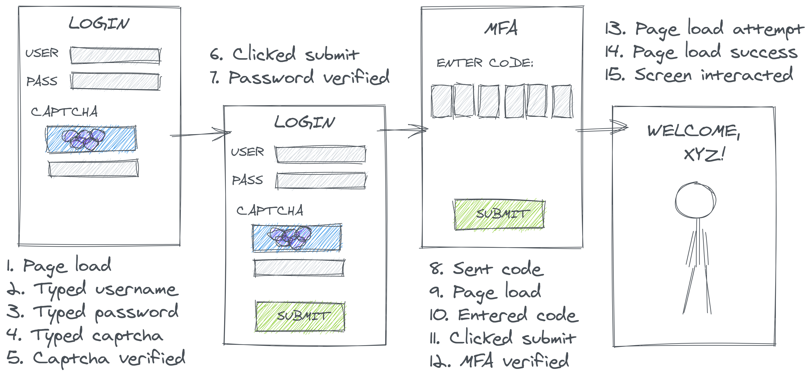

When we think about data documentation, like a trusty data dictionary, we tend to think about documenting the columns. Too often, data goes completely undocumented, so we're grateful when we can find simple metadata like expected data types and definitions of each of the fields. 

It's even more rare to 


Data discoverability and documentation are core challenges in the ever evolving data management stack. Like many other parts of the data stack, there has been an influx of start-ups (and VC funding) reenvisioning what a data catalog can be. The [Seattle Data Guy](https://seattledataguy.substack.com/p/cataloging-data-catalogs) recently catalogued the numerous catalogs themselves. However, despite the plethora of options (and I certainly haven't been able to survey most!), I notice an imbalance between the high-level of transparency they afford to documentation and lineage of *columns* versus the parsimonious information on *rows*.

This is not a new trend. From the "olden" days of a flat-file "data dictionary", documenting the fields/columns/measures of a dataset has been the focus. It's widely known that data may not mean what we think, and yet analysts focus their attention on understanding columns and not "what makes a row". Recent tools, I suspect, exacerbate this trend because information about columns (e.g. column-level lineage) can largely be automatically derived by parsing a DAG and forklifting metadata from common data tools (e.g. Looker, dbt); however, understanding rows often requires "external" information about real-world business systems and processes.

In this post, I make a plea for more focus on documenting rows by outlining the many things analysts don't know about their rows:

1. You don't know the intent
2. You don't know what triggers an event
3. You don't know what changes a record
4. You don't know row-based performance optimizations

(Note that 1-2 are general points whereas 3-4 are more specific to working with databases)

## You don't know the intent

Row definitions superficially seem less necessary since "what makes a row", in theory, corresponds to the very definition of the table in which the row lives in the relational model. In theory, each record represents a well-defined "entity" so table naming and the overall data model *imply* the definition of a row. In practice, it's not the simple. 

Suppose that you're an analyst looking to analyze website login data to check for friction in the UX. You may find a promising table in your database called `login`s - huzzah! But what does that really mean?



A data engineering might have defined (or, rather *instrumented*) a "login" to be any of a wide-ranging number of events throughout the login process. Are "logins" login *attempts*? *Successes*? Further, what actually is an attempt? Did you have to pass a Captcha that you weren't a robot? Could you even attempt to login if you forgot your username or couldn't find the submit button?

Which of these events gets collected and recorded has a significant impact on subsequent data processing. 
In a technical sense, no inclusion/exclusion decision here is *incorrect*, per se, but if the producers' choices don't match the consumers' understandings, we will end up with misleading results.

Consider calculating the rate of successful website logins. 
Reasonably enough, an analyst might compute this rate as the sum of successful events over the total. 
Now, suppose two users attempt to login to their account, and ultimately, one succeeds in accessing their private information and the other doesn't. 
The analyst would probably hope to compute and report a 50% success rate. However, depending on how the data is represented, they could quite easily compute nearly any value from 0% to 100%. 

As a thought experiment, we can consider what types of events might be logged: 

- **Per Attempt**: If data is logged once per overall login attempt, successful attempts only trigger one event, but a user who forgot their password may try (and fail) to login multiple times. In the case illustrated above, that deflates the successful login rate to **25%**.
- **Per Event**: If the logins table contains a row for every login-related event, each 'success' will trigger a large number of positive events and each 'failure' will trigger a negative event preceded by zero or more positive events. In the case illustrated below, this inflates our successful login rate to **86%**. 
- **Per Conditional**: If the collector decided to only look at downstream events, perhaps to circumvent record duplication, they might decide to create a record only to denote the success or failure of the final step in the login process (MFA). However, login attempts that failed an upstream step would not generate any record for this stage because they've already fallen out of the funnel. In this case, the computed rate could reach **100%**
- **Per Intermediate**: Similarly, if the login was defined specifically as successful password verification, the computed rate could his **100%** even if some users subsequently fail MFA

These different situations are further illustrated below.


```{r login-rate-tbl, echo = FALSE, error = FALSE, warning = FALSE, message = FALSE}
library(knitr)
df <- data.frame(
    Session = c(1, 2, 50),
    Attempt = c(1, 4, 25),
    Event = c(6, 7, 86),
    Outcome = c(1, 1, 100),
    Intermediate = c(2, 2, 100),
    row.names = c("Success", "Total", "Rate (%)")
)
kable(df, caption = "Success rate naively computed under different data collection schemes")
```

## 2. You don't know what triggers events

Even if you know the intent of a row is supposed to mean, without understanding the real-world process that generates that row, we cannot reason about data completeness or potential biases.

Suppose an e-commerce analyst is trying to analyze total revenues based on an `orders` table. An order might be fairly well-defined and widely agreed upon: a customer completed a checkout flow and paid for a specific set of items to be provided by the company. However, depending what upstream *system* this data is sourced from, the data might have different biases.

If the data is sourced from the order collection system, it should contain all orders for a given date fairly rapidly. However, if order data is sourced from a payment processing system that only bills customers once items are shipped, not all orders *placed* on a given data would populate in the table at the same time. (The third case illustrated below is discussed in the next section.)


The source system for our records, then, sets our expectations on data latency and changes our definition of data completeness. Further, data sourced from more slowly updating systems (e.g. the shipping stage) might cause biased discrepancies and missing not-at-random data. Given that many e-commerce companies offer "fast/free shipping if you spend more than \$X dollars", the same mechanism that would cause some orders to ship faster than others are confounded with the order's value. Thus, even the calculation of average spend metrics could be compromised.


## 3. You don't know what can change

It's also possible to know what causes a row to enter into a table but misunderstand what can cause an existing record to *change*. Consider if the `orders` table above is intended to track orders throughout their fulfillment process. Then the table might be organized in a few different ways:

- An event log: 1 record for each order x processing-step (e.g. separate records for order-placed, order-shipped, etc.)
- An updating record: 1 record per order with a changing `order_status` field 

Naturally, the different grains of this table have different implications for computing something as simple as a count of orders in a given period (to avoid double-counting) and understanding if historical records are able to change in a subsequent analysis.

## 4. You don't know the storage optimizations

Beyond analytical issues, there are also performance considerations. For large tables, different databases offer different ways to optimize query performance by savy storage and organization of rows including sortkeys, distkeys, clustering keys, and partitioning keys. If anaylsts know how such keys were set, they can savily use these in query filters, aggregations, etc. to achieve better performance on retrieval. However, if analysts don't know what keys the data producers set, the efforts of the data producer are in vein and, in fact, may sometimes hurt performance over the base case. (Some new features in emerging file formats like Apache Iceberg are working on workarounds here, but that is the minority case.)
