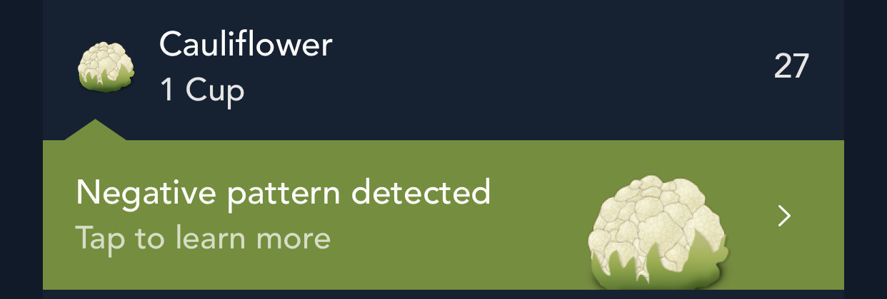
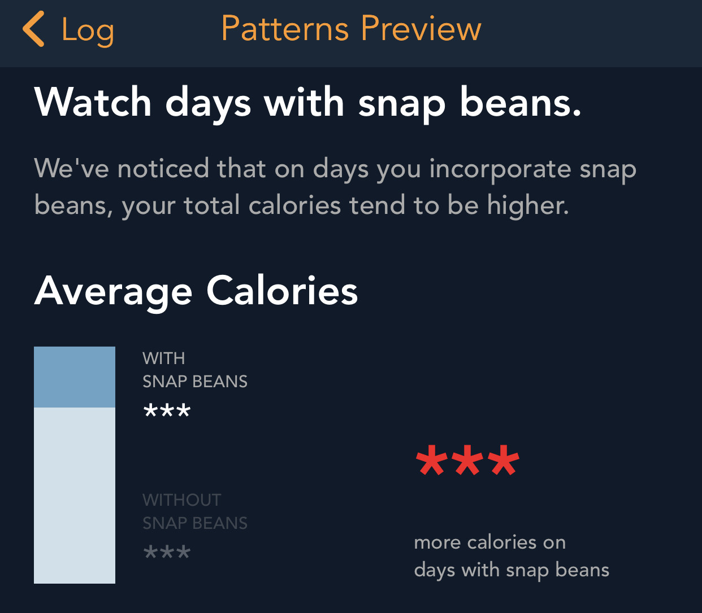

The collapse of [Zillow Offers](https://www.nytimes.com/2021/11/02/business/zillow-q3-earnings-home-flipping-ibuying.html) last week reignited the dialogue about good and bad uses of machine learning in industry. Low-value or counterproductive applications are all too common, and they can pose a range of risks from financial loss (in the case of Zillow) to consumer harm. This discourse inspired me to document a pandemic-era personal experience with bad and potentially harmful (but not to me specifically) machine learning.

In this post, I will briefly overview some unexpected "automated advice" that a fitness app began to give me, explore one potential cause grounded in the use of weak evaluation metrics, and reflect on the merits (or lack their of) of the intended use case. This serves as just one more example in the ever-growing corpus of cautionary tales of mindless machine learning results when out-of-the-box algorithms are applied to real-world problems without careful consideration for how algorithm objectives and domain objectives may vary.

What happened?
--------------

Early on in the pandemic, I started to engage in some personal data collection, including using a running app, a nutrition app, and a time-tracking app. This was motivated in equal if not greater part by a desire for a five minute daily respite from doom-scrolling Twitter than envisioning any specific project or usage for said data. However, there were two unexpected benefits.

First, it gave me an entirely new level of appreciation for what unreliable narrators individuals (like me!) are with self-reported data. Personal manual data entry is exceedingly uninteresting. I had zero incentive to lie -- no one would ever see this data but me! -- but nevertheless my reporting quality quickly devolved. Specifically, working with the nutrition app was incredibly boring so I started taking easy "shortcuts" which eroded any semblance of data quality.

As an example that will become quite relevant shortly, it was far easier to copy the same thing from day-to-day than look up different foods. As a result, foods became metonyms for one another; any vegetable I ate was "encoded" as green beans and cauliflower because those had ended up on this list one day and I just kept copying them. Specifically, the important thing to know is that I had a few items logged *every single day in the same quantities*.

Second, and related to the first, I came to learn that the app I was using was attempting to apply some sort of "intelligence" (by which, we cannot emphasize enough, means absolutely nothing more than automation) to make recommendations based on my sketchy inputs. Most curiously, on many occasions, the app seemed convinced that I should stop eating vegetables and offered pop-up warnings of a "Negative pattern detected":

Upon tapping these curious warnings and venturing down the rabbit hole, it explained "We've noticed that on days you incorporate {{food}}, your total calories tend to be higher".

Uhh... okay?

What caused it?
---------------

Naturally, I became intrigued was sort of algorithm-gone-wrong was convinced my life would be better off without vegetables. I may not ever know the exact technology underlying this feature, but there were some clues.

I first contemplated the most naive way possible that one might identify such relationships. My first thought was somehow correlating the amount of different foods with total daily calories. This seemed like a reasonable culprit since correlation comes up by or before Chapter 3 in introductory statistics and is perhaps best known for masquerading as causation. However, my sloppy, lazy data collection helped rule out this possibility quickly because I knew that there was **zero variance** in the amounts or incidences of my vegetables entries.[^1]

This fact of zero variance made me suspect that the actual quantities of the targeted items were not a factor in the method used. That is, it seemed likely that the approach being used was the result of some type of categorical data analysis. My next guess was that the suggestions were the result of [association rules](https://en.wikipedia.org/wiki/Association_rule_learning), which are statements of the form "the presence of x (item or set of items) tends to imply the presence of y (item or set of items" and learned by examining frequencies within sets of items. The ranking of "interesting" associate rules is governed by a range of heuristic evaluation metrics, so this seemed like a likely culprit.

### Association rules and interestingness metrics

Association rule mining attempts to find patterns of co-occurence in a set of categorical data. That is, it looks for patterns that suggest that the incidence of some `x` (or set of `x1`, `x2`, etc.) suggests the incidence of some `y` (denoted by something like `{x} => {y}`). The textbook example is market basket analysis in which someone might analyze items purchase together to uncover relationships such as "people who buy pepper tend to buy salt".

Finding such candidate rules is mostly a matter of arithmetic, and algorithms that implement these methods are distinguished by the elegant ways they handle the computational complexity moreso than any nuanced statistics.[^2]

Once candidate rules are determined, they can be evaluated for "interesting-ness" by a number of different metrics. For a rule such as `{x} => {y}` few examples are:

-   **Support**[^3]: `# observations with {x,y}` / `# of observations`
-   **Confidence**: `support({x,y}) / support({x})` = `# observations with {x,y} / # observations with {x}`
-   **Lift**: `support({x,y}) / support({x}) * support({y})` = `# observations with {x,y}` / `expected # observations if x and y independent`

Depending on your background, you might notice some analogy between support, confidence, and lift to an incidence proportion, a conditional probability, and a correlation, respectively.

As is true of any summary metric, all of these measures lose something important while attempting to compress information. For example:

-   Support reflects commonly occurring things. For example, the number of days my internet traffic includes both Twitter and the Weather is incredibly high not because my usage of these two are intrinsically linked, but simply because both are daily occurrences.
-   Confidence partially controls for this, but as we will see in an example, is still very sensitive to the incidence of `{y}`

### A demo

Coming back to the problem at hand ("Why does ML hate vegetables?"), let's look at a brief example using the `arules` R package.

First, we create a sample dataset, `log`. Here, `x` occurs in every entry (much like beans or cauliflower), `hi` or `lo` serve as a discretized "target" of interest, and `z` and `w` co-occur *exclusively* with `hi` and `lo` respectively. If this were a reasonable task at all (more on that in a minute), ideally `z` and `w` would be selected over `x` since they are more informative of `hi` and `lo`.

<pre class='chroma'><code class='language-r' data-lang='r'><a href='https://rdrr.io/r/base/library.html'>library</a>(<a href='https://github.com/mhahsler/arules'>arules</a>)

# create fake observations -----
log &lt;-
  <a href='https://rdrr.io/r/base/list.html'>list</a>(
  <a href='https://rdrr.io/pkg/arules/man/combine.html'>c</a>("x", "a", "z", "hi"),
  <a href='https://rdrr.io/pkg/arules/man/combine.html'>c</a>("x", "b", "z", "hi"),
  <a href='https://rdrr.io/pkg/arules/man/combine.html'>c</a>("x", "c", "z", "hi"),
  <a href='https://rdrr.io/pkg/arules/man/combine.html'>c</a>("x", "d", "z", "hi"),
  <a href='https://rdrr.io/pkg/arules/man/combine.html'>c</a>("x", "e", "z", "hi"),
  <a href='https://rdrr.io/pkg/arules/man/combine.html'>c</a>("x", "f", "w", "lo"),
  <a href='https://rdrr.io/pkg/arules/man/combine.html'>c</a>("x", "g", "w", "lo"),
  <a href='https://rdrr.io/pkg/arules/man/combine.html'>c</a>("x", "h", "w", "lo"),
  <a href='https://rdrr.io/pkg/arules/man/combine.html'>c</a>("x", "i", "w", "lo"),
  <a href='https://rdrr.io/pkg/arules/man/combine.html'>c</a>("x", "j", "w", "lo")
  )
</code></pre>

Next, we seek out rules that contain `"hi"` on the right-hand side. All rules provided have the same support, but the confidence and lift of `{z} => {hi}` is higher than `{x} => {hi}`. So that seems promising, right?

<pre class='chroma'><code class='language-r' data-lang='r'># learn association rules ----
rules &lt;- <a href='https://rdrr.io/pkg/arules/man/apriori.html'>apriori</a>(as(log, "transactions"),
                 parameter  = <a href='https://rdrr.io/r/base/list.html'>list</a>(support = 0.5, confidence = 0.5),
                 appearance = <a href='https://rdrr.io/r/base/list.html'>list</a>(rhs = "hi"),
                 control    = <a href='https://rdrr.io/r/base/list.html'>list</a>(verbose = FALSE)
                 )
<a href='https://rdrr.io/pkg/arules/man/inspect.html'>inspect</a>(rules)

#&gt;     lhs      rhs  support confidence coverage lift count
#&gt; [1] {}    =&gt; {hi} 0.5     0.5        1.0      1    5    
#&gt; [2] {z}   =&gt; {hi} 0.5     1.0        0.5      2    5    
#&gt; [3] {x}   =&gt; {hi} 0.5     0.5        1.0      1    5    
#&gt; [4] {x,z} =&gt; {hi} 0.5     1.0        0.5      2    5
</code></pre>

Not quite so fast. In our initial `log`, `hi` and `lo` occur the same number of times. What if instead, we create an imbalanced log where the "target" of interest[^4] occurs 2/3 of the time, we can observe how our metrics change.[^5]

<pre class='chroma'><code class='language-r' data-lang='r'>log_imbalance &lt;- <a href='https://rdrr.io/pkg/arules/man/combine.html'>c</a>(log, log[1:5])
rules &lt;- <a href='https://rdrr.io/pkg/arules/man/apriori.html'>apriori</a>(as(log_imbalance, "transactions"),
                 parameter  = <a href='https://rdrr.io/r/base/list.html'>list</a>(support = 0.5, confidence = 0.5),
                 appearance = <a href='https://rdrr.io/r/base/list.html'>list</a>(rhs = "hi"),
                 control    = <a href='https://rdrr.io/r/base/list.html'>list</a>(verbose = FALSE)
                 )
<a href='https://rdrr.io/pkg/arules/man/inspect.html'>inspect</a>(rules)

#&gt;     lhs      rhs  support   confidence coverage  lift count
#&gt; [1] {}    =&gt; {hi} 0.6666667 0.6666667  1.0000000 1.0  10   
#&gt; [2] {z}   =&gt; {hi} 0.6666667 1.0000000  0.6666667 1.5  10   
#&gt; [3] {x}   =&gt; {hi} 0.6666667 0.6666667  1.0000000 1.0  10   
#&gt; [4] {x,z} =&gt; {hi} 0.6666667 1.0000000  0.6666667 1.5  10
</code></pre>

Support is still consistent across all rules. Confidence, however, is boosted from 0.5 to 0.66. Why? Because confidence is `# observations where x and hi appear / # observations where x appears`. Since `x` appears in every single entry, this is equivalent to `# observations hi appears / # observations`, or the incidence of `"hi"`.

So, one conceivable reason that these rules might have surfaced on my health app might be if an approach like association rule mining were used with a hardcoded rule such as `confidence > 0.8` means interesting which would tend to simply pick out very common items to long as the "target" (of discretized high-calorie days) were sufficiently high.

Key Takeaways
-------------

I don't pretend to know what the exact methodology underlying this rule is. While a small part of me was intrigued enough to consider making a fresh account and plugging in more adversarial data, but given that this discovery was caused by a significant amount of apathy towards the application, I wasn't about to solve the case with a greater level of precision than I had at the outset. Nevertheless, I think this is yet another interesting drop in the ocean of cautionary tales about careless use of algorithms to provide "automated intelligence".

While my discussion above focused specifically on evaluation metrics, in reality, this was but one of many traps of mindless machine learning illustrated by this problem. In all, there are any issues at play including processing data, aligning algorithms and metrics to the right domain-specific problem, and framing useful questions to answer in the first place. I'll close with a few more thoughts on each.

**Dichotimization loses information.** I cannot imagine how these results would have occurred if the actual quantities or variation of my entries was taken into consideration. I have to imagine this system treats all inputs on a binary, yes-no basis. In countless cases, this starves analytical tools of meaningful information.

**Would the system work better if I wasn't a lazy, disengaged user?** No doubt. But does that matter? If systems are to be automated, they need to be resilient to bad inputs (whether that be due to adversarial intent, data quality, confused users, etc.) Plus, there's no reason the data I was entering might not have been real even if it wasn't in my case.

**Do out-of-the-box algorithms work?** Maybe, kind-of, sometimes? But probably not? Without exception, most algorithms are absolutely phenomenal are performing the specific tasks that their implicit or explicit optimization function is designed for. However, without careful thought and tuning, it is highly questionable how often the question the algorithm is answering is the question that matters to you. Which leads us to...

**Metrics are value judgments.** Any metric that is used either for optimization or evaluation of an algorithm implicitly has very, very strong opinions on what matters. The most basic example of this is simple RMSE[^6] which embeds a value judgment that many small errors are better than few huge errors. Simply using a canonical, textbook choice (like "confidence") without thinking about how it applies to a specific problem is dangerous.

**Would this problem ever be destined for success?** Questionable. I have no data to prove this, but my guess would be that days with unusually high caloric intake and characterized by more *variety* than other days -- like cake on a birthday, candy on Halloween, wings on a Superbowl Sunday. It's debatable whether rules finding common co-occurences would ever help diagnose a useful pattern.

**Would the conclusion ever by actionable?** Suppose the algorithm did work, so what? First we would have to define what "work" means, but consider in our example it meant that the algorithm only proposed the rule `{z} => {hi}` and not `{x} => {hi}`. How would I possibly use that information? It doesn't make sense that this is a causal claim. Does eating one thing *cause* higher caloric intake on a day? Probably not, unless that specific item is high in calories (at which point your algorithm is "`select food from log order by calories desc`"). How would users ever apply this information?

**Should ML be giving automated health advice at all?** No. In this case, the results are laughable and clearly not useful. But what about systems where *humans* have less ability to intuit what is good and bad advice. If instead of vegetables and calories, what if a similar algorithm were used to suggest interactions between foods and high/low blood sugar days to a diabetic patient? Maybe this is a strawman, but in general, automating high-stakes things implies the need for high-stakes rigor and governance.

In closing, algorithms are rarely answering the exact question you think you are asking, and they bear close interrogation. Oh, and also, keep eating your vegetables.

[^1]: It is also possible that some day I forgot to add something so there is variance created by a small number of outliers. Of course, that's an equally interesting but different story of "things algorithms need to handle."

[^2]: Specifically, the challenge come in needing to count frequencies across a combinatorial exploring of groupings, and different algorithms rely on different data structures and pruning methods to tame the problem.

[^3]: Support is actually a measure of the simpler concept of a "frequent pattern" for which there is no "direction" between x and y

[^4]: I keep putting scare-quotes around "target" since we are bastardizing an unsupervised method for a supervised problem

[^5]: Or try to reason this out for yourself!

[^6]: Root mean-squared error

