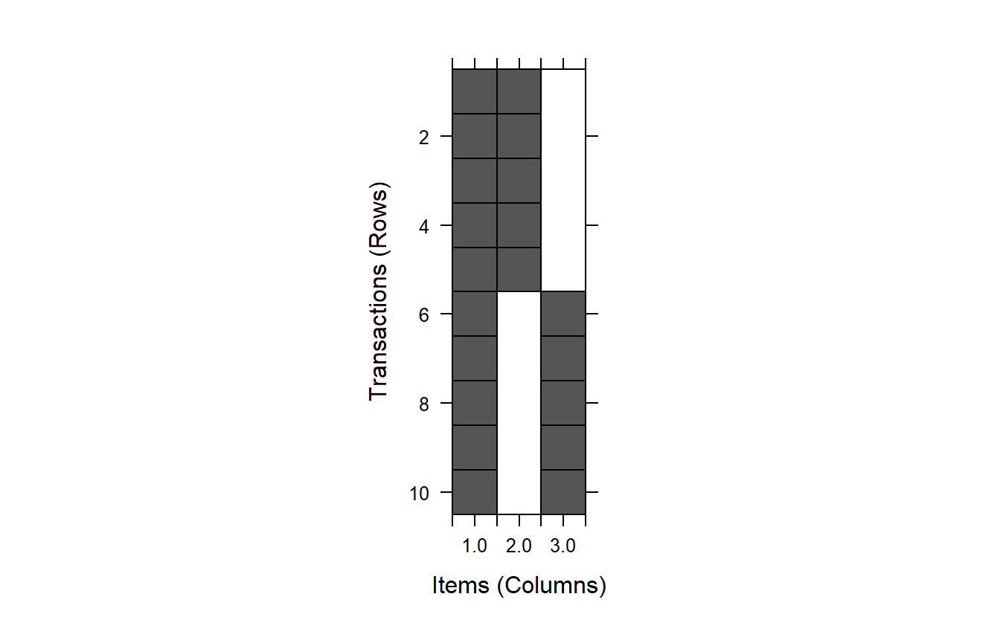

The collapse of [Zillow Offers](https://www.nytimes.com/2021/11/02/business/zillow-q3-earnings-home-flipping-ibuying.html) last week reignited the dialogue about good and bad uses of machine learning in industry. Low-value or counterproductive applications are all too common, and they can pose a range of risks from financial loss (in the case of Zillow) to consumer harm. This discourse inspired me to brush off a half-written draft I've had for a while about a pandemic-era personal experience with bad and potentially harmful (but not to me specifically) machine learning.

In this post, I will briefly overview some unexpected "automated advice" that a fitness app began to give me and my best guess as the underlying cause. This serves as just one more data point in the ever-growing corpus of cautionary tales of machine learning use cases.

Background
----------

personal data collection during the pandemic

did it with increasing laziness and disinterest

two key findings: - never trust self report data

What happened?
--------------

I started putting some of the same stuff all the time because I'm lazy

My app started telling me to not each vegetables

What caused it?
---------------

First, I really don't know

Couldn't be "correlation" because of ZERO VARIANCE

Pattern mining?

### A digression on metrics

That checks out if use a very naive interestingness metric

support: frequency(X) / total observations

confidence: support(X and Y) / support(X)

lift: support(x and y) / support(x) \* support(y)

### A demo

<pre class='chroma'><code class='language-r' data-lang='r'><a href='https://rdrr.io/r/base/library.html'>library</a>(<a href='https://github.com/mhahsler/arules'>arules</a>)

#&gt; Warning: package 'arules' was built under R version 4.0.5

#&gt; Loading required package: Matrix

#&gt; 
#&gt; Attaching package: 'arules'

#&gt; The following objects are masked from 'package:base':
#&gt; 
#&gt;     abbreviate, write

# support: frequency(X) / n
# confidence: support(x and y) / support(x)
# lift: support(x and y) / (support(x) * support(y))

basket &lt;-
  <a href='https://rdrr.io/r/base/list.html'>list</a>(
    <a href='https://rdrr.io/pkg/arules/man/combine.html'>c</a>("beans", "hi"),
    <a href='https://rdrr.io/pkg/arules/man/combine.html'>c</a>("beans", "hi"),
    <a href='https://rdrr.io/pkg/arules/man/combine.html'>c</a>("beans", "hi"),
    <a href='https://rdrr.io/pkg/arules/man/combine.html'>c</a>("beans", "hi"),
    <a href='https://rdrr.io/pkg/arules/man/combine.html'>c</a>("beans", "hi"),
    <a href='https://rdrr.io/pkg/arules/man/combine.html'>c</a>("beans", "lo"),
    <a href='https://rdrr.io/pkg/arules/man/combine.html'>c</a>("beans", "lo"),
    <a href='https://rdrr.io/pkg/arules/man/combine.html'>c</a>("beans", "lo"),
    <a href='https://rdrr.io/pkg/arules/man/combine.html'>c</a>("beans", "lo"),
    <a href='https://rdrr.io/pkg/arules/man/combine.html'>c</a>("beans", "lo")
  )

# correlation? ----
trans_df &lt;- <a href='https://rdrr.io/r/base/data.frame.html'>data.frame</a>(
  beans = <a href='https://rdrr.io/r/base/rep.html'>rep</a>(1, 5),
  total = <a href='https://rdrr.io/pkg/arules/man/combine.html'>c</a>(<a href='https://rdrr.io/r/stats/Uniform.html'>runif</a>(5, 1.1, 1.5), <a href='https://rdrr.io/r/stats/Uniform.html'>runif</a>(5, 0.7, 1))
)
<a href='https://rdrr.io/r/base/with.html'>with</a>(trans_df, <a href='https://rdrr.io/r/stats/cor.html'>cor</a>(beans, total))

#&gt; Warning in cor(beans, total): the standard deviation is zero

#&gt; [1] NA

# association rules ----
trans &lt;- as(basket, "transactions")
<a href='https://rdrr.io/r/base/dim.html'>dim</a>(trans)

#&gt; [1] 10  3

<a href='https://rdrr.io/pkg/arules/man/itemMatrix-class.html'>itemLabels</a>(trans)

#&gt; [1] "beans" "hi"    "lo"

<a href='https://rdrr.io/r/base/summary.html'>summary</a>(trans)

#&gt; transactions as itemMatrix in sparse format with
#&gt;  10 rows (elements/itemsets/transactions) and
#&gt;  3 columns (items) and a density of 0.6666667 
#&gt; 
#&gt; most frequent items:
#&gt;   beans      hi      lo (Other) 
#&gt;      10       5       5       0 
#&gt; 
#&gt; element (itemset/transaction) length distribution:
#&gt; sizes
#&gt;  2 
#&gt; 10 
#&gt; 
#&gt;    Min. 1st Qu.  Median    Mean 3rd Qu.    Max. 
#&gt;       2       2       2       2       2       2 
#&gt; 
#&gt; includes extended item information - examples:
#&gt;   labels
#&gt; 1  beans
#&gt; 2     hi
#&gt; 3     lo

<a href='https://rdrr.io/pkg/arules/man/image.html'>image</a>(trans)

</code></pre>

<pre class='chroma'><code class='language-r' data-lang='r'>rules &lt;- <a href='https://rdrr.io/pkg/arules/man/apriori.html'>apriori</a>(trans,
                 parameter = <a href='https://rdrr.io/r/base/list.html'>list</a>(support = 0.5, confidence = 0.5),
                 appearance = <a href='https://rdrr.io/r/base/list.html'>list</a>(rhs = "hi"))

#&gt; Apriori
#&gt; 
#&gt; Parameter specification:
#&gt;  confidence minval smax arem  aval originalSupport maxtime support minlen
#&gt;         0.5    0.1    1 none FALSE            TRUE       5     0.5      1
#&gt;  maxlen target  ext
#&gt;      10  rules TRUE
#&gt; 
#&gt; Algorithmic control:
#&gt;  filter tree heap memopt load sort verbose
#&gt;     0.1 TRUE TRUE  FALSE TRUE    2    TRUE
#&gt; 
#&gt; Absolute minimum support count: 5 
#&gt; 
#&gt; set item appearances ...[1 item(s)] done [0.00s].
#&gt; set transactions ...[3 item(s), 10 transaction(s)] done [0.00s].
#&gt; sorting and recoding items ... [3 item(s)] done [0.00s].
#&gt; creating transaction tree ... done [0.00s].
#&gt; checking subsets of size 1 2 done [0.00s].
#&gt; writing ... [2 rule(s)] done [0.00s].
#&gt; creating S4 object  ... done [0.00s].

<a href='https://rdrr.io/pkg/arules/man/inspect.html'>inspect</a>(rules)

#&gt;     lhs        rhs  support confidence coverage lift count
#&gt; [1] {}      =&gt; {hi} 0.5     0.5        1        1    5    
#&gt; [2] {beans} =&gt; {hi} 0.5     0.5        1        1    5
</code></pre>

Key Takeaways
-------------

Do out-of-the-box algorithms work? Maybe kind of but probably not? Need to think about what you are doing!

Optimization is a fallacy Optimizing for whom? For what outcome? Same with metrics -- what value judgements are doing into those?

Would system work better if I wasn't a lazy and disengaged user? Probably, but don't assume data quality you don't have

Should ML be giving automated health and diet advice at all? Similar concerns with diet websites/content served to ED patients

