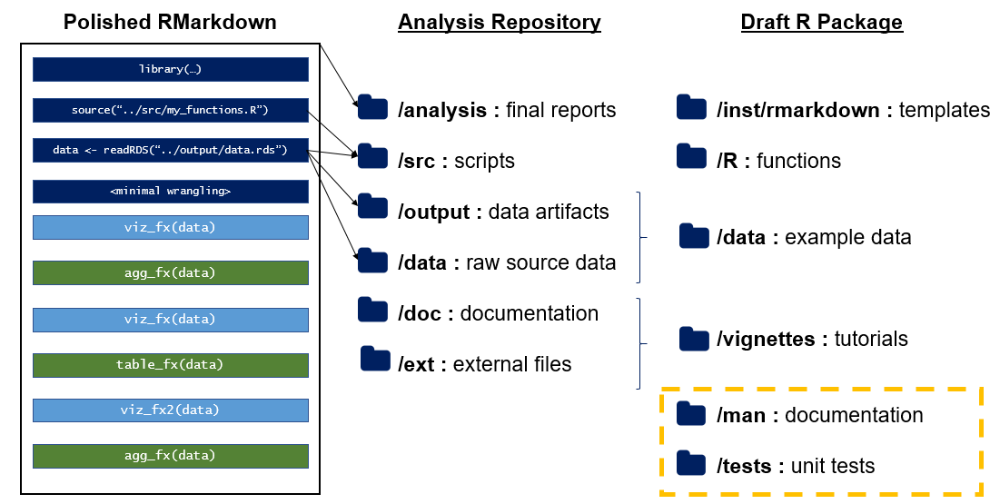

Introduction
------------

[RMarkdown](https://rmarkdown.rstudio.com/) is an excellent platform for capturing narrative analysis and code to create reproducible reports, [blogs](https://bookdown.org/yihui/blogdown/), [slides](https://bookdown.org/yihui/rmarkdown/xaringan.html), [books](https://bookdown.org/), and more. One benefit of RMarkdown is its abilities to keep an analyst in the "flow" of their work and to capture their thought process along the way. However, thought processes are rarely linear; as a result, first-draft RMarkdown scripts rarely are either. This is fine for some individual analysis and preliminary exploration but can significantly decrease how understandable and resilient an RMarkdown will be in the future.

As a proponent of the concept of "analysis engineering"[^1], I tend to think of each RMarkdown as having a "data product" (an analytical engine calibrated to answer some specific question) nestled within it. Surfacing this tool just requires a touch of forethought before beginning an analysis and a bit of clean-up afterwards.

In this post, I describe RMarkdown Driven Development (RmdDD?): a progression of stages between a single ad-hoc RMarkdown script and more advanced and reusable data products like R projects and packages. This approach has numerous benefits.

First, the promise of re-use and reproducibility helps justify any incremental time expenditure on constructing a single analysis with "good practices". Second, for newer project users or package developers, it hopefully helps emphasize that the learning gap between being a useR and developeR is much small than it may seem[^2]. Finally, I have found that this approach to package development leads to very intuitive, user-friendly packages. Essentially, you, a humble user, have conducted rigorous UX research before you, the tool developer, ever shows up!

In the broadest terms, I see an evolution of the following steps:

1.  [Removing Troublesome Elements](#remove)
2.  [Rearrange the Chunks](#rearrange)
3.  [Reduce Duplication with Functions](#functions)
4.  [Migrate from RMarkdown to R Project](#project) (Modularize your files!)
5.  [Convert your R Project to a Package](#package)

Each of these is discussed in more detail below. I also want to emphasize that this sequence is not a recommendation that every RMarkdown needs to become a project or a package. Clearly, that is just silly and in many cases causes unneccesary fragmentation and overhead. However, I believe imagining a spectrum between a single-file RMarkdown to a full-functioning R package is helpful to conscientiously make the decision where to draw the line. "Optimal stopping" at different stages may be the subject of a future post.

A Taxonomy of RMarkdown Chunks
------------------------------

First, let's consider a high-level classification of RMarkdown chunks by different purposes. For this discussion, I disregard finer points of different language engines and chunk options and only consider different RMarkdown components by what they contribute to the final output.

-   **Infrastructure**: These chunks set up the environment in which the RMarkdown is rendered. This includes code that helps add functions to your enviornment (e.g. `library()`, [`source()`](https://rdrr.io/r/base/source.html)), load data (e.g. functions from `readr` or [`data.table::fread()`](https://rdrr.io/pkg/data.table/man/fread.html) or functions calling APIs or databases), or define analysis parameters (e.g. hardcoded values that are somehow used to change behavior later in the script)
-   **Wrangling**: These chunks contain code to transform the data that you've loaded into information desired for analysis/discussion (e.g. tidying, aggregation, model fitting)
-   **Communication**: These chunks help to produce meaningful output for a report such as data visualizations and summary tables

(1) Remove Troublesome or Unsustainable Elements
------------------------------------------------

First and foremost, some things should (almost) never be in an RMarkdown. Even if you don't want to make your code more readable and reusable, please consider doing the following to preserve your own sanity and security.

-   **Do not hardcode passwords.** This is a good general principle of scripts, but especially important in an RMarkdown where they might accidentally "leak" into the rendered output (e.g. HTML) in a non-visible way without your realizing. If something in your file absolutely requires a password, one approach is to [create a parameter](https://bookdown.org/yihui/rmarkdown/parameterized-reports.html) and [supply this upon knitting](https://bookdown.org/yihui/rmarkdown/params-knit.html).
-   **Do not hardcode values, especially late in the script**. Use [parameters](https://bookdown.org/yihui/rmarkdown/parameterized-reports.html) to bring important variables that alter subsequent input to the top.
-   **Do not hardcode absolute file paths**. No one else has your specific set up of files, nor are you likely to if you change computers. This can lead to a lot of frustration.[^3] Try to use relative paths to reference any external files (e.g. data) being brought in to your report. This is significantly easier once the analysis becomes and [R project](#project). At minimum, move any brittle dependencies like this to the top of your script where they will at least be found more quickly to debug.
-   **Do not do complicated database queries.** For simple RMarkdown files, sometimes it may be convenient to use the `sql` language engine and query a database. However, at least in my experience, it is generally not the best approach to attempt database queries in your RMarkdown. Sometimes, queries can take a long time to run, and you do not want to do this every time you find a typo or tweak some plot styling and want to reknit your document. Consider making your data pull a separate script and read the results into your RMarkdown.
-   **Don't litter.** Resist the temptation to save everything you tried that didn't work and isn't part of your analysis or narrative. Note that I'm *not* advocating against transparency around reporting all the tests you ran, all the models you attempted to fit, etc. More precisely, don't leave half written code just in case you want to try to make some specific plot or graph later. Don't let your RMarkdown become a "junk drawer" or take misadvantage of the ability to store unneeded code with the `eval = FALSE` chunk option.
-   **Don't load unneccesary libraries.** Often, you may add library loads in exploratory analysis "just in case" or have tried out using one package before deciding on a different approach. After you've removed the "litter" discussed previously, also be sure to clean up any side-effects of such litter. There isn't a huge cost to excess library loads except that it can be confusing to users and raises (however slightly) the chance of a `NAMESPACE` conflict. You might also then cause some other user to install extra packages unneccesarily which, while not tragic, is inconvenient if there is no actual benefit.

> **Bonus Points** I mostly keep this discussion to structure, not content, but even for the simplest of all markdowns, please attempt to format your code nicely. Even a little whitespace and meaningful variables names (e.g. not `my_data_2`) can go a long way. For help here, check our the [`lintr`](https://cran.r-project.org/web/packages/lintr/index.html) package or use `Ctrl+Shift+A` in RStudio.

After stripping your RMarkdown of these basic risks and complications, next we can move on to restructuring.

(2) Rearrange the Chunks
------------------------

The lowest hanging fruit in cleaning up an RMarkdown document is to rearrange your chunks so that all Infrastructure chunks come first and most all Data Wrangling chunks immediately follow. This has two benefits: exposing dependencies and frontloading errors.

Moving all Infrastructure chunks to the beginning of your RMarkdown makes it clear what dependencies your RMarkdown has. Instantly upon opening a file, a new analyst can understand what libraries and external files it requires. This is optimal over a case where some obscure library in the penultimate chunk of some large RMarkdown which almost runs to completion before erroring out due to a missing dependency.

The rationale for front-loading a lot of wrangling chunks is similar. Because these chunks are the most computationally intense, they are most likely to throw errors. Having them at the beginning of your file means you will learn about your errors sooner; having all of them together will make it easier to debug. Additionally, in my experience, these are the chunks I most often want to edit, so it's efficient not to have to scroll through code for plots and tables simply to find these chunks

Of course, in this step, do be careful of being too "prescient". If some of your data wrangling chunks are motivated by certain output and discussion later in your file, it may be confusing for this computation to be removed from its context and placed at the beginning. I'm reasonably convicted about this advice for creating standardized reporting frameworks, but I caution that the best structure becomes far more subjective for more creative analyses.

> **Bonus Points** Now that your data load chunks are right at the top of your script, consider adding validation for the data getting loaded. Is it the same form that your code expects? Does it have the right variable names and types? Does it meet any logical checks or assumptions you deem necessary? A few good packages for this are [`validate`](https://cran.r-project.org/web/packages/validate/index.html) and [`assertr`](https://cran.r-project.org/web/packages/assertr/index.html). Depending on your project, you could put these in a separate code chunk with the chunk option `include = FALSE` so that data validation can be run manually or include them in you script to throw errors and prevent attempt to render incorrect data structures.

(3) Reduce Duplication with Functions
-------------------------------------

Reorganization offers other clear benefits, one of which is that code with similar purposes ends up physically closer in your document. This may make it easier for you to spot similarities. As you notice similarities in different chunks of wrangling or reporting chunks, keep in mind [the rule of three](https://en.wikipedia.org/wiki/Rule_of_three_(computer_programming)). That is, similar code repeated multiple times should be turned into a function.

For example, I often encounter situations where I need to produce the same plots or tables for many different groups. While an analyst is in exploratory mode, they might reasonably copy-paste such code, edit some key parameters, and eagerly proceed to analyzing the results. Converting this code to functions makes is significantly easier to test and maintain. It also has the benefit of converting Reporting code into Infrastructure code which can be moved to the top of the RMarkdown, with the previously described benefits. Generally, I define any local functions after my `library()` and [`source()`](https://rdrr.io/r/base/source.html) commands.

For good advice on *how* to modularize your functions, including naming[^4] and behavior, I recommend [Maëlle Salmon's blog post](https://masalmon.eu/2017/12/11/goodrpackages/) and [rOpenSci's package development guide](https://ropensci.github.io/dev_guide/building.html).

> **Bonus Points** Now that you have functions, it's a good time to think about testing them. You could add a few tests of your functions in a chunk with `include = FALSE` as described in the last section for data validation. One helpful package here is [`testthat`](https://testthat.r-lib.org/). Even if you don't include these in your RMarkdown, save any informal tests you run in a text file. They will be useful if you decide to turn your analysis all the way into a [package](#package)

(4) Convert Your RMarkdown to Project
-------------------------------------

At this point, your RMarkdown ideally has clear requirements (library, file, and data dependencies) and minimal duplicated code. Particularly if you find that you are [`source()`](https://rdrr.io/r/base/source.html)ing in a large number of files, defining many local functions, or reading in many different datasets, its worth considering whether to convert your single file RMarkdown into an R Project.

[R Projects](https://support.rstudio.com/hc/en-us/articles/200526207-Using-Projects) are a special type of folder on your computer which automatically regards itself as the working directory. This has important benefits for shareability because it enables you to use relative paths.

Additionally, by using a standardized file structure within your project[^5], you can help others easily navigate your repository. If an entire team or organization decides on a single file structure convention, collaborators can easily navigate each others folders and have a good intuition where to find a specific file in someone else's project.

There are many recommendations online for folder structures, but when modularizing an RMarkdown, I tend to use the following:

-   `analysis`: RMarkdown files that constitute my final narrative output
-   `src`: R scripts that contain useful helper functions or other set-up tasks (e.g. data pulls)
-   `data`: Raw data - this folder should be considered "read only"!
-   `output`: Intermediate data objects created in my analysis. Typically, I save these as RDS files (with `saveRDS` and `readRDS`)
-   `doc`: Any long form documentation or set-up instructions I wish to include
-   `ext`: Any miscellaneous external files that take part in my analysis

> **Bonus Points** Now that you have a project, consider taking a more proactive stance on package management to ensure the future user has correct / compatible versions of any packages on which your project relies. As of writing this, RStudio's new package management solution [`renv`](https://rstudio.github.io/renv/) is still in development, but follow that project for more details!

(5) Convert Your Project to a Package
-------------------------------------

One of the beautiful things about R packages is their shocking simplicity. Before I wrote my first package, I always assumed that there was some mystical step change in the level of effort between writing everyday R code and writing a package. This is a misconception I frequently hear repeated by newer R users. In reality (admittedly, painting with a *very* broad brush), writing an R package is simply the art of putting things (R files) where they belong (in the right folders.)

There is a clear parallel between the "project" folders described above and the folders typically found in an R package.[^6]

-   Functions in the project's `src/` folder can move to a package's `R/` folder
-   RMarkdown documents in the `analysis/` folder are worked examples of how your code solves a real problems - much like the contents of a `vignettes/` folder
-   If you take the time to clean up those worked analyses, strip out any problem-specific context, and perhaps provide more user instructions, this could turn into an [RMarkdown template](https://bookdown.org/yihui/rmarkdown/document-templates.html) which you can ship via the `inst/` folder
-   Your `data/` (and possibly `output/`) folder(s) contain datasets that fuel your examples. This is the type of sample data that one often includes in a `data/` folder

It's also instructive to notice the *differences* between projects and packages. Following the description above, the biggest notable gaps are the lack of unit tests (which would live in the `tests/` folder) and function documentation (which can be autogenerated from [roxygen2 comments](https://cran.r-project.org/web/packages/roxygen2/index.html) and live in `docs/`). These can easily be added when converting your project to a package.

More importantly, I encourage *project* developers to consider whether they shouldn't be including this level of detail even if they never plan to make a package. Even if your functions are just for you, don't you want to trust them and remember how to use them when you revisit your project next quarter or year?

That's a Wrap!
--------------

Voila! Now our humble RMarkdown has evolved all the way into a complete R package. Again, is this always necessary? Definitely not. Is it always advisable? No. But regardless of what end-state you want to leave your RMarkdown in, it's always worth considering how it can be groomed towards becoming a more sustainable data product.

Updates
-------

Since I initially wrote about this topic, I have since continued to explore this idea. Below is a list of more related content:

-   [Slides](https://www.slideshare.net/EmilyRiederer/rmarkdown-driven-development-rstudioconf-2020) and [video](https://resources.rstudio.com/rstudio-conf-2020/rmarkdown-driven-development-emily-riederer) from my rstudio::conf 2020 talk
-   Follow-up post giving a [technical appendix](/post/rmddd-tech-appendix/) of related R packages and tools that may help with this process

[^1]: Hilary Parker explores this issue at length in her PeerJ preprint [Opinionated Analysis Development](https://peerj.com/preprints/3210/) and related [tweet](https://twitter.com/hspter/status/669517674821521409) about what to call analysts who embrace such practices

[^2]: I would argue that RMarkdown offers a whole new way to "slide gradually into programming". This has always been a key tennet of R and its predecesors, as Roger Peng explored in his 2018 useR! keynote [Teaching R to New Users - From tapply to the Tidyverse](https://simplystatistics.org/2018/07/12/use-r-keynote-2018/)

[^3]: And Jenny Bryan will [set your laptop on fire](https://twitter.com/hadleywickham/status/940021008764846080)

[^4]: Which is all to say that the illustration is, as it sounds, for illustrative purposes only. Please, please, please do not ever actually name a function anything as uninformative as `viz_fx()` or `viz_fx2()`!

[^5]: One of the "Good Enough" practices recommended in [this excellent article](https://arxiv.org/abs/1609.00037) by [Data Carpentry](https://datacarpentry.org/)

[^6]: In fact, one could use a package structure for their project to begin with. This idea is brought to life with the idea of creating an R [research compendium](https://github.com/ropensci/rrrpkg). I personally prefer to keep the naming conventions separate to distinguish between projects and packages, and to use the name that is most appropriate for the contents in each case.

