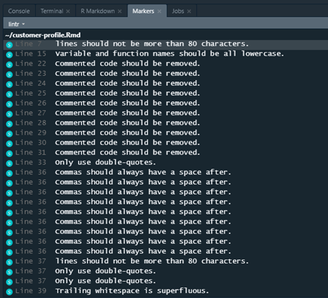

## Motivation

My initial post on [RMarkdown Driven Development](/post/rmarkdown-driven-development/) focuses on major *concepts* in the process of evolving a one-time, single-file analysis into a sustainable analytical tool. In the spirit of Etsy's [immutable documentation](https://codeascraft.com/2018/10/10/etsys-experiment-with-immutable-documentation/), I intentionally minimized references to specific tools or packages. After all, software is transient; principles are evergreen. 

However, RMarkdown Driven Development is more than just a *conceptual* framework. There are three main components: the main conceptual workflow (the why-to), the technical implementation (the how-to), and the comparison of merits between different destination states (the what-now). I touched on all three of these briefly in my rstudio::conf 2020 presentation^[If you wish, you may see the slides on [SlideShare](https://www.slideshare.net/EmilyRiederer/rmarkdown-driven-development-rstudioconf-2020) or watch the full conference [video](https://resources.rstudio.com/rstudio-conf-2020/rmarkdown-driven-development-emily-riederer)], but plan to explore each more deeply in their own post. This post focuses on the second: tools for technical implementation.  

To implement RMarkdown Driven Development (RmdDD), one should take full advantage of the current state-of-the-art in R developer tools and the RStudio IDE. This article surveys helpful some of these helpful packages and tools. As the title implies, this piece is a appendix and not a complete narrative. It is neither a stand-along replacement for the original post, nor does it intend completely explain each referenced package and tool it mentions. This companion piece simply focuses on awareness raising for the plethora of tools that can make your job as a (file / project / package) engineer easier. 

As this is a very lenthy post, please use the visual guide and the table of contents below to jump around as you please:


```{r echo = FALSE}
# Source: https://gist.github.com/gadenbuie/c83e078bf8c81b035e32c3fc0cf04ee8
render_toc <- function(
  filename, 
  toc_header_name = "Table of Contents",
  base_level = NULL,
  toc_depth = 3
) {
  x <- readLines(filename, warn = FALSE)
  x <- paste(x, collapse = "\n")
  x <- paste0("\n", x, "\n")
  for (i in 5:3) {
    regex_code_fence <- paste0("\n[`]{", i, "}.+?[`]{", i, "}\n")
    x <- gsub(regex_code_fence, "", x)
  }
  x <- strsplit(x, "\n")[[1]]
  x <- x[grepl("^#+", x)]
  if (!is.null(toc_header_name)) 
    x <- x[!grepl(paste0("^#+ ", toc_header_name), x)]
  if (is.null(base_level))
    base_level <- min(sapply(gsub("(#+).+", "\\1", x), nchar))
  start_at_base_level <- FALSE
  x <- sapply(x, function(h) {
    level <- nchar(gsub("(#+).+", "\\1", h)) - base_level
    if (level < 0) {
      stop("Cannot have negative header levels. Problematic header \"", h, '" ',
           "was considered level ", level, ". Please adjust `base_level`.")
    }
    if (level > toc_depth - 1) return("")
    if (!start_at_base_level && level == 0) start_at_base_level <<- TRUE
    if (!start_at_base_level) return("")
    if (grepl("\\{#.+\\}(\\s+)?$", h)) {
      # has special header slug
      header_text <- gsub("#+ (.+)\\s+?\\{.+$", "\\1", h)
      header_slug <- gsub(".+\\{\\s?#([-_.a-zA-Z]+).+", "\\1", h)
    } else {
      header_text <- gsub("#+\\s+?", "", h)
      header_text <- gsub("\\s+?\\{.+\\}\\s*$", "", header_text) # strip { .tabset ... }
      header_text <- gsub("^[^[:alpha:]]*\\s*", "", header_text) # remove up to first alpha char
      header_slug <- paste(strsplit(header_text, " ")[[1]], collapse="-")
      header_slug <- tolower(header_slug)
    }
    paste0(strrep(" ", level * 4), "- [", header_text, "](#", header_slug, ")")
  })
  x <- x[x != ""]
  knitr::asis_output(paste(x, collapse = "\n"))
}
```

```{r echo = FALSE}
render_toc(
  filename = "index.Rmd",
  toc_header_name = 'Motivation'
  )
```


## Review of RMarkdown Driven Development

Broadly speaking, RMarkdown Driven Development has five main steps.

1. Removing troublesome components
2. Rearranging chunks
3. Reducing duplication with functions
4. Modularizing Rmd chunks into separate files and folders
5. Migrating modularized project assets into a package

Steps 1-3 result in a well-engineered single-file RMarkdown, Step 4 in an R Project, and finally Step 5 in a Package. Critically, RmdDD introduces good software engineering practices as early as possible in each step of this workflow. This means that you can stop at steps 3, 4, or 5, and even up in a sustainable analytical tool in the form of either a single file `.Rmd`, an R project, or a package.^[The choice between these depends on the problem you are solving and the needs of your future users. While that choice is out-of-scope for this post, advice on making that decision is contained in my rstudio::conf slides and will be the subject of a future post.]

In service of these 'exit ramps', this post also discusses steps 3.5 and 4.5, that is tools that are not part of the overall RmdDD 'progression' but add functionality to the single-file or project folder end state. 

## Tools Covered

The following R packages, RMarkdown features, and RStudio IDE utilities are mentioned in this post. If some are of particular interest to you, you can search this post to jump to where they are mentioned. Do not be overwhelmed by the sheer number of tools and functionality mentioned. Very few are actually necessary to conduct RmdDD or to build a good analysis tool. Simply pick whichever tools you like to add to your toolkit. 

**R Packages**

- `rmarkdown`
- `keyring`
- `here`
- `roxygen2`
- `assertr`
- `pointblank`
- `lintr`
- `styler`
- `spelling`
- `DT`
- `xfun`
- `diffr`
- `ProjectTemplate`
- `starters`
- `workflowr`
- `renv`
- `drake`
- `usethis`
- `devtools`
- `testthat`
- `pkgdown`
- `ghactions`

**RMarkdown Features**

- Parameters
- Named chunks
- Code download
- Embed a file

**RStudio IDE Utilities**

- Parameters UI
- Named chunks
- Indexed comments 
- Function documentation skeleton shortcut
- Live spell-check
- R Project (`.Rproj`)
- Version control
- Package build pane

## Step 1: Removing troublesome components

The goal of this step is to remove 'clutter' that your RMarkdown accumulated over the course of this analysis. Core examples are removing hard-coded variables, plain text credentials, local file paths, and unused code chunks. 

### Convert hard-coded variables to parameters

Hard-coded values make code brittle. Future users may not know when and where to change them, or may change them inconsistently and violate the internal integrity of the analysis. 

For example, imagine a quarterly report that requires filter multiple datasets to the same date range. This give an analyst updating the report to make multiple types of errors. First, they might forget to change the dates altogether, resulting in stale information. Even worse, they might remember to change *some* of the dates but accidentally miss one and end up blending two inconsistent data sources.

```
data1_lastyr <- 
  data1 %>%
  filter(between(date, ‘2018-01-01’, ‘2018-03-31’))
  
data2_lastyr <- 
  data2 %>%
  filter(between(date, ‘2018-01-01’, ‘2018-03-31’))
```

Instead, [RMarkdown parameters](https://rmarkdown.rstudio.com/lesson-6.html) allow us highlight key variables in the YAML header, and turn the entire RMarkdown document into a 'mega-function'. 

```
---
title: “My Analysis"
output: html_document
params:
  start: ‘2018-01-01’
  end: ‘2018-03-31’
---
```

These parameters are stored as list items in the `params` variable and can be referenced in the code like this:

```
data1_lastyr <- 
  data1 %>%
  filter(between(date, params$start, params$end))

```

### Pass secure parameters at knit-time

Parameters also provide a secure way to deal with passwords or other secret credentials. For example, if we need to connect to a database to pull data, we can create parameters in our YAML header with dummy values.

```
---
title: “My Analysis"
output: html_document
params:
  username: emily
  password: x
---
```

These values can then be referenced within the code like this.

```
con <- 
  connect_to_database(
    username = params$username,
    password = params$password
  )
```

When it comes time to knit the RMarkdown, there are multiple ways to pass the parameters in at knit-time. 

If we are knitting our RMarkdown from the RStudio IDE, we can use the parameters UI to prompt a pop-up box in which to enter parameters and replace the dummy values from the header. To do this, click the down arrow on the `Knit` button and chose `Knit with Parameters...`.

Alternatively, this can also be done programmatically with the `rmarkdown::render` function. The `render` function can kick-off the process of knitting any RMarkdown when provided its file path, e.g. `rmarkdown::render(input = 'my-analysis.Rmd')`. `render` has a `params` argument which, as stated in the documentation, accepts "a list of named parameters that override custom parameters specified in the YAML front-matter". That is, we can write:

```
rmarkdown::render(input = 'my-analysis.Rmd', params = list(password = {{CODE TO RETRIEVE PASSWORD}}))
```

where `{{CODE TO RETRIEVE PASSWORD}}` is replaced with the relevant code. You could consider retrieving code from an environment variable, a [keychain from the `keyring` package](https://cran.r-project.org/web/packages/keyring/index.html), or code you may use to interface with other password managers. Credential management is a large topic unto itself and beyond the scope of this post.


### Create file paths with `here`

When our RMarkdown includes external files such as data, images, scripts, etc. it can be tempting to reference the resource by its full, global file path. This can deceptively seem like the most robust option since we are telling our computer *exactly* where to find the resource. So we may have file paths that look like this:

```
data <- readRDS(‘C:\Users\me\Desktop\my-project\data\my-data.rds’)
```

However, this code is incredibly brittle. It effectively guarantees your code will not work on any machine but the one you are currently using. Even then, the path will break if you move the `my-project` directory. 

Slightly better is to use relative file paths based on the relationship to the working directory. By default, RMarkdown assumes the directory where it is stored is the working directory. So, if our RMarkdown lives in the `my-project` directory, the working directory will be `‘C:\Users\me\Desktop\my-project'` and we can write:

```
data <- readRDS('data\my-data.rds’)
```

This version is resilient to moving around the `my-project` directory on your computer and will work on other computers so long as your RMarkdown and external file continue to have the same "steps" between them. 

However, this approach can still cause some unexpected behavior. Suppose we move our RMarkdown into the `analysis` sub-directory of `my-project` (as we will do in Step 4). Then, the effective working directory during the knitting process will be `‘C:\Users\me\Desktop\my-project\analysis'`. To reference the same data file, we would have to use a relative path that both gets us *out* of the `analysis` sub-directory (using `..` to move up to the parent directory) and then go back down into the `data` sub-directory like this:

```
data <- readRDS('..\data\my-data.rds')
```

To make our RMarkdown more resilient to where the RMarkdown lives within the project, we can construct file paths dynamically using the [`here` package](https://here.r-lib.org/). Malcolm Barrett's [blog post](https://malco.io/2018/11/05/why-should-i-use-the-here-package-when-i-m-already-using-projects/) provides a more complete description of `here`'s benefits, but in short, `here` helps guarantee consistent behavior both within a project and across operating systems. It's user-friendly syntax looks like this: 

```
data <- readRDS(here::here(‘data’, ‘my-data.rds’))
```

## Step 2: Rearranging chunks

The goal of this step is to group similar parts of code together, specifically by moving infrastructure (e.g. package loads, data ingestion) and heavy-duty computation chunks to the top and letting narratives, tables, and plots sink to the bottom. This makes our document more navigable and easier to edit by locating like elements (e.g. computation vs narration) more centrally, and it allows us to notice repeated code or narration for consolidation. 

While the process of rearranging chunks is mostly manually, we can also pursue the aim in enhancing developer navigability with a few useful features of the RStudio IDE.

### Named Chunks

Since we are grouping chunks together by intent in this step, We can use [named chunks](https://itsalocke.com/blog/namer-automatic-labelling-of-r-markdown-chunks/) to communicate the purpose of each chunk. For example, most analyses probably include steps such as loading packages, loading data, cleaning data, etc. so we might want chunks named `pkg-load`, `data-load`, `data-clean`, etc. To do this, we would simply insert the name in the chunk header immediately after we specify the language engine, e.g. `{r NAME-HERE}`.

Named chunks have numerous benefits, but the one most relevant for improving navigability is that RStudio uses chunk names to create a dynamic table of contents at the bottom of the pane in which your RMarkdown lives, as shown below. This makes it easier to quickly find the piece of code we want to inspect and to rapidly move between sections. 


### Indexed Comments

Similarly to named chunks, sometimes we might want to annotate specific sections of code within a single chunk. To do this, we can use normal R code comments and simply put four dashes (`----`) at the end of the comment. RStudio uses this special type of comment in two ways. First, it adds this to the same table of contents we discussed before (as shown in the image above). Second, this also enables the ability to collapse code subsections by clicking on the small triangle that appears to the right of the line number of the commented line. 

## Step 3: Reducing duplication with functions

The goal of this step is to reduce duplicated code by taking note of similar, repeated code patterns and converting them to functions. Doing this improves code readability and helps us apply changes more consistently. How to write R functions is out of scope for this post, but you can learn more [here](https://swcarpentry.github.io/r-novice-inflammation/02-func-R/).

### Document functions with `roxygen2` template

One general benefit of R is the level of structure and consistency in the required documentation for R packages. Any time we bring up documentation with `?` or the `help()` function, we benefit from precise descriptions of the functions intent, input, and output. 

[`roxygen2`](https://roxygen2.r-lib.org/) provides a light-weight syntax for authors to write this documentation, which then is rendered to official documentation files in the package-building process. However, `roxygen2` can be used even before we are building a package. This ensures we are writing documentation that is similar to what other R users are familiar with seeing and interpreting, and it also forces us to think more formally about the range of acceptable inputs and outputs for each function we write. 

Suppose we have defined a local scatterplot function that looks something like this:

```
viz_scatter_x <- function(data, vbl) {
  ggplot(
    data = data, 
    mapping = aes(x = x, y = {{vbl}}) +
  geom_point()
}

```

We can add `roxygen2` documentation using special `#'` comments above our function followed by `roxygen2` tags and values. To facilitate learning this system and rapidly generating documentation, we can use the RStudio IDE's function documentation skeleton shortcut. With your cursor inside the function body, click `Code > Insert Roxygen Skeleton` or use shortcut `Ctrl+Alt+Shift+R`. This adds into our code a basic documentation template. 

```
#' Title
#'
#' @param data 
#' @param vbl 
#'
#' @return
#' @export
#'
#' @examples
viz_scatter_x <- function(data, vbl) {
  ggplot(
    data = data, 
    mapping = aes(x = x, y = {{vbl}}) +
  geom_point()
}

```

To complete this example, we can fill out the template like this:

```
#’ Scatterplot of variable versus x 
#'
#' @param data Dataset to plot. Must contain variable named x
#' @param vbl Name of variable to plot on y axis
#'
#' @return ggplot2 object
#’ @import ggplot2
#' @export

viz_scatter_x <- function(data, vbl) {
  ggplot(
    data = data, 
    mapping = aes(x = x, y = {{vbl}}) +
  geom_point()
}
```

An overview of `roxygen2` syntax can be found [here](https://roxygen2.r-lib.org/articles/rd.html).

### Validate data inputs with `assertr`

The function above is not, in fact, an ideal R function. While the y variable in our plot is specified by a function argument, the x variable is hard-coded into the function internally. As such, we are assuming that the dataset a user passes into the function contains a variable specifically named `x`. This is not a best practice since it adds some brittleness to the code, but when you first begin writing functions, you might occasionally end up with some. Additionally, if you are confident your dataset should stay consistent overtime (e.g. pulling from a stable database schema),you may find this to be a practical option since it avoid repeatedly specifying arguments that you don't expect to take different values. 

If you are making any assumptions about the structure of your input data in your code, you might want to include a step to validate these assumptions and proactively flag to the user of the code if the data does not meet those expectations. R has multiple good options for data validation packages. If you are familiar with `dplyr` and are working with small datasets, the [`assertr` package](https://docs.ropensci.org/assertr/) has a similar look and feel. If you want to validate large datasets on a remote system, the brand new [`pointblank` package](https://rich-iannone.github.io/pointblank/) looks very promising, but I have not yet experimented with it personally.

### Enforce style guide with `lintr` or `styler`

At this point, we've eliminated as much unneeded or duplicative code as possible. Next, we should consider the quality and style of the code that remains. The [`lintr`](https://github.com/jimhester/lintr) and the [`styler`](https://styler.r-lib.org/) packages both accomplish this in slightly different ways.

`lintr` works by analyzing your code and flagging issues for you to manually change. It can be run on one or more files and provides an itemized list of line numbers where a problem exists and a description of the issue. Example output is shown below:



`styler` analyzes code similarly to `lintr`, but it automatically edits scripts to adhere to a style guide instead of providing suggestion.

Both packages allow us to customize what checks we impose on our script. The main differences is a personal preference how 'human-in-the-loop' you want to be. I personally prefer the `lintr` package to maintain full control over my code. Additionally, getting immediate feedback on ways to improve my code style helps me learn to avoid those specific mistakes in the future.

### Catch typos with `spelling`

Finally, recall that one key reason we are working in RMarkdown to begin with is its capacity for literate programming and enabling communication of our results. We have thus far been mostly focused on the needs of future *analysis tool users* not the *analysis results consumer*. They will never see the style of our code but likely care a lot about the human-readability of our prose. 

For this reason, as we finish polish our single-file RMarkdown, we should use the [`spelling` package](https://docs.ropensci.org/spelling/) to check for typos in our analysis. Alternatively, if you are working in RStudio version 1.3 or later, you may also take advantage of the [live spellcheck feature](https://github.com/rstudio/rstudio/issues/2825)

## Step 3.5: Enhance Single-File Output

Before we continue with the normal RmdDD 'flow', it's worth taking a break to reflect upon what we've accomplished so far. At this point, we engineered a well-organized, well-document RMarkdown that is easier for developers to use. 

There are a few reasons why this might be the right stopping point. First, if you are automating a report that is nearly identical from iteration to iteration, the value of single-file push-button execution may trump greater modularity or unneeded flexibility. Secondly, if you are in a resource constrained environment and lack a good system for sharing files with collaborators or conducting version control, a single-file documents is appealing for its portability.

If either of these describe your use case, this side-note is for you. Here, I comment on a few tips and tricks specific to getting the most out of single-file RMarkdowns. Otherwise, you may find it a bit tangential and prefer to jump to Step 4.

### Sharing Resources

If portability is the goal, you can carry this to the logical extreme and ship additional resources in the *output* of your RMarkdown. In a sense, we are creating a 'desert island' RMarkdown that is completely self-sustaining. I don't recommend doing all of the things listed below simultaneously;this will drastically increase file size, and if you *need* to do all of these things, it's probably a sign you shouldn't be aiming for the single-file endpoint. That said, I mention them all here in case any one might be useful for your scenario.

#### Allow Code Download from RMarkdown Output

You can allow those with access to the HTML output of your RMarkdown download the source `.Rmd` by specifying `code_download: true` in the YAML header like this:

```
output:
  html_document:
    code_download: true
```

Thanks to Allison Hill for publicizing this great trick:

```{r echo=FALSE}
blogdown::shortcode('tweet', '1108925218850893832')
```

#### Allow Data Preview/Download with `DT`

For relatively small datasets, you can both display you dataset and offer the option to download it using the `DT` package. [This example](https://rstudio.github.io/DT/003-tabletools-buttons.html) demonstrates how you can add buttons to copy the data to clipboard or download it into multiple different formats. 

#### Embed an arbitrary file

More broadly, you can embed a file, file(s), or folder from the HTML output of an RMarkdown with the functions `embed_file()`, `embed_files()`, and `embed_dir()` from the [`xfun`](https://cran.r-project.org/web/packages/xfun/index.html) package. The process of doing this is described in more detail in Yihui Xie's [blog post](https://yihui.org/en/2018/07/embed-file/) on these new functions.

### Version Comparison with `diffr`

As mentioned above, single file outputs may be useful in scenarios in which you have no formal version control system. In this case, you can conduct a rudimentary comparison of the differences between separately saved versions of your script using the [`diffr` package](https://github.com/muschellij2/diffr). 

This tool wraps the JavaScript `codediff` library and provides an aesthetic comparison of differences between two text files, much like `diff` command line tools. 

## Step 4: Modularizing Rmd chunks into a project

The goal of this step is to strip as much as reasonable^['Reasonable' in this case is highly dependent on what parts of the RMarkdown are static or dynamic.] outside of our RMarkdown by organizing it into other sub-directories in a project directory. This forces us to make more modular and reusable project assets and to decrease our RMarkdown's knit-time by not making it do unnecessary work. 

### Use RStudio R Project (`.Rproj`)

A [R Project](https://support.rstudio.com/hc/en-us/articles/200526207-Using-Projects) is a convenient structure that make a typically directory 'smarter'. Projects have numerous benefits, but one particularly important one is that, when opened in RStudio, they immediately are treated as the working directory. 

In the RStudio interface, they also improve navigability by enabling a [Git tab for version control](https://support.rstudio.com/hc/en-us/articles/200532077-Version-Control-with-Git-and-SVN) and easy access to a file explorer. 

You can make a new project in RStudio using `usethis::create_project()` or by clicking `File > New Project...`. 

### Pick a consistent & opinionated folder structure 

Alternatively, other packages such as [`ProjectTemplate`](http://projecttemplate.net/getting_started.html),  [`starters`](https://itsalocke.com/starters/), or [`workflowr`](https://jdblischak.github.io/workflowr/articles/wflow-01-getting-started.html) will create your R project for you. 

Each ships with opinionated sub-directory structures to organize your work. These are similar in spirit to the structure I describe in the original RMarkdown Driven Development blog post but vary some in the exact semantics. Additionally, each provides a slightly different set of helper features to further tune and polish your project. I encourage you to explore all your options and pick what works best for you. 

The most critical step here is consistency; the more you keep the same structure between projects (and, ideally, across collaborators or any organization of which you are part), the easier it is for others to navigate your directory and find the project assets in which they are interested. 

## Step 4.5: Manage dependencies, versions, and interactions

Once again, as in Section 3.5, we will briefly digress to take stock of where we are. Should we chose to take the 'exit ramp' of a well-formed R project, we will now find ourselves will a documented, modularized project with easy to find components. However, this structure has some additional benefits to reap and drawbacks to overcome *if we plan to stop at the project stage*, so this section focuses on overcoming them.

One advantage of moving from a single file to a project structure is that it enables you to create helper artifacts and sub-directories that contain various types of package metadata in order to better maintain your project over time. Three particularly important examples of this are package dependency management, version control, and project interdependency management. 

### Manage Package Dependencies with `renv`

Dependency management refers to the process of tracking the specific versions of the packages you used in your project. This helps ensure reproducibility of your code even if those packages change in future updates. For example, sometimes functions may be removed, renamed, or re-implemented in functions; these 'breaking changes' may be the best option for that package but may break your downstream code. 

Package management is a challenging issue for many reasons. There are many critical decisions regarding when to capture the state of your dependencies, how to characterize the current version, and how to ensure you can recreate that environment in the future.

Currently, one promising tool in the dependency management space is [`renv`](https://rstudio.github.io/renv/index.html). It provides a portable and light-weight solution to package management problems by logging metadata about dependencies without actually saving all packages that are needed locally. By preserving this information, it can help restore this information, `renv` can also help recreate these specific environments by re-installing specific versions of packages across a number of different repositories (CRAN, GitHub, etc.)

### Conduct Version Control with RStudio git Integration

This is also a good time to start thinking about version control with git. This is yet another huge topic and out of scope for this post. A good place to get started with using git with R is Jenny Bryan's [Happy Git and GitHub for the UseR](https://happygitwithr.com/). More tactically, if you prefer to use Git through an IDE instead of the command line, RStudio has a [built-in interface](https://support.rstudio.com/hc/en-us/articles/200532077-Version-Control-with-Git-and-SVN). You can add version control to an existing project by choosing `Tools > Project Options > Version Control`.

I personally prefer (and, to some extent, recommend) executing git commands in a terminal, but I still make use of RStudio's version control pane to easily preview my current branch and project status (e.g. equivalents of always-on access to the `git status` commands.)

As another alternative, `usethis` has a rapidly growing collection of functions to wrap conduct git and GitHub-related tasks in declarative R syntax.

### Ensure Project Syncing with `drake`

However, moving from a single-file RMarkdown to a project is not purely upside; we've introduced to risks and brittleness of a different variety. Knitting a single-file RMarkdown causes all computation to rerun.^[Unless one uses chunk caching. I personally find this to be a risky solution that is prone to human-error, so I leave it out of scope for this piece.] This can be slow and tedious, but it helps guarantees that all of the parts of our analysis have run in order and all changes have complete 'flowed through'. Projects, on the other hand, risk us forgetting steps (e.g. pulling fresh raw data but forgetting to refresh some intermediate data artifacts). 

The [`drake`](https://docs.ropensci.org/drake/) package helps counteract this by providing an R wrapper for the command line utility [`make`](https://swcarpentry.github.io/make-novice/). These tools help us specify which documents in a project depend upon each other and allow us to selectively refresh elements that are 'downstream' from other critical elements.

## Step 5: Migrating a project to a package

The goal of this step is to convert our R project to a package. This is fairly straightforward because an R package is, at the highest level, simple R files stored in the right places, and R has excellent developer tools to help us accomplish this. Additionally, there is a fairly clear one-to-one mapping between analysis project files and an R package structure, as is described in more detail in the main post.

### Configure your package with `usethis`

[`usethis`](https://usethis.r-lib.org/index.html) is a phenomenal tool for build R packages. I said above that write an R package is basically about saving files in the right place. Well, `usethis` makes this blazingly fast and simple by auto-generating many skeleton files, folder structures, and configuration infrastructure for your with simple declarative commands (e.g. `use_r_script()`, `use_vignette()`) which give you detailed and helpful messages as they go to work. 

Jenny Bryan is current rewriting the acclaimed [R Packages](http://r-pkgs.had.co.nz/) book to highlight synergy with `usethis`. Check out this resource, even while the transformation is in progress, for a great overview of package components.

### Autogenerate documentation with `devtools`

[`devtools`](https://devtools.r-lib.org/) has many helpful functions for writing a package. Most critically for this discussion is the `devtools::document()` function which will translate the `roxygen2` comments you wrote way back in Step 3 and translate them into official R documentation files (`.Rd` files which will populate the `man/` folder).

### Write unit tests with `testthat`

[`testthat`](https://testthat.r-lib.org/) offers a high-level interface for writing unit tests for your R functions. This is critical for a well-managed R package, but quite honestly, writing functions for your unit tests are something you should start to think about as soon as you write functions!^[Arguably, proponents of test-driven development would say you think about your tests *before* writing any functions.]

In fact, as Davis Vaughn points out on Twitter, if you save your R functions in an `R/` folder instead of the generic `src/` folder at the project stage, you can actually go ahead and run `testthat` unit tests at that step.

```{r echo=FALSE}
blogdown::shortcode('tweet', '1124732877344784384')
```

### Create a package website with `pkgdown`

[`pkgdown`](https://pkgdown.r-lib.org/) goes one step above-and-beyond the requirements for an R package. It cleverly re-uses all of the metadata contained in your resulting R package to create an aesthetic and highly accessible documentation website for your pages. Want to see an 'in the wild example'? All of the links above to `usethis`, `devtools`, `testthat`, and `pkgdown` point to outputs of this magical tool! Advanced features include custom search bars and Google Analytics tracking. 

### Coordinate tasks with RStudio's Build Pane

RStudio's [package build pane](https://support.rstudio.com/hc/en-us/articles/200486488-Developing-Packages-with-RStudio) provides a great number of resources for helping with the package build process. This tab will help you execute and review the results of unit tests and R CMD check (don't worry if you don't know what that is yet!) and provides many helpful options for installing and building your package. The build pane accomplishes this by adding a UI layover over many of the functions in `devtools` and relates package development tools to further streamline your workflow.

### Automate builds with `ghactions`

As mentioned above, a lot of packages like `devtools` and `testthat` help you easily set up a lot of critical package infrastructure. However, you may find that there is a lot of manual overhead in repeatedly rerunning commands to build documentation, execute unit tests, or rebuild your package website. Additionally, if you are working with collaborators, you may wish to ensure these process-steps are executed on their code contributions before you incorporate them into your repository. If any of this sounds like a problem you are having, you might need a solution for *continuous integration*.

The [`ghactions`](https://www.maxheld.de/ghactions/index.html) package is here to help! It provides an R interface to [GitHub Actions](https://github.com/features/actions), a workflow automation tool available for GitHub-based repos. 

This is a relatively new package, and currently you will likely find more online support and documentation for other continuous integration tools like Travis CI and Appveyor (including `usethis` functions that will help you set up configuration files for these services, along with documentation in the *R packages* book). However, GitHub Actions appears to be growing in popularity due to it's parity of features and superior integration with GitHub repositories. For more information, check out Jim Hester's compelling rstudio::conf 2020 presentation on GitHub Actions.

## Closing Thoughts

This post recounts the best practices and tools that I am aware of for RmdDD as of January 2020. As I stated in the introduction, I'm under no illusion that this content will not eventually grow stale. If you know over other good tools that should be included or find any of the information mentioned is out of date, please contact me on [Twitter](https://twitter.com/EmilyRiederer) or consider submitting a PR on GitHub to add or update content.
