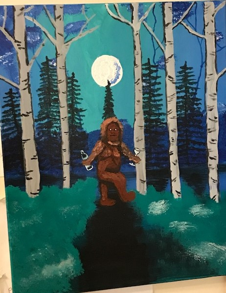
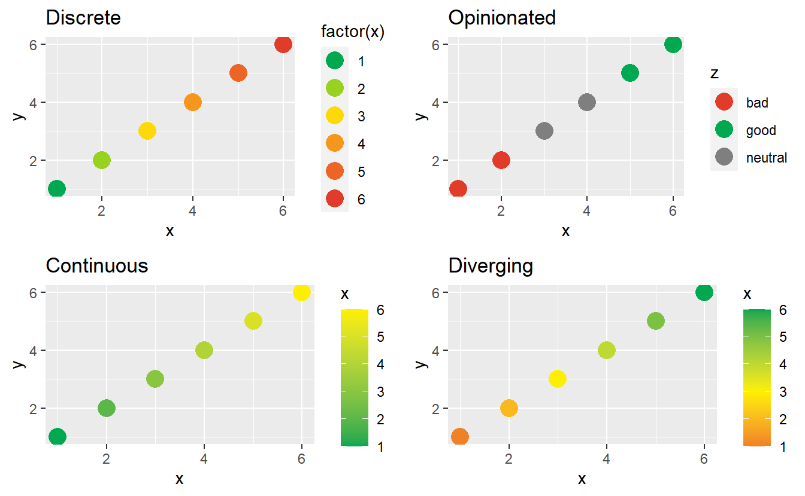
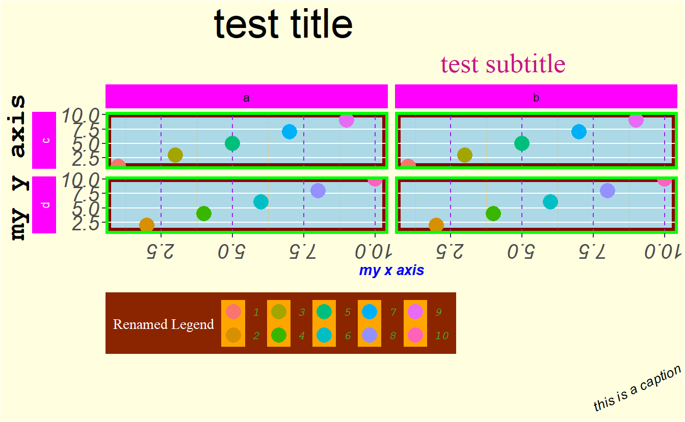

Last winter, I attended a holiday party at a "paint-and-sip" venue. For those unfamiliar, "paint-and-sip" is a semi-trendy cottage industry offering evenings of music, wine, and a guided painting activity. For example, my group painted sasquatch on a snowy winter's eve:

As often happens, this completely unrelated thing set me thinking about R. What made painting fun when we lacked the talent and experience to excel, when it almost surely wouldn't turn out very well, and when "failure" would be very visibly and undeniably on display? Many of these same dimensions (novelty, risk, and visibility) often intimidate new coders, yet somehow they were core to the paint-and-sip business model.

(Admittedly, the "sipping" part may be a major confounder here, but this isn't a post on causal inference!)

Of course, this was nothing more than a tongue-in-cheek thought experiment, but it did bring a few observations to the front of my mind.

-   **The evening was highly structured**. It would be miserable (at least, for me) to be given any sort of picture and to simply be told to paint it.[^1]. Instead, the instructor told us and showed us step-by-step which order to tackle the painting in.
-   **The objective wasn't too serious**. Complete and utter failure was low stakes. No balls would be dropped. No important meetings would have to be postponed. No deadlines would be missed. There was no dire consequence of trying, and possibly failing, to paint a sasquatch.
-   **The ability to succeed wasn't correlated with anything important**. Hopefully, no one is going to measure their self-worth by sasquatch painting. In contrast, sometimes people unfortunately seem to associate their current technical abilities with a more foundational measure or worth or intelligence. This dramatically increases the cost of "failure" and dissuades exploration.
-   **The playing field was mostly level**. As far as I know, there are no experts in acrylic sasquatch painting.

It did pique my curiosity if these principles could help introduce concepts like GitHub or package development in a friendlier and more engaging way. Over the next few months, life carried on and took me in a variety of directions, including to the Chicago R unconf where I marvelled at the passion and productivity of teams coming together for a two day hackathon. Somewhere in there, a project idea began to form.

Introducing `Rtistic`
---------------------

Now that you've indulged my musings, let me introduce my [`Rtistic`](https://github.com/emilyriederer/Rtistic) repo on GitHub.

Structurally, `Rtistic` is a package in the sense that you could install it with [`devtools::install_github()`](https://rdrr.io/pkg/devtools/man/remote-reexports.html). However, it is not an R package in the sense that you would be sorely disappointed if you did that. `Rtistic` is incomplete, by intent, and always will be. It is a skeleton of an R package and intended to be used as a "hackathon-in-a-box" or an "R package cookbook". Small groups at a meetup, office, or classroom can come together and collectively build out a package containing palettes and themes for `ggplot2` and RMarkdown. Much like the paint-and-sip, it strives to be highly structured and low stakes.

> **Caveat lector!:** `Rtistic` continues to evolve. For example, since first writing the below, I have added support for `xaringan`, utilized the new [GitHub template repository](https://github.blog/2019-06-06-generate-new-repositories-with-repository-templates/) functionality, and further standardized file names. The description below remains accurate *in spirit*, but the repo `README` is the best resource for the most up-to-date information for actual use.

### Structure

Much of the boilerplate code already exists, so partipants are less likely to get caught up on some cryptic error message. Off-the-shelf, the project's file structure looks similar to what's shown below (additional files may be added after I post this). Files prefixed with `my-` are open to edits by each team.

<pre class='chroma'><code class='language-r' data-lang='r'>-- DESCRIPTION
-- footer-helpers
   |__generate-footer-logo.R
   |__my-footer-template.html
   |__my-logo.png
-- inst
   |__rmarkdown
      |__resources
         |__my-footer.html
         |__my-styles.css
-- LICENSE.md
-- man
   |__figures
      |__logo.png
   |__my_html_format.Rd
   |__my_theme.Rd
   |__scale_custom.Rd
   |__test_pal.Rd
-- NAMESPACE
-- R
   |__my-gg-palette.R
   |__my-gg-theme.R
   |__my-html-format.R
   |__palette-infrastructure.R
-- README.md
-- Rtistic.Rproj
-- scratchpad
   |__gg-theme-demo.Rmd
   |__rmd-theme-demo.Rmd
-- vignettes
   |__my-gg-theme-vignette.Rmd
</code></pre>

### Whimsical...

With this much structure, participants can focus on the fun task of picking colors, fonts, and other theme components. Truly, a team contribution could be as minimal as defining four palettes in a file similar to the provided [`my-gg-palette.R` file](https://github.com/emilyriederer/Rtistic/blob/master/R/my-gg-palette.R):

<pre class='chroma'><code class='language-r' data-lang='r'>test_pal &lt;- <a href='https://rdrr.io/r/base/c.html'>c</a>("green", "yellow", "orange", "red") # discrete colors
test_pal_op &lt;- <a href='https://rdrr.io/r/base/c.html'>c</a>("green", "grey50", "red")        # discrete colors mapping to good/neutral/bad
test_pal_cont &lt;- <a href='https://rdrr.io/r/base/c.html'>c</a>("green", "yellow")             # endpoints for a continous scale
test_pal_div &lt;- <a href='https://rdrr.io/r/base/c.html'>c</a>("green", "yellow", "red")       # reference points for diverging scale</code></pre>

 Full example file below the fold 

<pre class='chroma'><code class='language-r' data-lang='r'>#&gt; #' Test palette
#&gt; #'
#&gt; #' This is a test palette inspired by stop-light colors
#&gt; #'
#&gt; #' @references https://en.wikipedia.org/wiki/Traffic_light
#&gt; #' @name test_pal
#&gt; NULL
#&gt; 
#&gt; #' @name test_pal
#&gt; #' @export
#&gt; # Define disrete palette
#&gt; test_pal &lt;- c(
#&gt;   "#00A850", # green
#&gt;   "#FEEF01", # yellow
#&gt;   "#F58222", # orange
#&gt;   "#E13C29"  # red
#&gt; )
#&gt; 
#&gt; #' @name test_pal
#&gt; #' @export
#&gt; # Define opinionated discrete palette (good, neutral, bad)
#&gt; test_pal_op &lt;- c(test_pal[1], "grey50", test_pal[4])
#&gt; 
#&gt; #' @name test_pal
#&gt; #' @export
#&gt; # Define two colors for endpoints of continuous palette
#&gt; test_pal_cont &lt;- c(test_pal[1], test_pal[2])
#&gt; 
#&gt; #' @name test_pal
#&gt; #' @export
#&gt; # Define three colors for endpoints of diverging continuous pallete (high, middle, low)
#&gt; test_pal_div  &lt;- c(test_pal[1], test_pal[2], test_pal[4])</code></pre>

These palettes can then be used in a number of functions (thanks to the [`R/palette-infrastructure.R` file](https://github.com/emilyriederer/Rtistic/blob/master/R/palette-infrastructure.R)):

-   `scale_(color/colour/fill)_discrete_rtistic(palette = "test")`: Discrete palette with optional `extend` parameter to interpolate more values
-   `scale_(color/colour/fill)_opinionated_rtistic(palette = "test")`: Discrete palette to map to subjectively coded "good"/"bad"/"neutral" column[^2]
-   `scale_(color/colour/fill)_continuous_rtistic(palette = "test")`: Standard continous palette
-   `scale_(color/colour/fill)_diverging_rtistic(palette = "test")`: Diverging continuous palette

For example, that contribution leads to the following styles:

To "level up", participants can also use `roxygen2` syntax to add documentation about their theme and showcase it by editing the [`my-gg-theme-vignette.Rmd` template](https://github.com/emilyriederer/Rtistic/blob/master/scratchpad/gg-theme-demo.Rmd).

The `get_rtistic_palettes()` function scans the package's namespace for anything ending in `_pal` to help users learn about all the available options[^3]:

<pre class='chroma'><code class='language-r' data-lang='r'>Rtistic::<a href='https://rdrr.io/pkg/Rtistic/man/get_rtistic_palettes.html'>get_rtistic_palettes</a>()
#&gt; [1] "test_pal"</code></pre>

Adding actual `ggplot2` and RMarkdown themes is slightly more advanced, but the core design of participants altering templates still holds. Helper functions and instructions are also provided for some of the most esoteric tasks, like encoding a logo image as a URI to be included as a custom footer of a self-contained RMarkdown.

### ...but Valuable

Despite the low barriers to entry, my hope is that there is a lot to learn with `Rtistic`. For example, participants might get exposure to:

-   **Package structure**: By filling in the missing pieces of an existing package, teams will navigate through an R package file structure. Whether or not teams have package building aspirations, being able to read package source code is a useful skill.[^4] It's also a chance to practice good documentation with commenting and vignette writing.[^5]
-   **Collaboration on GitHub**: I'm convinced no one will ever understand git or GitHub by *reading*. The easiest way to learn forks, branches, and pull requests is to use them. `Rtistic` attempts to make this as easy as possible. Multiple teams should never need to edit the same file, so the likelihood of a big merge conflict problem is low.[^6]
-   **ggplot2 styling**: `ggplot2` is intuitive; however, compared to most of the `tidyverse`, it is intuitive in the sense of having a rich philosophical basis - not in the sense of "barely needed to read the docs because I can infer it all". Unfortunately, this difference can make it feel *unintuitive* to new users. Exposure to `ggplot2` theme options pays dividends in getting the most from the package.
-   **HTML / CSS**: R users more typically come from math and stats backgrounds (versus tech), knowledge of front-end web development can be limited. However, users of any of the `*down` packages[^7] can benefit a lot by having even a cursory understanding of these tools to take advantage of RMarkdown's customization capabilities.

If this seems like too much at once, the modular nature of the project makes it easy to strip down. If GitHub is out of scope, participants can locally change a small number of files and share them with an organizer for compilation. If `ggplot2` and HTML/CSS are too much to tackle at once, either the plot or RMarkdown theme pieces can be ignored.

### A Level Playing Field

For the more complex tasks of `ggplot2` and RMarkdown themes, the `scratchpad/` directory provides additional context. This directory contains two RMarkdown files with working examples of:

-   [**RMarkdown styling with CSS**](https://github.com/emilyriederer/Rtistic/blob/master/scratchpad/rmd-theme-demo.Rmd) for participants to edit and re-knit. This can help build intuition over how RMarkdown is translated into different HTML tags and how those respond to CSS
-   As many [**ggplot2 theme options**](https://github.com/emilyriederer/Rtistic/blob/master/scratchpad/gg-theme-demo.Rmd) as I could possibly fit in one plot with the goal of exposing participants to all of the possible options

The plot, in particular, is hopefully illuminating since the theme is in no way intended to be coherent. Each design choice uses wildly different fonts, colors, and alignments to make it very clear what line of code corresponds to each element:

 Code here 

<pre class='chroma'><code class='language-r' data-lang='r'><a href='https://rdrr.io/r/base/library.html'>library</a>(<a href='http://ggplot2.tidyverse.org'>ggplot2</a>)
# sample data for plot ----
points &lt;- 
  <a href='https://rdrr.io/r/base/data.frame.html'>data.frame</a>(
    x = <a href='https://rdrr.io/r/base/rep.html'>rep</a>(1:10,3), 
    y = <a href='https://rdrr.io/r/base/rep.html'>rep</a>(1:10,3), 
    z = <a href='https://rdrr.io/r/base/sort.html'>sort</a>(<a href='https://rdrr.io/r/base/rep.html'>rep</a>(letters[1:2], 15)),
    w = <a href='https://rdrr.io/r/base/rep.html'>rep</a>(letters[3:4], 15)
    )
# ggplot using many theme options ----
<a href='https://ggplot2.tidyverse.org/reference/ggplot.html'>ggplot</a>(data = points, 
       mapping = <a href='https://ggplot2.tidyverse.org/reference/aes.html'>aes</a>(x = x, y = y, col = <a href='https://rdrr.io/r/base/factor.html'>factor</a>(x))) + 
  <a href='https://ggplot2.tidyverse.org/reference/geom_point.html'>geom_point</a>(size = 5) + 
  <a href='https://ggplot2.tidyverse.org/reference/facet_grid.html'>facet_grid</a>(w ~ z, switch = "y") +
  <a href='https://ggplot2.tidyverse.org/reference/theme.html'>theme</a>(
    
    plot.background = <a href='https://ggplot2.tidyverse.org/reference/element.html'>element_rect</a>(fill = "lightyellow"),
    plot.title = <a href='https://ggplot2.tidyverse.org/reference/element.html'>element_text</a>(size = 30, hjust = 0.25),
    plot.subtitle = <a href='https://ggplot2.tidyverse.org/reference/element.html'>element_text</a>(size = 20, hjust = 0.75, color = "mediumvioletred", family = "serif"),
    plot.caption = <a href='https://ggplot2.tidyverse.org/reference/element.html'>element_text</a>(size = 10, face = "italic", angle = 25),
    
    panel.background = <a href='https://ggplot2.tidyverse.org/reference/element.html'>element_rect</a>(fill = 'lightblue', colour = 'darkred', size = 4),
    panel.border = <a href='https://ggplot2.tidyverse.org/reference/element.html'>element_rect</a>(fill = NA, color = "green", size = 2),
    panel.grid.major.x = <a href='https://ggplot2.tidyverse.org/reference/element.html'>element_line</a>(color = "purple", linetype = 2),
    panel.grid.minor.x = <a href='https://ggplot2.tidyverse.org/reference/element.html'>element_line</a>(color = "orange", linetype = 3),
    panel.grid.minor.y = <a href='https://ggplot2.tidyverse.org/reference/element.html'>element_blank</a>(),
    
    axis.title.x = <a href='https://ggplot2.tidyverse.org/reference/element.html'>element_text</a>(face = "bold.italic", color = "blue"),
    axis.title.y = <a href='https://ggplot2.tidyverse.org/reference/element.html'>element_text</a>(family = "mono", face = "bold", size = 20, hjust = 0.25),
    axis.text = <a href='https://ggplot2.tidyverse.org/reference/element.html'>element_text</a>(face = "italic", size = 15),
    axis.text.x.bottom = <a href='https://ggplot2.tidyverse.org/reference/element.html'>element_text</a>(angle = 180), # note that axis.text options from above are inherited
    
    strip.background = <a href='https://ggplot2.tidyverse.org/reference/element.html'>element_rect</a>(fill = "magenta"),
    strip.text.y = <a href='https://ggplot2.tidyverse.org/reference/element.html'>element_text</a>(color = "white"),
    strip.placement = "outside",
    
    legend.background = <a href='https://ggplot2.tidyverse.org/reference/element.html'>element_rect</a>(fill = "orangered4"), # generally will want to match w plot background
    legend.key = <a href='https://ggplot2.tidyverse.org/reference/element.html'>element_rect</a>(fill = "orange"),
    legend.direction = "horizontal",
    legend.position = "bottom",
    legend.justification = "left",
    legend.title = <a href='https://ggplot2.tidyverse.org/reference/element.html'>element_text</a>(family = "serif", color = "white"),
    legend.text = <a href='https://ggplot2.tidyverse.org/reference/element.html'>element_text</a>(family = "mono", face = "italic", color = "limegreen")
    
  ) +
  <a href='https://ggplot2.tidyverse.org/reference/labs.html'>labs</a>(title = "test title",
       subtitle = "test subtitle",
       x = "my x axis",
       y = "my y axis",
       caption = "this is a caption",
       col = "Renamed Legend") </code></pre>

### Take it for a Spin!

Complete information and more tactical step-by-step instructions for both organizers and participants can be found on the [`Rtistic` GitHub repo](https://github.com/emilyriederer/Rtistic). Please let me know if you check it out. I welcome any and all feedback!

[^1]: As in the ever popular "draw an owl" [meme](https://knowyourmeme.com/memes/how-to-draw-an-owl)

[^2]: I will admit that the `opinionated` scale likely is not useful or relevant in many cases. However, since corporate color palettes are one place I can imagine `Rtistic` being useful, I decided to include it since having a predefined mapping of "good" and "bad" colors (e.g. for profits and losses). I also think it's a nice discrete parallel to the more typical `diverging` scale for continuous-valued variables.

[^3]: This allows discoverability without having to maintain any centralized list of palettes since, for logistical reasons, `Rtistic` is designed to be completely modular.

[^4]: For example, I recently started using a package with very little documentation but an excellent test suite. Once I figured this out, I was able to use it a lot more efficiently by learning from the test examples.

[^5]: Another conviction of mine is that these skills should be used for most R projects -- not just packages. R's strong conventions and culture for documentation are one of its hallmarks.

[^6]: Obviously, merge conflicts are an important concept to understand, but as a day-one intro, "how this ideally works" is easier to grasp.

[^7]: Or Shiny, flexdashboard, etc.

