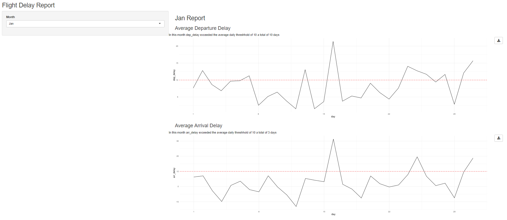
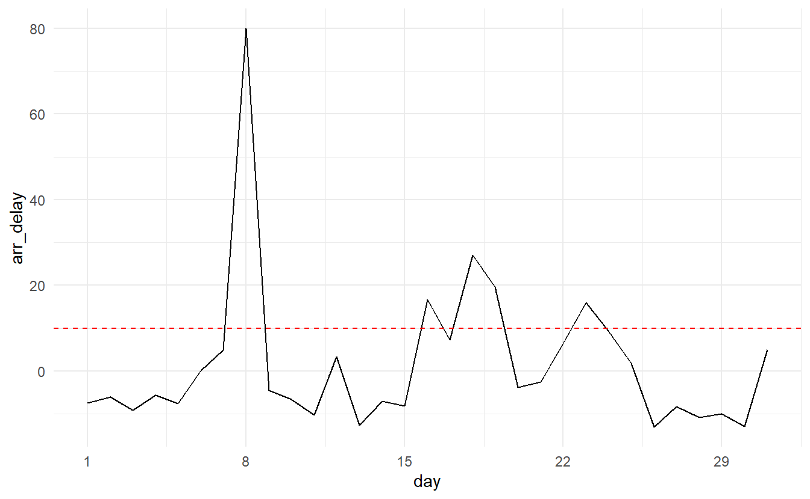

Recently, I argued the case on Twitter that Shiny modules are not an advanced topic and can actually be a great way for novice Shiny developers to start building more complex applications.

<blockquote class="twitter-tweet">

My Shiny hot take is that modules are **not** an advanced topic. IMHO it's so much easier and more natural for <a href="https://twitter.com/hashtag/rstats?src=hash&amp;ref_src=twsrc%5Etfw">\#rstats</a> users to write small, modular functions that they can independently play with and test than huge monolithic apps (1/3)

--- Emily Riederer (@EmilyRiederer) <a href="https://twitter.com/EmilyRiederer/status/1286072799463911424?ref_src=twsrc%5Etfw">July 22, 2020</a>
</blockquote>

The good people of [\#rstats Twitter](https://twitter.com/search?q=%23rstats) helped me refine this thesis a bit with a few key caveats. If you already are an R user who likes to **think and write functions** and **understand Shiny basics** (i.e. the basics of reactivity come first no matter what), then modules **for certain types of tasks** (discussed at the end of this post) are an excellent way to up your game.

In fact, when I first tried to learn Shiny, the monolithic scripts and *lack* of function-based thinking in introductory materials was something that really tripped me up because it felt so unlike normal R programming. So, not only is it *possible* to learn modules early, it may actually be decidedly easier than the alternative depending on your frame of mind.

In this post, I walk through a toy example of building a reporting app from the `flights` data in the `nycflights13` package to demonstrate how modules help scale basic Shiny skills. The recurring theme we will discuss are that modules help novice developers:

-   focus on smaller, narrower tasks at a time
-   test out and experiment with small pieces in isolation for easier debugging
-   avoid massively nested blocks of code that can arise in Shiny app development

In effect, I aim to demonstrate a workflow and encourage use of modules for newer Shiny users. I do not aim to *teach* Shiny or module development itself, persay. For that, I recommend the [Shiny documentation](https://shiny.rstudio.com/) and Hadley Wickham's [Mastering Shiny book](https://mastering-shiny.org/).

Why Modules?
------------

In effect, you can think of modules as the "function-ization" of a set of Shiny UI and server elements. You may wonder why you cannot just accomplish this with the normal functions as you use in other R programming. The reason for this is a bit more technical. If you are interested, it is explained well in *Mastering Shiny*. However, I believe that it's only the "why functions won't work" part of Shiny modules that make them appear to be an advanced topic. If you see the value of writing functions, you are more than ready to take advantage of modules in app development.

Motivating Example
------------------

For the sake of argument, let's pretend that we work for an airline and are tasked with building a basic dashboard to track various measures of travel delays against preset thresholds. We have the following requirements:

-   Let users pick a month of interest to visualize
-   For each[^1] metric of interest, users should:
    -   See a time-series plot of the average daily value of the metric
    -   Click a download button to download a PNG of the plot
    -   Read a text summary that reports the number of days the value breached the threshold
-   The metrics of interest are:
    -   Average departure delay
    -   Average arrival delay
    -   Proportion of daily flights with an arrival delay exceeding 5 minutes

The completed application is hosted [here, on shinyapps.io,](https://emilyriederer.shinyapps.io/shiny-modules-demo/)[^2] and the underlying code can be read [on GitHub](https://github.com/emilyriederer/shiny-modules-flights-demo).

Below is a preview of the final application. It isn't going to win any beauty contests; I kept the layout and styling to a minimum so we could focus on modules in the code.

Set-Up
------

<pre class='chroma'><code class='language-r' data-lang='r'><a href='https://rdrr.io/r/base/library.html'>library</a>(<a href='http://shiny.rstudio.com'>shiny</a>)
<a href='https://rdrr.io/r/base/library.html'>library</a>(<a href='http://github.com/hadley/nycflights13'>nycflights13</a>)
<a href='https://rdrr.io/r/base/library.html'>library</a>(<a href='https://dplyr.tidyverse.org'>dplyr</a>)
<a href='https://rdrr.io/r/base/library.html'>library</a>(<a href='http://ggplot2.tidyverse.org'>ggplot2</a>)</code></pre>

For any of the explanation below to make sense, it will help to familiarize yourself with the data. We filter the `flights` data down to a single airline and aggregate the results by day.

<pre class='chroma'><code class='language-r' data-lang='r'>ua_data &lt;-
  nycflights13::<a href='https://rdrr.io/pkg/nycflights13/man/flights.html'>flights</a> %&gt;%
  <a href='https://dplyr.tidyverse.org/reference/filter.html'>filter</a>(carrier == "UA") %&gt;%
  <a href='https://dplyr.tidyverse.org/reference/mutate.html'>mutate</a>(ind_arr_delay = (arr_delay &gt; 5)) %&gt;%
  <a href='https://dplyr.tidyverse.org/reference/group_by.html'>group_by</a>(year, month, day) %&gt;%
  <a href='https://dplyr.tidyverse.org/reference/summarise.html'>summarize</a>(
    n = <a href='https://dplyr.tidyverse.org/reference/context.html'>n</a>(),
    <a href='https://dplyr.tidyverse.org/reference/across.html'>across</a>(<a href='https://tidyselect.r-lib.org/reference/starts_with.html'>ends_with</a>("delay"), mean, na.rm = TRUE)
    ) %&gt;%
  <a href='https://dplyr.tidyverse.org/reference/group_by.html'>ungroup</a>()

<a href='https://rdrr.io/r/utils/head.html'>head</a>(ua_data)
#&gt; # A tibble: 6 x 7
#&gt;    year month   day     n dep_delay arr_delay ind_arr_delay
#&gt;   &lt;int&gt; &lt;int&gt; &lt;int&gt; &lt;int&gt;     &lt;dbl&gt;     &lt;dbl&gt;         &lt;dbl&gt;
#&gt; 1  2013     1     1   165      7.65     6.27          0.476
#&gt; 2  2013     1     2   170     12.8      7.04          0.458
#&gt; 3  2013     1     3   159      8.66    -2.76          0.357
#&gt; 4  2013     1     4   161      6.84    -9.86          0.180
#&gt; 5  2013     1     5   117      9.66     0.786         0.274
#&gt; 6  2013     1     6   137      9.79     3.53          0.409</code></pre>

I've also defined the plotting function that we will want to visualize a month-long timeseries of data for each metric.

<pre class='chroma'><code class='language-r' data-lang='r'>viz_monthly &lt;- function(df, y_var, threshhold = NULL) {
  
  <a href='https://ggplot2.tidyverse.org/reference/ggplot.html'>ggplot</a>(df) +
    <a href='https://ggplot2.tidyverse.org/reference/aes.html'>aes</a>(
      x = .data[["day"]],
      y = .data[[y_var]]
    ) +
    <a href='https://ggplot2.tidyverse.org/reference/geom_path.html'>geom_line</a>() +
    <a href='https://ggplot2.tidyverse.org/reference/geom_abline.html'>geom_hline</a>(yintercept = threshhold, color = "red", linetype = 2) +
    <a href='https://ggplot2.tidyverse.org/reference/scale_continuous.html'>scale_x_continuous</a>(breaks = <a href='https://rdrr.io/r/base/seq.html'>seq</a>(1, 29, by = 7)) +
    <a href='https://ggplot2.tidyverse.org/reference/ggtheme.html'>theme_minimal</a>()
}</code></pre>

For example, to visualize the average arrival delay by day for all of March and compare it to a threshhold of 10 minutes, we can write:

<pre class='chroma'><code class='language-r' data-lang='r'>ua_data %&gt;%
  <a href='https://dplyr.tidyverse.org/reference/filter.html'>filter</a>(month == 3) %&gt;%
  viz_monthly("arr_delay", threshhold = 10)
</code></pre>

One Module at a Time
--------------------

Modules don't just help organize your code; they help you organize your *thinking*. Given our list of requirements, it might feel overwhelming where to start. Filtering the data? Making the plots? Wiring up buttons? Inevitably, when juggling 10+ components (the reactive dataset plus a plot, button, and text summary for each of three metrics), you're likely to introduce a bug by copy-pasting a line with the wrong `id` or getting nested parentheses out of whack.

Instead, modules essentially allow your to write *many simple Shiny apps* and compose them together.

For example, we might decide that first we just want to focus on a very simple app: given a monhthly subset of the data, a metric, and a threshold of interest. Let's write a simple text summary of the flights performance. This task seems relatively straightforward. We now know we just need to define a UI (`text_ui`) with a single call to [`textOutput()`](https://rdrr.io/pkg/shiny/man/textOutput.html), a server (`text_server`) that does a single calculation and calls [`renderText()`](https://rdrr.io/pkg/shiny/man/renderText.html). Best of all, we can immediately see whether or not our "app" works by writing a minimalistic testing function (`text_demo`) which renders the text for a small, fake dataset.[^3]

I saved the follow in a file called `mod-test.R`:

<pre class='chroma'><code class='language-r' data-lang='r'># text module ----
text_ui &lt;- function(id) {
  
  <a href='https://rdrr.io/pkg/shiny/man/fluidPage.html'>fluidRow</a>(
    <a href='https://rdrr.io/pkg/shiny/man/textOutput.html'>textOutput</a>(<a href='https://rdrr.io/pkg/shiny/man/NS.html'>NS</a>(id, "text"))
  )
  
}

text_server &lt;- function(id, df, vbl, threshhold) {
  
  <a href='https://rdrr.io/pkg/shiny/man/moduleServer.html'>moduleServer</a>(id, function(input, output, session) {
    
    n &lt;- <a href='https://rdrr.io/pkg/shiny/man/reactive.html'>reactive</a>({<a href='https://rdrr.io/r/base/sum.html'>sum</a>(<a href='https://rdrr.io/r/stats/Fdist.html'>df</a>()[[vbl]] &gt; threshhold)})
    output$text &lt;- <a href='https://rdrr.io/pkg/shiny/man/renderText.html'>renderText</a>({
      <a href='https://rdrr.io/r/base/paste.html'>paste</a>("In this month", 
            vbl, 
            "exceeded the average daily threshhold of",
            threshhold,
            "a total of", 
            <a href='https://dplyr.tidyverse.org/reference/context.html'>n</a>(), 
            "days")
    })
    
  })
  
}

text_demo &lt;- function() {
  
  df &lt;- <a href='https://rdrr.io/r/base/data.frame.html'>data.frame</a>(day = 1:30, arr_delay = 1:30)
  ui &lt;- <a href='https://rdrr.io/pkg/shiny/man/fluidPage.html'>fluidPage</a>(text_ui("x"))
  server &lt;- function(input, output, session) {
    text_server("x", <a href='https://rdrr.io/pkg/shiny/man/reactive.html'>reactive</a>({df}), "arr_delay", 15)
  }
  <a href='https://rdrr.io/pkg/shiny/man/shinyApp.html'>shinyApp</a>(ui, server)
  
}</code></pre>

We can follow the same pattern to create a module for the plot itself consisting of a UI (`plot_ui`), a server (`plot_server`), and a testing function (`plot_demo`). This module is responsible for showing the plot of a single metric and enabling users to download it. You can see this code on GitHub in the file [`mod-plot.R`](https://github.com/emilyriederer/shiny-modules-flights-demo/blob/master/mod-plot.R):

Once again, we can run that self-contained file and then execute `plot_demo()` to run our mini-application. This time, it is more interactive. We can click the "Download" button and ensure that our download feature is working.

We don't have an application yet, but we have two components that build pretty easily off of our basic Shiny knowledge and that we can see working before our eyes[^4].

### Composing Modules

We now have a text module and a plot module. However, recall for each metric of interest, we want to produce *both*. We could do this by simply calling these two modules one after the other in our final app, but if we want to, we can create another module that wraps our first two modules so that we can produce in single commands everything that we need for a given metric.

With all of the underlying plot and text module logic abstracted, our metric module definition is very clean and simple. I define it in the `mod-metr.R` file:

<pre class='chroma'><code class='language-r' data-lang='r'># metric module ----
metric_ui &lt;- function(id) {
  
  <a href='https://rdrr.io/pkg/shiny/man/fluidPage.html'>fluidRow</a>(
    text_ui(<a href='https://rdrr.io/pkg/shiny/man/NS.html'>NS</a>(id, "metric")),
    plot_ui(<a href='https://rdrr.io/pkg/shiny/man/NS.html'>NS</a>(id, "metric"))
  )
  
}

metric_server &lt;- function(id, df, vbl, threshhold) {
  
  <a href='https://rdrr.io/pkg/shiny/man/moduleServer.html'>moduleServer</a>(id, function(input, output, session) {
    
    text_server("metric", df, vbl, threshhold)
    plot_server("metric", df, vbl, threshhold)
    
  })
  
}

metric_demo &lt;- function() {
  
  df &lt;- <a href='https://rdrr.io/r/base/data.frame.html'>data.frame</a>(day = 1:30, arr_delay = 1:30)
  ui &lt;- <a href='https://rdrr.io/pkg/shiny/man/fluidPage.html'>fluidPage</a>(metric_ui("x"))
  server &lt;- function(input, output, session) {
    metric_server("x", <a href='https://rdrr.io/pkg/shiny/man/reactive.html'>reactive</a>({df}), "arr_delay", 15)
  }
  <a href='https://rdrr.io/pkg/shiny/man/shinyApp.html'>shinyApp</a>(ui, server)
  
}</code></pre>

Again, we can test that these components went together as we intended by running the `metric_demo()` function. We will see the text from our text module on top of the plot and button from our plot module. Here's what our module looks like so far:

For this app, this might seem like overkill, but I wanted to illustrate the ability to compose modules because it's very useful as your application grows in complexity. In essence, everything you bundle into a module gives you a license to forget about how the next layer lower is implemented and frees up your mind to take on the next challenge.

### Putting it all together

Finally, we are ready to write our complete application in a file called `flights-app.R`:

<pre class='chroma'><code class='language-r' data-lang='r'># load libraries ----
<a href='https://rdrr.io/r/base/library.html'>library</a>(<a href='http://github.com/hadley/nycflights13'>nycflights13</a>)
<a href='https://rdrr.io/r/base/library.html'>library</a>(<a href='http://shiny.rstudio.com'>shiny</a>)
<a href='https://rdrr.io/r/base/library.html'>library</a>(<a href='http://ggplot2.tidyverse.org'>ggplot2</a>)
<a href='https://rdrr.io/r/base/library.html'>library</a>(<a href='https://dplyr.tidyverse.org'>dplyr</a>)

# load resources ----
<a href='https://rdrr.io/r/base/source.html'>source</a>("viz-mtly.R")
<a href='https://rdrr.io/r/base/source.html'>source</a>("mod-plot.R")
<a href='https://rdrr.io/r/base/source.html'>source</a>("mod-text.R")
<a href='https://rdrr.io/r/base/source.html'>source</a>("mod-metr.R")

# data prep ----
ua_data &lt;-
  nycflights13::<a href='https://rdrr.io/pkg/nycflights13/man/flights.html'>flights</a> %&gt;%
  <a href='https://dplyr.tidyverse.org/reference/filter.html'>filter</a>(carrier == "UA") %&gt;%
  <a href='https://dplyr.tidyverse.org/reference/mutate.html'>mutate</a>(ind_arr_delay = (arr_delay &gt; 5)) %&gt;%
  <a href='https://dplyr.tidyverse.org/reference/group_by.html'>group_by</a>(year, month, day) %&gt;%
  <a href='https://dplyr.tidyverse.org/reference/summarise.html'>summarize</a>(
    n = <a href='https://dplyr.tidyverse.org/reference/context.html'>n</a>(),
    <a href='https://dplyr.tidyverse.org/reference/across.html'>across</a>(<a href='https://tidyselect.r-lib.org/reference/starts_with.html'>ends_with</a>("delay"), mean, na.rm = TRUE)
    ) %&gt;%
  <a href='https://dplyr.tidyverse.org/reference/group_by.html'>ungroup</a>()

# full application ----
ui &lt;- <a href='https://rdrr.io/pkg/shiny/man/fluidPage.html'>fluidPage</a>(
  
  <a href='https://rdrr.io/pkg/shiny/man/titlePanel.html'>titlePanel</a>("Flight Delay Report"),
  
  <a href='https://rdrr.io/pkg/shiny/man/sidebarLayout.html'>sidebarLayout</a>(
  sidebarPanel = <a href='https://rdrr.io/pkg/shiny/man/sidebarLayout.html'>sidebarPanel</a>(
    <a href='https://rdrr.io/pkg/shiny/man/selectInput.html'>selectInput</a>("month", "Month", 
                choices = <a href='https://rdrr.io/r/stats/setNames.html'>setNames</a>(1:12, month.abb),
                selected = 1
    )
  ),
  mainPanel = <a href='https://rdrr.io/pkg/shiny/man/sidebarLayout.html'>mainPanel</a>(
    <a href='https://rdrr.io/pkg/htmltools/man/builder.html'>h2</a>(<a href='https://rdrr.io/pkg/shiny/man/textOutput.html'>textOutput</a>("title")),
    <a href='https://rdrr.io/pkg/htmltools/man/builder.html'>h3</a>("Average Departure Delay"),
    metric_ui("dep_delay"),
    <a href='https://rdrr.io/pkg/htmltools/man/builder.html'>h3</a>("Average Arrival Delay"),
    metric_ui("arr_delay"),
    <a href='https://rdrr.io/pkg/htmltools/man/builder.html'>h3</a>("Proportion Flights with &gt;5 Min Arrival Delay"),
    metric_ui("ind_arr_delay")
  )
)
)

server &lt;- function(input, output, session) {
  
  output$title &lt;- <a href='https://rdrr.io/pkg/shiny/man/renderText.html'>renderText</a>({<a href='https://rdrr.io/r/base/paste.html'>paste</a>(month.abb[<a href='https://rdrr.io/r/base/integer.html'>as.integer</a>(input$month)], "Report")})
  df_month &lt;- <a href='https://rdrr.io/pkg/shiny/man/reactive.html'>reactive</a>({<a href='https://dplyr.tidyverse.org/reference/filter.html'>filter</a>(ua_data, month == input$month)})
  metric_server("dep_delay", df_month, vbl = "dep_delay", threshhold = 10)
  metric_server("arr_delay", df_month, vbl = "arr_delay", threshhold = 10)
  metric_server("ind_arr_delay", df_month, vbl = "ind_arr_delay", threshhold = 0.5)
  
}

<a href='https://rdrr.io/pkg/shiny/man/shinyApp.html'>shinyApp</a>(ui, server)</code></pre>

Notice how few lines of code this file requires to create all of our various components and interactions! We've eliminated much of the dense code, nesting, and potential duplication we might have encountered if trying to write our application without modules. Whether you were trying to maintain this app or reading someone else's code, the top-level code is accessible, semantic, and declarative. We can fairly easily infer the intent of each line and note which pieces of UI and server logic are responsible for which components.

Additionally, we also have all of the typical benefits afforded by functions. For example, if we were asked to change the plot download feature to download an `.svg` file instead of a `.png`, we could make a single change to the `plot_server()` function instead of having to change many pieces of our code for each metric.

### Caveats

Not all modules are made alike, and in this walk-through I intentionally chose relatively easy pieces of logic to demonstrate. Note that our modules *consume* a reactive variable (data) from the global environment, but they themselves do not attempt to *alter* the global environment or *exchange* information between them. Both of those things are also very possible to do with modules, but they may feel a bit harder or more error prone at first. In my opinion, modules that simply consume reactives are the easiest way to start out.

I also intentionally did not discuss more advanced features of modules or more formal and automated testing of them. These topics are covered in both [*Mastering Shiny*](http://mastering-shiny.org/) and [*Engineering Production Grade Shiny Apps*](https://engineering-shiny.org/). These books also introduce ways to share modules via R packages and to organize them in Shiny app projects built with the excellent [`golem` package](https://cran.r-project.org/web/packages/golem/index.html) (the `usethis` of Shiny apps).

[^1]: In the spirit of "don't repeat yourself", any time you have the phrase "for each" in your requirements, it's a strong signal that modules might make your work a good bit easier.

[^2]: If I stop hosting the app in the future and this link does not work, the easiest way to run the app is by going to the repo, copying the code in the file `flights-app-single-file.R` and running it locally.

[^3]: In *Mastering Shiny*, Hadley points out its a good practice to always include such a demo function for testing: <a href="https://mastering-shiny.org/scaling-modules.html#updated-app" class="uri">https://mastering-shiny.org/scaling-modules.html#updated-app</a>

[^4]: Of course, "working for one use case" is not a substitute for real testing, but that's out of scope for this post

