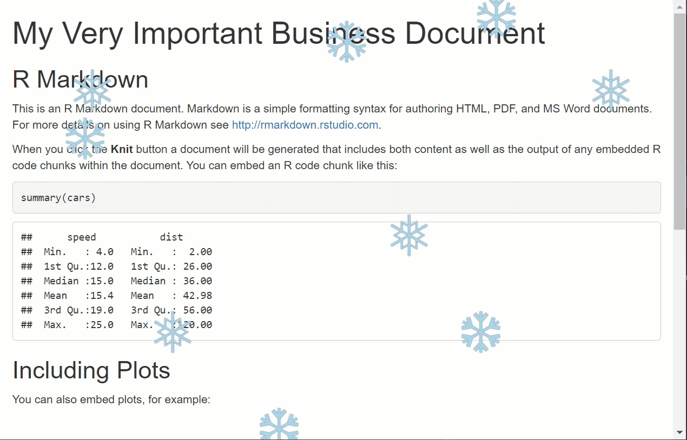

Full project: <a href="https://github.com/emilyriederer/demo-rmd-snow" class="uri">https://github.com/emilyriederer/demo-rmd-snow</a>

<blockquote class="twitter-tweet">

No one:  Absolutely no one:  Me: SO, I know we can\'t have a holiday party this year, but we CAN make our <a href="https://twitter.com/hashtag/rstats?src=hash&amp;ref_src=twsrc%5Etfw">\#rstats</a> R Markdown reports snow before we send them to each other <a href="https://t.co/SSBzlgb3TV">https://t.co/SSBzlgb3TV</a> HT to <a href="https://t.co/c7c5c5csMK">https://t.co/c7c5c5csMK</a> for the heavy lifting <a href="https://t.co/hIu7z0knR4">pic.twitter.com/hIu7z0knR4</a>

--- Emily Riederer (@EmilyRiederer) <a href="https://twitter.com/EmilyRiederer/status/1337178684868980738?ref_src=twsrc%5Etfw">December 10, 2020</a>
</blockquote>

-   **Using child documents...** to add snowflake
-   **Includig custom CSS style...** to animate them
-   **Evaluating chunks conditionally...** to keep things timely

We will see how to dress up this [very important business R Markdown](https://github.com/emilyriederer/demo-rmd-snow/blob/main/index.Rmd)

Much more useful applications of these same features are discussed in the linked sections of the [R Markdown Cookbook](https://bookdown.org/yihui/rmarkdown-cookbook/).

Child documents
---------------

[Child documents](https://bookdown.org/yihui/rmarkdown-cookbook/child-document.html)

Adding CSS style sheets
-----------------------

[Adding CSS to R Markdown](https://bookdown.org/yihui/rmarkdown-cookbook/html-css.html)

For more tips on writing CSS for R Markown, check out my [post]() on finding the right selectors.

Conditional chunk evaluation
----------------------------

[Chunk options](https://yihui.org/knitr/options/)

[Using variables in chunk options](https://bookdown.org/yihui/rmarkdown-cookbook/chunk-variable.html)

If we had chosen not to use child documents, we could also use chunks to achieve conditional evaluation using the [`asis` engine](https://bookdown.org/yihui/rmarkdown-cookbook/eng-asis.html).

