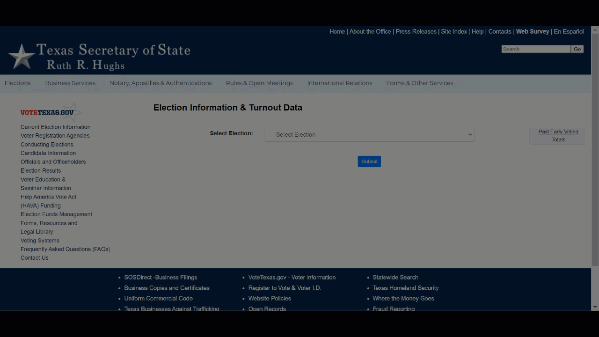

Like many Americans, last fall I was captivated by [Professor Michael McDonald](https://twitter.com/ElectProject)'s [US Elections Project](http://www.electproject.org/) and, in particular, his daily reporting of [early vote totals](https://electproject.github.io/Early-Vote-2020G/) across all 50 states. Not only did this reporting provide fuel for anxious speculation and satiate an innate desire for reading the tea leaves, but it was also a quite a feat in data management.

In many discussions of [modern data management](https://a16z.com/2020/10/15/the-emerging-architectures-for-modern-data-infrastructure/), the extract-load-transform (ELT) process is offered as a solution to data silos. However, these tools largely focus on abstracting away the different REST APIs of common sources (e.g. Salesforce, Google Analytics, Facebook Ads) and destinations (e.g. BigQuery, Redshift, Snowflake). At the same time, many data science resources introduce static web page scraping as a tool in one's toolkit but discuss less scraping websites rendered with client side JavaScript (as quite a bit of the internet is) or navigating arbitrary applications with browser automation.

For more "creative", persay, sources, we need to build our own solutions. And this is particularly true when we're attempting to access, standardize, and analyze 50 separate data sets published at different cadences, provided with different levels of granularity, partitioned along different dimensions, controlled by different levels of access and permission, and embedded in systems with vastly different underlying architecture. (Oh, and in Dr. McDonald's case, with a good number of Twitter users starting to tweet at you if you haven't refreshed your website by 8:02AM!)

To give an example of some of the diverse data sources used in the Elections Project:

-   [IL](https://elections.il.gov/VotingAndRegistrationSystems/PreElectionCounts.aspx?MID=l0hlXuSrKL0%3d&T=637317257975604269), [WI](https://elections.wi.gov/index.php/publications/statistics/absentee), and [NC](https://dl.ncsbe.gov/?prefix=ENRS/2020_11_03/) provide direct `csv` downloads with predictable URLs which contain all data to-date
-   [WV](http://services.sos.wv.gov/Elections/AbsenteeBallotStats) and [AK](https://www.elections.alaska.gov/doc/info/statstable.php) display data in static tables rendere by server-side PHP
-   [VA](https://www.vpap.org/elections/early-voting/) shows its data in a dashboard rendered by client-side JavaScript (which may superficially sound like the last bullet but has different implications for the types of scraping tools that could lend a hand[^1])
-   [GA](https://elections.sos.ga.gov/Elections/voterabsenteefile.do) and [TX](https://earlyvoting.texas-election.com/Elections/getElectionEVDates.do) offer downloadable data which requires navigating through a Java serverlet UI[^2] to access
-   [RI](https://app.powerbigov.us/view?r=eyJrIjoiMGEwN2E0MzUtOTA0OC00ZDA3LThjMTItZDZhYTBjYjU5ZjhjIiwidCI6IjJkMGYxZGI2LWRkNTktNDc3Mi04NjVmLTE5MTQxNzVkMDdjMiJ9) publishes data in a PowerBI dashboard
-   AL, AZ, MI, IA, and PA were among those that didn't publish data publicly and required Professor McDonald to directly contact their Secretary of State offices

The disparities in these data publishing formats and access patterns seemed like an interesting opportunity to compare different tools for data extraction. This posts starts out with a few trivial examples of using `requests` for HTTP requests and `BeautifulSoup` for static web scraping in order to understand the strengths and limitations for each tool and the unmet needs that browser automation helps address. We'll then switch over to `Playwright` (with a touch of `pytesseract`) for a sampling of the types of challenges that browser automation can tackle.

-   [NC: Direct Download with `urllib.request`](#nc-direct-download)
-   [WI: Direct Download with a Dynamic URL](#wi-direct-download-with-dynamic-url)
-   [AK: Web scraping with `BeautifulSoup`](#ak-web-scraping-with-beautifulsoup)
-   [VA: Web scraping with `Playwright`](#va-web-scraping-with-playwright)
-   [TX: Browser automation with `Playwright`](#tx-browser-automation-with-playwright)
-   [RI: Arbitrary UIs with OCR](#ri-arbitrary-uis-with-ocr)

NC: Direct Download
-------------------

North Carolina provides one of the simplest paths to accessing paths to downloading its data. Data files live in a public S3 bucket with static file names based on the election date. Granular voter-level data can be downloaded easily with the `urllib.request` library.

<pre class='chroma'><code class='language-r' data-lang='r'>import urllib.request

url = 'https://s3.amazonaws.com/dl.ncsbe.gov/ENRS/2020_11_03/absentee_counts_county_20201103.csv'
urllib.request.urlretrieve(url, 'nc.csv')
</code></pre>

WI: Direct Download with Dynamic URL
------------------------------------

Wisconsin has similarly accessible data files available for download. However, when they update files during an election cycle, each new file is named by publishing date. So, unlike North Carolina, the URL of interest varies and it's not altogether obvious what the most current one is.

We can still use `requests` to download this data, but it requires more caution in constructing the URL. The `retrieve_date()` function requires an ISO 8601 date to be passed in and attempts to construct a URL from it. Our `GET` request returns a status code of 500 if no such path exists, at which point we can throw an exception. Some calling program could decrement the date and try again.

<pre class='chroma'><code class='language-r' data-lang='r'>import requests
import datetime

def retrieve_date(date): 

  # format dates as needed
  dt = datetime.datetime.strptime(date, '%Y-%m-%d')
  yyyy_mm = dt.strftime('%Y-%m')
  mm_d_yyyy = dt.strftime('%m-%#d-%Y')
  
  # download csv
  url = f'https://elections.wi.gov/sites/elections.wi.gov/files/{yyyy_mm}/AbsenteeCounts_County%20{mm_d_yyyy}.csv'
  req = requests.get(url)
  if req.status_code == 500:
    raise Exception('Resource not found')
  content = req.content
  
  # write to file
  csv = open('wi.csv', 'wb')
  csv.write(content)
  csv.close()
</code></pre>

AK: Web Scraping with `BeautifulSoup`
-------------------------------------

Instead of provided a direct download, Arkansas publishes data to its election website by rendering a static HTML table with server-side PHP. As with before, we can retrieve this content with `requests`, but now we need to parse the output ourselves. Specifically, we want to iterate over table rows such as this:

    <tr>
      <td>Online Delivery</td>
      <td>16,446</td>
      <td>12,026</td>
    </tr>

For this, we can use `BeautifulSoup` to iterate through the table and save the results to a CSV file with `pandas`.

<pre class='chroma'><code class='language-r' data-lang='r'>from bs4 import BeautifulSoup
import requests
import datetime
import pandas as pd

url = "https://www.elections.alaska.gov/doc/info/statstable.php"
html_content = requests.get(url).text
soup = BeautifulSoup(html_content, "lxml")
table = soup.find("table", attrs = {"class":"lctbl"})

data = []
rows = table.tbody.find_all("tr")

# iterate over rows excluding first (header) and last (total)
for r in range(1, len(rows) - 1): 

  row = rows[r]
  vals = [d.get_text() for d in row.find_all("td")]
  # convert count columns to numeric
  vals[1] = int(vals[1].replace(',',''))
  vals[2] = int(vals[2].replace(',',''))
    
  data.append(vals)
  
# save resulting data
df = pd.DataFrame(data, columns = ['channel','n_issued','n_returned'])
df['dt_updated'] = dt_fmt
df.to_csv('ak.csv', index = False)
</code></pre>

VA: Web Scraping with `Playwright`
----------------------------------

Virginia seems superficially similar to Arkansas insomuch as data is provided in an in-browser display. However, since this display is constructed with browser-side JavaScript, it won't appear in the content that results from a call to `requests.get()`.

Many different approaches exist to force JavaScript to update the DOM before accessing the source[^3]. Arguably Microsoft's `Playwright` is overly complicated for this situation, but I use it for this example since it is a flexible tool for browser automation, and the next three examples help demonstrate the variety of features it offers.

The following script navigates to Virginia's website with a headless Firefox browser and then extracts vote counts stored as attributes in the bar chart tooltip. Each bar is create with script like this:

    <rect x="95.333" y="101" width="7.333" height="104" 
          data-toggle="popever" data-placement="top" title 
          data-content="In-Person: 140 Mail: 94 Total: 234" 
          data-original-title="Sep 30">
    </rect>

As before, results are then coerced into a `pandas` dataframe and written to a `csv`.

The following script defines a `retrieve_county()` function to parse out this information for a single county.

<pre class='chroma'><code class='language-r' data-lang='r'>from playwright.sync_api import sync_playwright
import datetime
import re
import pandas as pd

def retrieve_county(county, page):

  # navigate to county-specific page
  county_url = county.lower().replace(' ','-')
  page.goto(f'https://www.vpap.org/elections/early-voting/year-2020/{county_url}-va')
  
  county_records = []
  
  for n in range(1,100):
  
    selector = f'#timeline g.popovers rect:nth-of-type({n})'
    try:
      date = page.get_attribute(selector, 'data-original-title')
      vals = page.get_attribute(selector, 'data-content')
    except:
      break

    # process data into tabular structure
    vals_method = re.search('In-Person: (\d+) Mail: (\d+) Total: (\d+)', vals.replace(',',''))
    date_parse = datetime.datetime.strptime(date + ' 2020', '%b %d %Y').strftime('%Y-%m-%d')
    county_records.append([county, date_parse, 'In-Person', vals_method.group(1)])
    county_records.append([county, date_parse, 'Mail', vals_method.group(2)])
    
  return county_records
</code></pre>

As a low fidelity but transparent example of it in operation, I show it looping over a few counties. In reality, we'd add more exception handling or save interim results separately so failures in any one county did not take down the whole process.

<pre class='chroma'><code class='language-r' data-lang='r'>with sync_playwright() as p:

  # set up
  browser = p.firefox.launch()
  context = browser.new_context(accept_downloads = True)
  page = context.new_page()
  
  # iterate over counties
  county = ['Accomack County', 'Albemarle County', 'Alexandria City']
  records = []
  for c in county:
    records += retrieve_county(c, page)
  
  # save resulting data
  df = pd.DataFrame(records, columns = ['county', 'date', 'channel', 'n'])
  df.to_csv('va.csv', index = False)

  # cleanup
  page.close()
  context.close()
  browser.close()
</code></pre>

This creates the following data structure:

<pre class='chroma'><code class='language-r' data-lang='r'>#&gt; # A tibble: 6 x 4
#&gt;   county          date       channel       n
#&gt;   &lt;chr&gt;           &lt;date&gt;     &lt;chr&gt;     &lt;dbl&gt;
#&gt; 1 Accomack County 2020-09-17 In-Person     0
#&gt; 2 Accomack County 2020-09-17 Mail          0
#&gt; 3 Accomack County 2020-09-18 In-Person   212
#&gt; 4 Accomack County 2020-09-18 Mail          0
#&gt; 5 Accomack County 2020-09-19 In-Person     0
#&gt; 6 Accomack County 2020-09-19 Mail          0
</code></pre>

TX: Browser Automation with `Playwright`
----------------------------------------

Next up, we come to Texas. Texas, somewhat paradoxically, generously provides rich data (by day, by voting method, by county, and even *by person*) and yet does so in a way that is particularly tedious to access. Navigating to the data download requires selecting an election and then a voting date out of a UI before clicking a button in a Java serverlet[^4] that triggers the creation and downloading of a report as shown above.

This is where `Playwright` really shines. As with Virginia, it loads the Texas' data in a headless[^5] browser. But beyond just opening a browser, `Playwright` can interact with it in the same way as a user: selecting options from menus, clicking buttons, and more.

In the `retrieve_date()` function below, I tell my browser exactly what I want it to do: go to the website, pick an election, click submit, pick a date, click submit, and then finally click a button to download data.

<pre class='chroma'><code class='language-r' data-lang='r'>from playwright.sync_api import sync_playwright
import datetime

def retrieve_date(date, page):

  # navigate to date-specific page 
  target_date = datetime.datetime.strptime(date, '%Y%m%d')
  target_date_str = target_date.strftime('%Y-%m-%d 00:00:00.0')
  target_file = 'tx-' + target_date.strftime('%Y%m%d') + '.csv'
  
  # pick election
  page.goto('https://earlyvoting.texas-election.com/Elections/getElectionDetails.do')
  page.select_option('#idElection', label = "2020 NOVEMBER 3RD GENERAL ELECTION")
  page.click('#electionsInfoForm button')
  page.wait_for_selector('#selectedDate')
  
  # pick day
  page.select_option('#selectedDate', value = target_date_str)
  page.click('#electionsInfoForm button:nth-child(2)')
  page.wait_for_selector('"Generate Statewide Report"')

  # download report  
  with page.expect_download() as download_info:
    page.click('"Generate Statewide Report"')
  download = download_info.value
  download.save_as(target_file)
</code></pre>

This function could then be called for one or more dates of interest:

<pre class='chroma'><code class='language-r' data-lang='r'>with sync_playwright() as p:

  browser = p.firefox.launch()
  context = browser.new_context(accept_downloads = True)
  page = context.new_page()
  
  dates = ['20201020','20201021','20201022']
  for d in dates:
    retrieve_date(d, page)

  # cleanup
  page.close()
  context.close()
  browser.close()
</code></pre>

RI: Arbitrary UIs with OCR
--------------------------

The ability to navigate around a UI starts to blend the capabilities of `Playwright`'s *browser automation* with the more full-fledged concept of robotic process automation (RPA). RPA tools can similarly navigate arbitrary non-browser-based UIs to perform manual tasks with great speed. Abritrary UIs lack many of the features we've been using so far such as Xpaths and CSS IDs and classes to tell our tools where to do what. Instead, their often have built-in optical character recognition (OCR) to recognize buttons or input boxes "on sight".

`Playwright` doesn't quite have these capabilities built in natively, but it does offer users the ability to screenshot their browser. This allows us to pass the screenshot to `pytesseract` for OCR in a similar manner.

This techniques comes in handy for Rhode Island whose data is hosted in an embedded PowerBI app. The following script navigates to and screenshots the app, converts the resulting image to text, extracts the total vote count, and writes the results to PDFs.

<pre class='chroma'><code class='language-r' data-lang='r'>import cv2
import pytesseract
from playwright.sync_api import sync_playwright
import time
import re
import pandas as pd
pytesseract.pytesseract.tesseract_cmd = 'C:\\Program Files\\Tesseract-OCR\\tesseract.exe'

with sync_playwright() as p:

  # set up
  browser = p.firefox.launch()
  context = browser.new_context(accept_downloads = True)
  page = context.new_page()
  page.goto('https://app.powerbigov.us/view?r=eyJrIjoiMGEwN2E0MzUtOTA0OC00ZDA3LThjMTItZDZhYTBjYjU5ZjhjIiwidCI6IjJkMGYxZGI2LWRkNTktNDc3Mi04NjVmLTE5MTQxNzVkMDdjMiJ9')
  page.wait_for_load_state(state = 'networkidle')
  time.sleep(30)
  page.screenshot(path = 'ri.png')
  
  # cleanup
  page.close()
  context.close()
  browser.close()

# extract text
img = cv2.imread('ri.png')
text = pytesseract.image_to_string(img)
n_tot = re.search('Turnout\n\n(\d+)', text.replace(',','')).group(1)
n_mail = re.search('Mail Ballots Received by BOE\n\n(\d+)', text.replace(',','')).group(1)

# write output
df = pd.DataFrame([[n_tot, n_mail]], columns = ['n_tot','n_mail'])
df.to_csv('ri.csv', index = False)
</code></pre>

This creates the following data structure:

<pre class='chroma'><code class='language-r' data-lang='r'>#&gt; # A tibble: 1 x 2
#&gt;    n_tot n_mail
#&gt;    &lt;dbl&gt;  &lt;dbl&gt;
#&gt; 1 305724 156178
</code></pre>

What Next?
----------

Simply *accessing* data is only the first in many steps towards unifying and analyzing it. The full scope of the US Elections Project requires far more numerous and challenging steps including:

-   Understanding the exact schema and variables of each data set
-   Understanding when historical data may be modified or corrected and adjusting accordingly
-   Accounting for sudden changes to reporting formats, cadences, or locations
-   Obtaining data from states where the `robots.txt` prevents scraping (I'm looking at you, IL)
-   Building relationships with Secretary of States' offices where data is not publicly available

Regardless, surveying what different states choose to publish and how they choose to share it provides an interesting opportunity to think about data access, usability, and available technologies for data retrieval.

[^1]: Traditional tools like python's `BeautifulSoup` or R's `rvest` don't play nicely with dynamic websites where client-side JavaScript is modifying the DOM

[^2]: Or so [this StackExchange](https://stackoverflow.com/questions/3597582/why-do-java-webapps-use-do-extension-where-did-it-come-from) would suggest based on the `.do` extension

[^3]: Selenium and PhantomJS are popular related tools

[^4]: The significance of this is that this button is not like clicking a link with a specific web URL.

[^5]: Headless basically just means the browser doesn't physically open on our computer so we don't see it. Time and compute resources aren't wasted on "painting" the browser to show us what is happening. However, if you enjoy watching your computer work in a "Look Mom, no hands!" sort of way, you can use the `headless = False` option when launching the browser.

