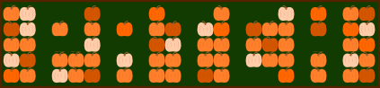
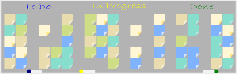

One of the joys of the open-source community is not only learning from excellent developers but also from stellar community organizers. This time of the year, one initiative I particularly love is [Hacktoberfest](https://hacktoberfest.digitalocean.com/), a global month-long "hackathon" sponsored by GitHub and DigitalOcean. Hacktoberfest encourages first-time contributors (or anyone who really wants a T-shirt) to make pull requests throughout the month of October, provides on-ramps and Git training for new developers, and emphasizes the primacy of contributing to existing projects over starting new work.

As a hackathon organizer, this focus on maintenance is something I find particularly inspiring. Last spring, at our virtual [Chicago R Collaborative](https://chircollab.github.io/), my favorite project was one led by [James Lamb](https://twitter.com/_jameslamb) to help ensure a wide variety of CRAN packages that depend on `{httr}` were using [best practices](https://github.com/chircollab/chircollab20/issues/1). This project demonstrated how a short hackathon sprint can create real, lasting value by focusing on maintenance instead of starting a brand new, exciting project with no clear path for ongoing development after the event has ended. This led me to think more critically about how to mobilize maintenance work in a gamified setting ("how many repos can we fix?") and a incisive, narrow focus.

Broadly speaking, [maintenance is more important than innovation](https://aeon.co/essays/innovation-is-overvalued-maintenance-often-matters-more), and I love to see it in the spotlight. However, in open source and InnerSource, both human nature and incentive structures make it more challenging to motivate and invest in maintenance. There's often more joy in dreaming up the first mile of a project than powering through the last, despite the fact that, without maintenance and sustenance, this surge of innovation is not valuable.

Inspired by Hacktoberfest, I recently started thinking about other whimsical, seasonally-themed events that a community or organization could host to intentionally create time, space, skills, and enthusiasm around maintaining quality code. My goal was to think of fun, engaging, and narrowly focused themes for events so that any necessary training could be supplied and real value could be produced within the span of a 1-2 day event.

In the R community, we joke about "sticker-driven development"[^1] so why not "sticker-driven maintenance"? I threw together a set of seasonally-themes logos or laptop stickers that could be used for event marketing and given to participants. I show previews below, and the full collection (as both `png` and `svg`) can be found [on GitHub](https://github.com/emilyriederer/sticker-driven-maintenance) where anyone is welcome to use or modify them.

There are two main themes: those with a heavy grid/gradient design in vague homage to the notorious GitHub activity grid and "other random things I though of". I'll be the first to admit that these are quite kitschy -- and intentionally so. When building communities and especially when trying to motivate some of the less glamorous work of development, I've often found that a touch of irrational exuberance on the part of the organizer can go a long way. Currently, this set is largely biased towards US holidays that I'm most familiar with. I'm most proficient at bad puns related to my own experiences, and it also seems most appropriate for me to riff off of those. I'd certainly welcome ideas or contributions for a broader set.

And yes, is there a slight irony that this introduction amount to: "Maintenance is more important than innovation, so I made a bunch of random new stuff, and I leave you with the hard part of turning my silly graphic into a productive event"? Probably. I really don't have a good answer for that. We're all susceptible to the allure of novelty.[^2]

Designs
-------

### October

Are there known bugs or issues in your org's repos that could use a patch? A *pumpkin* patch, perhaps? Both of these designs are inspired by the GitHub activity board; the latter is more minimal but also (on beta testing) was not obvious to anyone but me that it was pumpkins.

### November

It's time for the fall harvest! If your team's work isn't on GitHub or is on GitHub but not optimized for discoverability (in an org; consistently named; has a README, Description, tags, etc.), "harvest" them off your hard-drive and centralize them for reuse.

### December

Deck the halls -- with good documentation! We all have code or data that could use a bit better documentation, so take some time to work on this collaboratively. Think you've got all the boxes check on documentation? Think again. Consider if you have the best documentation for different audiences (users versus developers[^3]), different formats (written or visual diagrams), and different time durations (I'm a big fan of setting up [immutable documentation](https://codeascraft.com/2018/10/10/etsys-experiment-with-immutable-documentation/)). There's bound to be something to improve.

Alternatively, your code "naughty or nice"? Santa makes his list and checks it twice; all you have to do is add unit tests and run them once.

For R users, this could be a great time to learn about testing packages such as [{testthat}](https://testthat.r-lib.org/) or [{tinytest}](https://cran.r-project.org/web/packages/tinytest/index.html) or related packages like [{assertr}](https://cran.r-project.org/web/packages/assertr/index.html) or [{pointblank}](https://rich-iannone.github.io/pointblank/index.html) for a variety of static or live testing and checks.

### January

Much like hackathons tend to be biased towards novelty, they are more broadly also focus on *doing* instead of *thinking*. In January, we have a new year, new resolutions, and an old and mature toolkit. Gather around a whiteboard as a team *without* building a thing to reassess priorities and simply make a plan. Think about what work needs to be done and how the tools and packages that you *already have* can be re-used instead of reinvented.

### February

Being an open-source maintainer is a long-term relationship, and many open souce tools lack that "special someone" to support them when they break and help them to be their best. When codebases have few contributors or maintainers, they are more susceptible to going stale. Take the opportunity to do some "matchmaking" between orphaned packages and potential maintainers or, alternatively, help new maintainers get into relationships with existing projects.

This GitHub-esque grid asks, will you "Be Mine"? Or alternatively, a candy heart cuts right to the chase as asks to be maintained.

### March

See a tool that doesn't quite meet your need? Work on an enhancement instead of starting a new project.

### April

As Ben Franklin once said, "Nothing can be said to be certain, except death and taxes and technical debt" -- or something like that. Tech debt [is not an inherently bad thing](https://changelog.com/podcast/379). When it is taken on conscientiously, it can be an investment in the future -- much like a car or house loan. However, just like those loans, it's an investment that needs to get paid down. Take some time to identify and pay down the accumulated debt in your projects.

This could include a wide range of activities such as code refactoring or fixing code style. For R users, in particular, it could be a good time to break out the [{lintr}](https://github.com/jimhester/lintr) or [{styler}](https://styler.r-lib.org/) packages. Formatting isn't generally high on the list of tech debt, but it can impede onboarding new people to your project and compounds over time since poorly formatted code doesn't model good behavior for contributors. It's also a relatively manageable issue to tackle during a short event.

### July

Dependencies are great for quick prototyping, but when you're planning to launch or maintain a long-term project, there are a number of reasons you might want to ccut them back. Re-evaluate and potentially reduce dependencies in your project.

For R users, the [{pkgdepends}](https://github.com/r-lib/pkgdepends) R package is a great resource here.

[^1]: In which a developer might hypothetically create a new package simply to justify the existence of a stunning new [hex sticker](http://hexb.in/)

[^2]: In my defense, and in way of thanks, all logos were made with [Inkscape](inkscape.org), a great FOSS software with a very easy on-ramps. This was a weekend project mostly motivated by my needing to learn a touch of Inkscape basics, so I took this on as a use case. If you want to get hands-on to edit my designs or to make your own, I recommend the YouTube tutorials from [Logos by Nick](https://logosbynick.com/).

[^3]: I generally believe that most R packages have a significant underinvestment in developer-facing documentation: <a href="https://twitter.com/EmilyRiederer/status/1266431103948206080?s=20" class="uri">https://twitter.com/EmilyRiederer/status/1266431103948206080?s=20</a>

