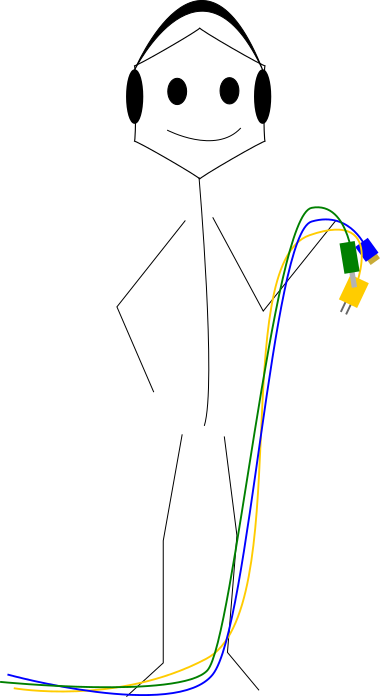
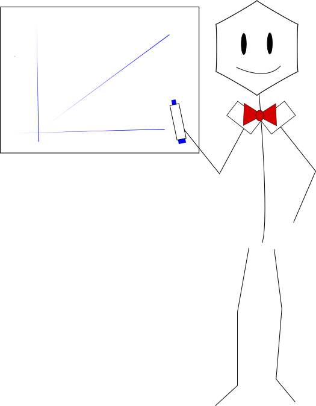
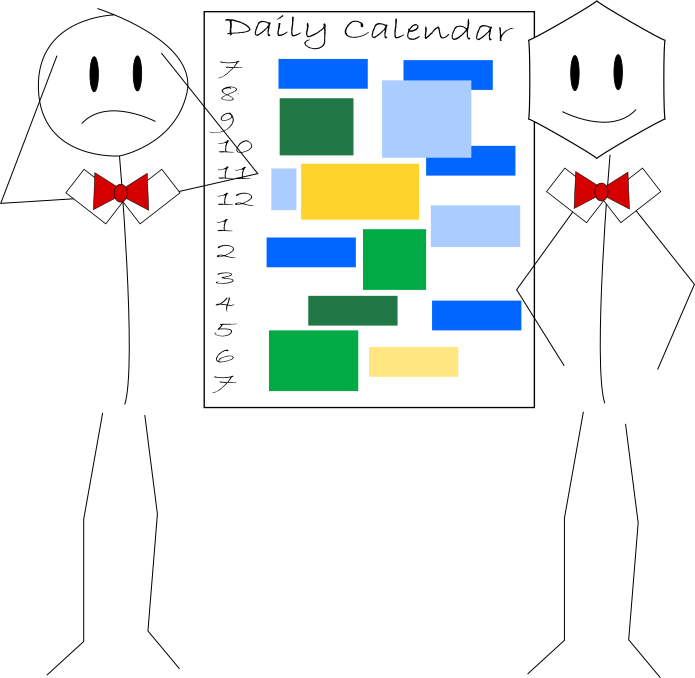
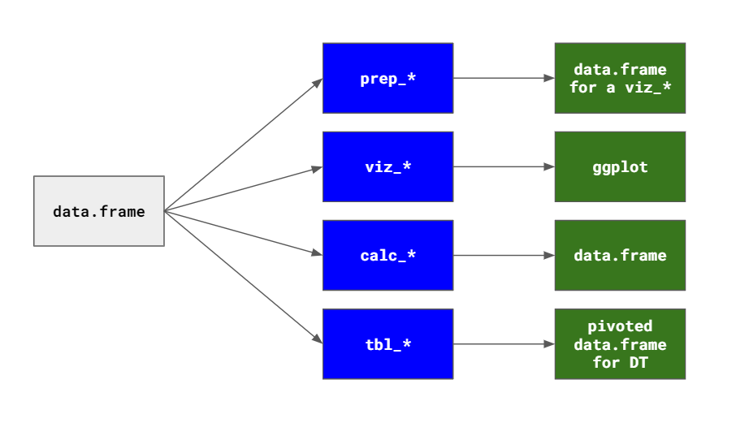
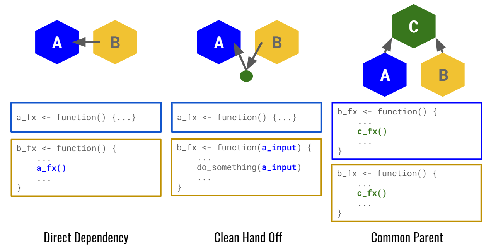
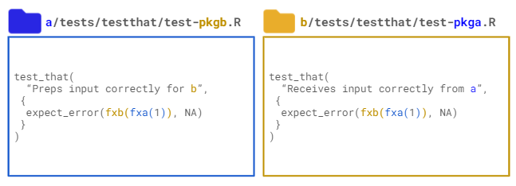
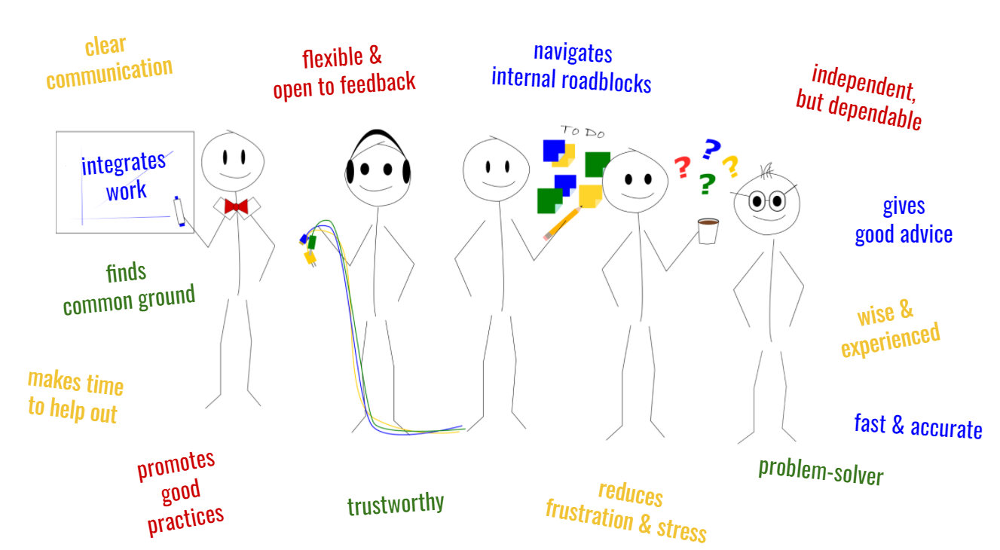

*Note: this post is a written version of my [rstudio::global 2020 talk](talk/organization) on the same topic. Please see the link for the slides and video version. I do elaborate on a few points here that I cut from the talk; if you've already watched the talk and just want the delta, please see the sections in blue*

More and more organizations are beginning to write their own internal R packages to. These internal tools have great potential to improve overall code quality, promote reproducible analysis frameworks, and enhance knowledge management. Internal developers are often inspired by their favorite open-source tools when building these packages and, consequently, rely on the design patterns and best practices they have observed. While this is a good starting position, internal packages have unique challenges (such as a smaller developer community) and opportunities (such as an intimate understanding of the problem space and over-arching organization goals), and internal packages can realize their full potential by designing to embrace these unique features. In this post, I explore the jobs of internal packages and the types of different design decisions these jobs can inspire -- from function naming and documentation to training and testing. **If you'd rather just read the main ideas instead of the full essay, [skip to the tl;dr](#too-long-didnt-read).**

To begin, think about the last time that you joined a new organization. There was so much you had to learn before you could get started. Remember the frustration when you could not figure out how to access data, the lost hours trying to answer the wrong questions until you built up intuition, and the awkwardness of sussing out team norms through trial and error. Thankfully, when we join a new organization, we have to descend this steep learning curve only once before we can hit the ground running. However, the off-the-shelf tools we use on a daily basis can't preserve this same context and culture. Every day is like their first day at work.

Performing at a high level of abstraction is one of the features that makes open-source data tools and R packages successful. Stripping context out of code enable reuse and collaboration across the global; the `survival` package need not care whether one is modeling the time-to-death in a clinical trial or the time-to-attrition of a Netflix subscriber. As such, users and developers of open-source tools are used to leaning *out* and thinking *big*. Unlike open source packages, though, internal packages can drive unique value if they become more of a colleague and embrace institutional knowledge.

Comparing internal and external packages on two dimensions illuminates this difference.

First and foremost, they can aim to solve a far more domain-specific and concrete set of problems than open-source packages. Inherently, in an institution the **problem definition** can be much more specific and less abstract. This means our functions can be more tailored to the countours and corner cases of our problems and our documentation can use more relevant examples,

Second, and somewhat unintuitively, these same internal packages that are narrower in their problem definition can actually span a broader **solution space**. For example, an open source package might offer many different methods to model time-to-event but remain agnostic to where the input data came from or what the analyst does with the results. In contrast, an internal package might cater to answering a narrower question but apply its insight into our organization to cover more of the steps in the workflow of answering that questions -- such as pulling data, engineering features, and communicating outcomes.

Because of these two factors, internal packages can make large contributions to our organization by addressing different needs such as:

-   **Utilities**: Providing an abstraction layer over internal infrastructure, such as connecting to databases, APIs, servers or enabling proxies
-   **Analysis**: Guiding analysts through a curated set of methods and packages to answer common questions
-   **Developer Tools**: Helping analysts produce better outputs faster with building blocks like ggplot themes, R Markdown templates, and Shiny modules

But it's not just what internal packages *do* that distinguishes them from open-source tools. Even more critical is how these packages are *designed* to do these tasks and embrace our organizations context. In the rest of this post, I share examples of how every step in the design of internal packages -- from writing functions, crafting documentation, and wiring up unit tests -- can be conscientiously crafted to help our packages act more like a veteran than a new hire.

Jobs to be Done
---------------

To motivate the design goals and decisions we'll discuss, it's useful to think about Harvard Business School Professor Clayton Christensen's [jobs-to-be-done](https://hbr.org/2016/09/know-your-customers-jobs-to-be-done) theory of disruptive innovation. This asserts that

> we *hire* a product to do a job that helps us make progress towards a goal

and sometimes[^1] the theory further asserts that

> these jobs can have functional, social, and emotional components

In the world of product development, that focus on the *progress* a customer is a critical distinction from the conventional understanding of competition and industry makeup. For example, if I ask you who Twitter's competitors are, you might first think of Facebook, Instagram, or TikTok -- other entrants in the category of mobile apps for social networking. However, if we think about the jobs that I might "hire" Twitter to do, I might consider "hiring" Twitter to help me pass the time while I wait in a long line or (back in "the olden days") ride my long commute to work. Through that lens, it not longer matters what industry Twitter is nominally in; this is about me and my needs - not Twitter. So, Twitter is "competing" for the position of my travel companion against all sorts of other potential hires like Spotify, podcast apps, books, or even an extra 20 minutes of sleep on the train.

Bringing this back to packages, open source packages know a *task* we want done (e.g. "fit a Cox proportional hazard model"), but what really sets internal packages apart is that they can use their knowledge of our organization to cater to the kind of *progress* that we truly want to make. It's hard for passionate R users to imagine, but no one actually *wants* a package. I'd even go as far to say that no one even *wants* data (blasphemy!) Organizations need *progress* -- they need strategies, fueled by decisions, fueled by answers to questions, and fueled, in turn and in part, by data sets and tools.

I claim that we can make internal tools more useful and more appealing by targeting them towards the specific jobs of an organization. To complete the analogy, I'll restate the initial theory with a few alterations

> let's build a *team of packages* that can do the *jobs* that help our organization make *answer impactful questions* with efficient workflows

So how does jobs-to-be-done inform our package design? To explore this, we'll consider what makes good teammates and how we can imbue those traits in our tools.

The IT Guy (Abstraction, Functions, and Opinionated Design)
-----------------------------------------------------------

First, let's meet the IT Guy. IT and DevOps colleagues are great because they complement the skills of data analysts and think about the very things that data analysts generally are not the most skilled or experienced at handling independently -- production systems, servers, etc. In that abstraction process, they also take on additional responsibilities to promote good practices like data security and credential management. Ideally, they can save us time and frustration in navigating organization-specific roadblocks than no amount of searching on StackOverflow can help.

Put another way, the IT Guy fills the jobs of

-   **Functional:** Abstracting away confusing quirks of infrastructure
-   **Social:** Promoting or enforcing good practices
-   **Emotional:** Avoiding frustrating or stress of lost time or "silly" questions

We can emulate these characteristics in internal packages by including utility functions, taking an opinionated stance on design, and providing helpful and detailed error messages.[^2]

As an example, let's consider a simple function to connect to an organization's internal database. First, we might start out with a rather boilerplate piece of code using the `DBI` package. We take in the username and password; hardcode the driver name, server location, and port; and return a connection object. (Note that the content of this example doesn't matter. The jobs of the IT Guy prototype are abstracting away things we don't need to think about and protecting us from anti-patterns -- not just connecting to databases. The design patterns shown will apply to the more general problem.)

<pre class='chroma'><code class='language-r' data-lang='r'>get_database_conn &lt;- function(username, password) {

conn &lt;-
  DBI::<a href='https://dbi.r-dbi.org/reference/dbConnect.html'>dbConnect</a>(
    drv = odbc::odbc(),
    driver = "driver name here",
    server = "server string here",
    UID = username,
    PWD = password,
    port = "port number here"
  )

<a href='https://rdrr.io/r/base/function.html'>return</a>(conn)

}
</code></pre>

### Opinionated Design

Now, let's suppose our organization has strict rules against putting secure credentials in plain text. (Let's actually *hope* they have such rules!) To enforce this, we can remove `username` and `password` from the function header, and use [`Sys.getenv()`](https://rdrr.io/r/base/Sys.getenv.html) inside of the function to retrieve specifically named environment variables containing these quantities.[^3]

In an open source package, I wouldn't presume to force users' hand to use one specific system set-up. However, in this case, we can make strong assumptions based on our knowledge of an organization's rules and norms. And this sort of function can be great leverage to incentivize users to do it right (like storing their credentials in environment variables) because there's only one way it can work.

<pre class='chroma'><code class='language-r' data-lang='r'>get_database_conn &lt;- function() {

conn &lt;-
  DBI::<a href='https://dbi.r-dbi.org/reference/dbConnect.html'>dbConnect</a>(
    drv = odbc::odbc(),
    driver = "driver name here",
    server = "server string here",
    UID = <a href='https://rdrr.io/r/base/Sys.getenv.html'>Sys.getenv</a>("DB_USER"),
    PWD = <a href='https://rdrr.io/r/base/Sys.getenv.html'>Sys.getenv</a>("DB_PASS"),
    port = "port number here"
  )

<a href='https://rdrr.io/r/base/function.html'>return</a>(conn)

}

</code></pre>

### Helpful Error Messages

Of course, that's only helpful if we provide a descriptive error message when the user does not have their credentials set in this way. Otherwise, they'll get an error that `DB_PASS` is missing and find nothing useful online to help them troubleshoot since this is a specific internal choice that we made. So, we can enhance the function with extremely custom and prescriptive error messages explaining what went wrong and either how to fix it (e.g. setting an environment variable, applying for an access) or where one can get more information (in a vignette, asking someone on a specific support team, checking out a specific document in a team wiki).

Such support messages can be made even more approachable with the use of the [`cli` package](https://github.com/r-lib/cli) which makes console messages more aesthetic, user-friendly, and clear in intent.

<pre class='chroma'><code class='language-r' data-lang='r'>get_database_conn &lt;- function() {

if (<a href='https://rdrr.io/r/base/any.html'>any</a>(<a href='https://rdrr.io/r/base/Sys.getenv.html'>Sys.getenv</a>(<a href='https://rdrr.io/r/base/c.html'>c</a>("DB_USER", "DB_PASS")) == "")) {
  <a href='https://rdrr.io/r/base/stop.html'>stop</a>(
    "DB_USER or DB_PASS environment variables are missing.",
    "Please read set-up vignette to configure your system."
  ) 
}

conn &lt;-
  DBI::<a href='https://dbi.r-dbi.org/reference/dbConnect.html'>dbConnect</a>(
    drv = odbc::odbc(),
    driver = "driver name here",
    server = "server string here",
    UID = <a href='https://rdrr.io/r/base/Sys.getenv.html'>Sys.getenv</a>("DB_USER"),
    PWD = <a href='https://rdrr.io/r/base/Sys.getenv.html'>Sys.getenv</a>("DB_PASS"),
    port = "port number here"
  )

<a href='https://rdrr.io/r/base/function.html'>return</a>(conn)

}
</code></pre>

### Proactive Problem Solving

Of course, even better than explaining errors is preventing them from occurring. We might also know at our specific organization, non alphanumeric characters are required in passwords and that [`DBI::dbConnect()`](https://dbi.r-dbi.org/reference/dbConnect.html) doesn't natively encode these correctly when passing them to the database. Instead of troubling the users and telling them how to pick a password, we can instead handle this silently by running the password retrieved from the `DB_PASS` environment variable through the [`URLencode()`](https://rdrr.io/r/utils/URLencode.html) function.

<pre class='chroma'><code class='language-r' data-lang='r'>get_database_conn &lt;- function() {

if (<a href='https://rdrr.io/r/base/any.html'>any</a>(<a href='https://rdrr.io/r/base/Sys.getenv.html'>Sys.getenv</a>(<a href='https://rdrr.io/r/base/c.html'>c</a>("DB_USER", "DB_PASS")) == "")) {
  <a href='https://rdrr.io/r/base/stop.html'>stop</a>(
    "DB_USER or DB_PASS environment variables are missing.",
    "Please read set-up vignette to configure your system."
  ) 
}

conn &lt;-
  DBI::<a href='https://dbi.r-dbi.org/reference/dbConnect.html'>dbConnect</a>(
    drv = odbc::odbc(),
    driver = "driver name here",
    server = "server string here",
    UID = <a href='https://rdrr.io/r/base/Sys.getenv.html'>Sys.getenv</a>("DB_USER"),
    PWD = <a href='https://rdrr.io/r/utils/URLencode.html'>URLencode</a>(<a href='https://rdrr.io/r/base/Sys.getenv.html'>Sys.getenv</a>("DB_PASS"), reserved = TRUE),
    port = "port number here"
  )

<a href='https://rdrr.io/r/base/function.html'>return</a>(conn)

}
</code></pre>

At this point, you might be wondering: "Isn't proactive troubleshooting and helpful error messages good standard practice?" And, yes, these are things that both external and internal packages should strive for. The differences with internal R packages are that you have a tighter feedback loop with your users and their systems. This has two advantages.

First, you'll be quicker to learn about the spectrum of issues your users are encountering (trust me, they'll find you!), and proactively explaining or solving those issues in the package saves you both a lot of time.

Secondly, in a constrained environment, there are more predictable ways things can go wrong, so you attempts at proactive problem solving and helpful error messages have a better chance at spanning the spectrum of commonly occurring problems.

The Junior Analyst
------------------

Of course, strong opinions and complete independence don't always make a great teammate. Other times, we might want someone more like a junior analyst. They know a good bit about our organization, and we can trust them to execute calculations correctly and make reasonable assumptions. At the same time, we want them to be responsive to feedback and willing to try out things in more ways than one.

More concretely, a Junior Analyst fills the jobs:

-   **Functional:** Performs rote tasks effectively and makes reasonable assumptions where needed
-   **Social:** Communicates assumptions and eagerly adapts to feedback
-   **Emotional:** Builds trust so you can focus on other things

To capture these jobs in our package, we can build proactive yet responsive functions by using default arguments, reserved keywords, and the ellipsis.

To illustrate, now let's imagine a basic visualization function that wraps `ggplot2` code but allows users to input their preferred x-axis, y-axis and grouping variables to draw cohort curves. (Again, note that the content of this example doesn't matter. The jobs of the junior analyst prototype are performing rote tasks efficiently and flexibly -- not visualizing cohort curves, per say. The design patterns shown will apply to the general problem of assisting in analysis without overbearing assumptions.)

<pre class='chroma'><code class='language-r' data-lang='r'>viz_cohort &lt;- function(data, time, metric, group) {

  gg &lt;- 
    ggplot(data) +
    aes(x = .data[[time]], 
        y = .data[[metric]],
        group = .data[[group]]) +
    geom_line() +
    my_org_theme()

  <a href='https://rdrr.io/r/base/function.html'>return</a>(gg)

}
</code></pre>

This function is "fine", but we can probably draw on institutional knowledge to make our junior analyst a bit more proactive.

### Default Function Arguments

If we relied on the same opinionated design as the IT Guy, we might consider hard-coding some of the variables inside of the function. Here, though, that is not a great approach. The junior analyst's job is not to give edicts. We might know what the desired x-axis will be 80% of the time, but hard-coding here is a too-strong assumption even for an internal package and decreases the usefulness of the function in the other 20% of applications.

<pre class='chroma'><code class='language-r' data-lang='r'>viz_cohort &lt;- function(data, metric, group) {

  gg &lt;- 
    ggplot(data) +
    aes(x = .data[["MONTHS_SUBSCRIBED"]], 
        y = .data[[metric]],
        group = .data[[group]]) +
    geom_line() +
    my_org_theme()

  <a href='https://rdrr.io/r/base/function.html'>return</a>(gg)

}
</code></pre>

Instead, we can put our best-guess 80-percent-right names as the default arguments in the function header -- ordered by decreasing likelihood to override. This means, when users do not provide their own value, a default value is used (that's the junior analyst's best-guess!), but users retain complete control to change it as they see fit.

<pre class='chroma'><code class='language-r' data-lang='r'>viz_cohort &lt;- function(data, 
                       metric = "IND_ACTIVE",
                       time = "MONTHS_SUBSCRIBED", 
                       group = "COHORT") {

  gg &lt;- 
    ggplot(data) +
    aes(x = .data[[time]], 
        y = .data[[metric]],
        group = .data[[group]]) +
    geom_line() +
    my_org_theme()

  <a href='https://rdrr.io/r/base/function.html'>return</a>(gg)

}
</code></pre>

### Reserved Keywords

This approach becomes even more powerful if we can abstract out a small set of commonly occuring assumed variable names or other values. Then, we can define and document a set of "keywords" or special variable names that span all of our internal packages. Following the example above, we might define a handful of reserved keywords such as `TIME_SUBSCRIBED`, `CUSTOMER_COHORT`, and `CUSTOMER_SEGMENT`.

If these are well-known and well-documented, users will then get into the habit of shaping their data so it "plays nice" with the package ecosystem and save a lot of manual typing. This type of "incentive" to standardize field names can have other convenient consequences in making data extracts more sharable and code more readable.

In the spirit of the IT Guy's proactive problem-solving, we can also help users catch potential errors caused by missing keywords. A few strategies here are to provide a function like `validate_{package name}_data()` to check that any required names exist or report out what is missing or to provide similar on-the-fly validation inside of functions that expect reserved keyword variable names to exist.

<pre class='chroma'><code class='language-r' data-lang='r'>validate_mypackage_data &lt;- function(vbl_names) {
  
  # validate variable names ----
  required &lt;- <a href='https://rdrr.io/r/base/c.html'>c</a>("TIME_SUBSCRIBED", "CUSTOMER_COHORT", "CUSTOMER_SEGMENT")
  not_present &lt;- <a href='https://rdrr.io/r/base/sets.html'>setdiff</a>(required, vbl_names)
  
  # report missing / required names ----
  if (<a href='https://rdrr.io/r/base/length.html'>length</a>(not_present) == 0) {<a href='https://rdrr.io/r/base/function.html'>return</a>(TRUE)}
  <a href='https://rdrr.io/r/base/message.html'>message</a>("The following required variable(s) are missing: ", 
          <a href='https://rdrr.io/r/base/paste.html'>paste</a>(not_present, collapse = ", "))
  <a href='https://rdrr.io/r/base/function.html'>return</a>(FALSE)
  
}
</code></pre>

(An alternative approach to reserved keywords is to let users specify important variables by using package [`options()`](https://rdrr.io/r/base/options.html). However, I do not prefer this approach because it does not have the benefits of driving consistency, and it requires more documentation and R knowledge. Most any user can grasp \")

### Ellipsis

Finally, one other nice trick in making our functions responsive to feedback is the ellipsis (`...`, also called "passing the dots"). This allows users to provide any number of additional, arbitrary arguments beyond what was specified by the developer and to plug them in at a designated place in the function body.

<pre class='chroma'><code class='language-r' data-lang='r'>viz_cohort &lt;- function(data, 
                       time = "MONTHS_SUBSCRIBED", 
                       metric = "IND_ACTIVE",
                       group = "COHORT",
                       ...) {

  gg &lt;- 
    ggplot(data) +
    aes(x = .data[[time]], 
        y = .data[[metric]],
        group = .data[[group]]) +
    geom_line(aes(...)) +
    my_org_theme()

  <a href='https://rdrr.io/r/base/function.html'>return</a>(gg)

}
</code></pre>

This way, users can extend functions based on needs that the developer could not have anticipated, like customizing the color, size, and line type with commands such as:

<pre class='chroma'><code class='language-r' data-lang='r'>viz_cohort(my_org_data)
viz_cohort(my_org_data, color = COHORT, linetype = COHORT)
</code></pre>

Note that the benefits of the ellipsis are very similar to the benefits of functional programming, in general, with small, modular, and composable functions that do not preserve state. This also provides users flexibility because they can continue to add on to our functions from the *outside* without having to modify the internals. For example, if users wanted to make our plot separate by the quarter that different cohorts began, they could simply create an additional column with this information before calling our function and add a `facet_grid()` call outside of `viz_cohort()`.

<pre class='chroma'><code class='language-r' data-lang='r'>my_org_data %&gt;%
  mutate(COHORT_QUARTER = quarter(DATE_COHORT_START)) %&gt;%
  viz_cohort(my_org_data) + 
  facet_grid(rows = vars(COHORT_QUARTER))
</code></pre>

The Tech Lead
-------------

So far, we've mostly focused on that first dimension of differentiation between internal and open-source tools -- making our package teammates targeted to solving specific internal problems. But there's just as much value in that second dimension: using internal packages as a way to ship not just calculations but workflows and share an understanding of how the broader organization operates. This allows our packages to play leadership and mentorship roles in our org. To illustrate this, consider our intrepid tech lead.

We value this type of teammate because they can draw from a breadth of past experience and institutional knowledge to help you weigh trade-offs, learn from collected wisdom, and inspire you to do your best work.

-   **Functional:** Coach you through weighing alternatives and debugging issues based on vast experience
-   **Social:** Shares collected "tribal" knowledge
-   **Emotional:** Breaks down barriers to help you do your best work

Of course, all of that is a pretty tall order for a humble R package! But conscientious use of vignettes, R Markdown templates, and project templates can do a lot to help us toward this goal.

### Vignettes

Vignettes often help introduce the basic functionality of a package with a toy example, as found in the `dplyr` vignette, or less commonly may discuss a statistical method that's implemented, as done in the `survival` package. Vignettes of internal R packages can do more diverse and numerous jobs by tackling comprehensive *knowledge management*. These vignettes can accumulate the hard-won experience and domain knowledge like an experienced tech leads' photographic memory and hand-deliver them to anyone currently working on a related analysis.

Just as a few examples, vignettes of an internal package might cover some of the following topics:

-   **Conceptual Overview:** Explain the problem(s) the package is trying to solve and how they help the organization make progress
-   **Workflow:** Describe the workflow for answering the question For example, does it require data collection or use of existing data? what sort of models will be employed? what are the steps in in what order?
-   **Key Questions:** What sort of questions should an analyst be asking themselves throughout the analysis? What assumptions are the methods making that they should verify? What are common "gotchas"?
-   **Process Documentation:** What are organizational challenges to this problem (as opposed to quantiative ones)? What other systems might someone have to set up or teams to contact (e.g. if need to deploy a model or add features to a library)?
-   **Technical Documentation:** How does the conceptual workflow map to different functions in the package? What sort of inputs do these functions require and what sort of outputs do they produce? Where should these inputs and outputs be stored?
-   **Method Comparison:** When the package offers different options for solving specific problems, how should users evaluate these options and decide which is best? Are there quantitative measures? Examples from past experience?
-   **Lessons Learned:** What has gone wrong when solving this type of problem before? What can be done better?
-   **Past Examples:** Previous case studies of successful use of the package and the organizational progress it drove

These examples of potential vignettes further illustrate how our internal packages can help us better achieve *progress*. No one in an organization wants a model for the sake of having a model; they want is to answer a question or suggest an action. Open-souce packages are relatively "blind" to this, so their vignettes will focus on getting to the model; internal packages can partner with us in understanding that "moment before" and "moment after" with tips on everything from featuring engineering to assessing the ethics and bias in a certain output.

### Package Websites

In fact, all of that context may be *so* helpful, even people who are not direct users of your package may wish to seek its mentorship.

In this case, you can use the [`pkgdown` package](https://pkgdown.r-lib.org/) to automatically (honestly, you just run [`pkgdown::build_site()`](https://pkgdown.r-lib.org/reference/build_site.html)) create a package website to share these vignettes with anyone who needs to learn about a specific problem space -- whether or not they will ultimately be the data analyst using your package to solve the *computational* part of this quest for organizational progress. And, unlike their human counterparts, the packaged tech lead can always find time for another meeting.

Like other R Markdown output types, `pkgdown` creates basic HTML output. This means that you can host it on an internal server or (if you organization uses it) GitHub Pages in GitHub enterprise. Alternatively, you may even simply store the HTML files in an internal shared drive and any users may open the site on their own computer in their favorite browser.

### R Markdown Templates

Similar to vignettes, embedded [R Markdown templates](https://rstudio.github.io/rstudio-extensions/rmarkdown_templates.html) take on a more important and distinctive role for internal packages.

Templates are a way to include prepopulated R Markdowns within your package, which users may access through `File > New File > R Markdown > From Template` in the RStudio IDE or with the [`rmarkdown::draft()`](https://rdrr.io/pkg/rmarkdown/man/draft.html) function. In open-source packages, R Markdown templates provide a pre-populated file instead of the default. This is most commonly used to demonstrate proper formatting syntax. For example, the `flexdashboard` package use a template to show users how to set up their YAML metadata and section headers.

Instead, internal packages can use templates to coach users through workflows because they understand the problem users are facing and the progress they hope to achieve. Internal packages can mentor users and structure their work in two different ways:

**Process walk-throughs** can serve as interactive notebooks that "coach" users through common analyses. As an example, if a type of analysis requires manual data cleaning and curation, a template notebook could guide users to ask the right questions of their data and generate the common views they need to analyze.

We can also include full end-to-end **analysis outlines** which include placeholder text, commentary, and code if the type of analysis that a package supports usually results in a specific report.

### Project Templates

Similarly, our package can include [RStudio project templates](https://rstudio.github.io/rstudio-extensions/rstudio_project_templates.html). These templates can predefine a standard file-structure and boilerplate set of files for a new project to give users a helping hand and drive the kind of consistency across projects that any tech lead dreams of when doing a code review. When any package user is beginning a new analysis, they may click `File > New Project` in RStudio and select your custom project template among a number of options in the IDE.

For example, one flexible file structure might be something like:

-   `analysis`: RMarkdown files that constitute the final narrative output
-   `src`: R scripts that contain useful helper functions or other set-up tasks (e.g. data pulls)
-   `data`: Raw data - this folder should be considered "read only"!
-   `output`: Intermediate data objects created in the analysis
-   `doc`: Any long form documentation or set-up instructions
-   `ext`: Any miscellaneous external files or presentation material collected or created throughout the analysis

Additionally, for a given problem that our package attempts to solve, we could pre-populate this file structure with certain guaranteed files such as template scripts for querying and accessing data, configuration files, some of the template R Markdowns we mentions above, etc. The more that directories and files are standardized for a given problem type, the easier it is for anyone else in our organization that has previously used our tool to easily understand our project.

The idea of a standardized file structure is one of the 10 principles called out in the wonderful [Good Enough Practices for Scientific Computing](https://arxiv.org/abs/1609.00037) and potentially one of the single highest leverage practices I've found for driving consistency and preserving sanity when building collaboratively on large teams.

The Project Manager
-------------------

Now, we discussed how a package filling the "tech lead" role can help structure our work with templates and how this can help collaboration between R users. But to think about collaboration more broadly, we must turn to our final teammate -- the project manager.

One of the biggest differences between task-doing open-source packages versus problem-solving internal packages is understanding the whole workflow and helping coordinate projects across different components.

In short, a package can help project manage by addressing the jobs of

-   **Functional:** Integrate work across colleagues and components
-   **Social:** Help mediate conflict and find common ground
-   **Emotional:** Meet individual teammates where they are at and remove barriers

Specifically, when writing open-source packages, we rightly tend to assume our target audience is R users, but on a true cross-functional team not everyone will be, so we can intentionally modularize the workflow and think about how to augment RStudio's IDE to make sure our tools work well with all of our colleagues.

### Modularization

Modularizing allows us to isolate parts of our workflow that do not really require R code to provide a lower barrier of entry for more of our colleagues to contribute.

For example, in the templates we just discussed, we could actually make separate template components for parts that require R code and for commentary. The commentary files could be plain vanilla markdown files that any collaborator could edit without even having R installed, and main R Markdown file can pull in this plaintext output using child documents. This approach is made even easier with advances in the RStudio IDE like the [visual markdown editor](https://rstudio.github.io/visual-markdown-editing/#/) provides great, graphical UI support for word processing in markdown.

### IDE Support

We can also use [RStudio Add-Ins](https://rstudio.github.io/rstudioaddins/) to extend RStudio interface and ship interactive widgets (imagine writing a "baby Shiny app") in our internal packages. For example, the [`esquisse` package](https://dreamrs.github.io/esquisse/) uses add-ins to ship a point-and-click plot coding assistant. Add-ins should be used judiciously because they require more investment upfront, but they are much easier to maintain than a full application and can help slowly convert more teammates to R users over time. Besides, a good project manager is willing to go the extra mile to support their team.

One other way to "go the extra mile" could also be to include an interactive [`learnr` tutorial](https://rstudio.github.io/learnr/) as another way to help onboard new users. These tutorials are now also viewable through the RStudio IDE's Tutorial pane.

Collaboration
-------------

Now, speaking of collaboration, we've talked about how packages can act like team *members* such as the IT Guy, Analyst, Tech Lead, or Project Manager. But being a good *teammate* is about more than doing individual jobs; organizational progress is made by working together. Another major opportunity when building a suite of internal tools is that we have the unique opportunity to think about how multiple packages on our team can interact most effectively.

We want teammates that are clear communicators, have defined responsibilities, and keep their promises. We can help our packages be good teammates with naming conventions, clearly defined scopes, and careful attention to dependencies and testing.

### Clear Communication (Naming Conventions)

Clear function naming conventions and consistent method signatures help packages effectively communicate with both package and human collaborators.

Internally, we can give our suite of internal packages a richer language by define a consistent set of prefix name stubs that indicate how each function is used. One approach is that each function prefix can denote the type of object being returned (like "viz" for a `ggplot` object).[^4]

This sort of convention can reduce the cognitive load when working with any packages; it's not particularly unique to internal tools. However, while the *practice* is general, the benefits scale significantly for internal packages. Since we can drive this consistent standard across a collection of packages, past experience working with any one of our internal packages gives a user intuition when working with the next.

### Defined Roles (Curation)

Another aspect of good team communication is having clearly defined roles and responsibilities. Again, since we own our whole internal stack, we have more freedom in how we chose to divide functionality across packages.

Open source packages inevitably have overlapping functionality which forces users to compare alternatives and decide which is best. The need to *curate* all of the potentially useful tools creates a meta-job for analysts of researching and weighing alternatives, seeking their colleague's advice, and piecing disparate pieces of a pipeline together.

But internally, we can use some amount of central planning to ensure each package teammate has a clearly defined role -- whether that be to provide a horizontal utility or to enable progress on a specific workstream. And just like one team ought to work well with another, that central planning can include curation and promotion of open-source tools that "play nicely" with our internal ones. After all, no one team can go it alone!

### Definded Roles (Dependencies)

When assigning these roles and responsibilities to our team of packages, we should consider how to manage the dependencies between them when different functionality needs to be shared.

Packages often have direct dependencies where a function in one package calls a function in another. This is not necessarily bad, but especially with internal packages which might sometimes have a shorter shelf-life and few developers, this can create a domino effect. If one package is deprecated (or decides to retire or take a vacation), we don't want the rest of our ecosystem affected.

Alternative, we can use the fact that both packages A and B are under our control and see if we can eliminate explicit dependencies by promoting a clean hand-off. We can see if a function in A can produce an output that B can consume instead of directly calling A's function internally.

Additionally, because we own the full stack, we may also consider if there are shared needs in A and B that should be be extracted into a common "building block" package C. For instance, a set of common visualization function "primitives". This was, we at least have a clear hierarchy of dependencies instead of a spiderweb and can identify a small number of truly essential ones.

### Delivering Reliably (Testing)

Regardless of the type of dependencies we end up with, we can use tests to make sure that our packages are reliable teammates who do what they promised.

Typically, if I write a package B that depends on package A, I can only control package B's tests, so I could write tests to see if A continues to perform as B is expecting.

This is a good safeguard, but it means that we will only detect problems after they have already been introduced in A. There's nothing in place to actually stop package A from getting distracted in the first place.

Instead, we'd prefer that both A and B be conscientious of the promises that they have made and stay committed to working towards their shared goals.

We can formalize that shared vision with integration tests. That is, we can add tests to both the upstream and downstream packages to ensure that they continue to check in with each other and inquire if any changes that they are planning could be disruptive. Now, just imagine having such rigorous and ongoing communication and prioritization with your actual teammates!

Final Thoughts
--------------

In summary, we all know the the joy of working with a great team, and, if you've made it this far, I suspect you know the pleasure of cracking open a new R package. By taking advantage of unique opportunities when designing internal packages, we can truly achieve the best of both worlds. We can share the fun of working with good tools with the teammates we care about, and elevate those same tools to full-fledged teammates by giving them the skills to succeed.

*(One anti-climactic sidenote: not every organizational problem lends itself to an R package! In [this post](https://emilyriederer.netlify.app/post/resource-roundup-r-industry/), I review some great case studies of the use of R in industry including some great examples of when the jobs-to-be-done are best met by a different end-product like a GitHub repo, bookdown cookbook, etc.)*

Too Long; Didn't Read
---------------------

The following summarizes the key principles and practices discussed in this article.

**Abstraction & Enforcement**: In an organization, there are more things that we absolutely know to be true (e.g. the location of a server) or required (e.g. the right way to authenticate.) Thus, for internal tools, sometimes less flexible functions are useful; these don't require users to input things that will not change or that they may not completely understand (e.g. encryption). So, internal packages could include functions that:

-   Provide **utilities** such as database connections objects
-   Take an **opinionated stance** to be more efficient and enforce best practices (by what they chose *not* to parameterize)
-   Provide extremely helpful and **prescriptive error messages** not only explaining failure but explaining what organizational resources are needed to fix (e.g. perhaps someone needs to access a DBA for access to a schema). Bonus points for using the [`cli` package](https://github.com/r-lib/cli) to make these errors easy to read
-   Continually learn from user challenges to **silently handle more potential errors** and corner cases internally

**Informed & Flexible**: Because we know our organization's problem domain, there are some things we probably know to be true 80% of the time. When designing functions, we can make our functions informed enough to save user's time and typing by handling this 80% of cases more automatically but still providing complete flexibility to override with:

-   **Default arguments** which allow us to provide a likely value for a function argument that is used unless overridden by the user
-   **Reserved keywords** that provide at the package or package-ecosystem level a small set of variable names that will be repeatedly used for these defaults
-   **Ellipsis** to allow users to insert additional arguments and customize functions in ways we did not foresee
-   **Functional programming** which, like the ellipsis, makes our functions seamless to extend

**Providing Context & Coaching**: Internal packages can shared knowledge learned from past experience and nudge users towards better coding standards by include:

-   **Vignettes** that package the accumulated knowledge about solving a certain type of problem within the bounds of an organization
-   **[`pkgdown`](https://pkgdown.r-lib.org/) sites** to share all of the qualitative information contained in vignettes as part of institutional knowledge management
-   **R Markdown templates** to encode an interactive workflow or provide an analysis template
-   **R Project templates** to drive consistency in how a project using that package is structured

**Improving accessibility**: Internal packages can become more integral to how our organization works if they make it possible for non-R users to engage. Some strategies for this are:

-   **Modularizing** parts of the workflow that do and do not require programming. One way to do this is with R Markdown **child documents**
-   Promoting use of the **RStudio Visual Markdown Editor**
-   Providing **RStudio Add-ins** to help new users get some amount of graphical support in performing simple tasks with out package

**Collaboration**: When we write multiple internal R package, we also have the unique ability to think about how our set of packages can interact well with each other. To fully capitalize on this, we can:

-   Define a **naming convention** to use across all packages and help make "performance guarantees" so knowledge transfers between packages
-   Carefully rationalizing the functions in each package to **avoid confusing redunancy** and promote a **curated set of (internal and open) tools**
-   Tackle refactoring **across all our packages** instead of one-by-one to attempt to unneeded, potentially brittle dependencies
-   Set up **two-way unit tests** (or "integration tests") where we have dependencies to ensure that the intent of dependent packages doesn't drift apart

[^1]: Many practitioners have built off of Christensen's initial theory with sometimes passionately conflicting opinions on the nuances

[^2]: The `usethis` package also has many great examples of "IT Guy"-like qualities. One that I don't discuss in this post is explicitly *informing* users what it intends to do and then seeking permission

[^3]: This is *not* a recommendation for the best way to store credentials! There are many other options such as keychains and password managers that your organization may prefer. I use a relatively simple example here that I could implement without adding any bulky code or additional packages to illustrate the point of opinionated design - not to give advice on security.

[^4]: rOpenSci has a nice discussion on function naming in their package [style guide](https://devguide.ropensci.org/building.html#package-api)

